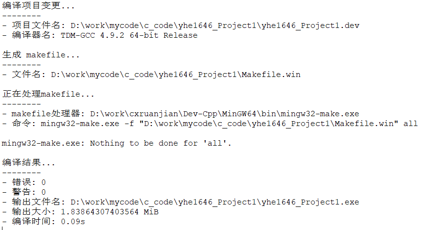
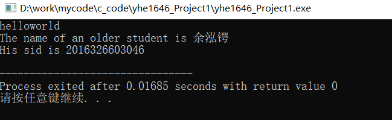
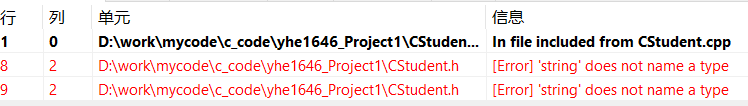
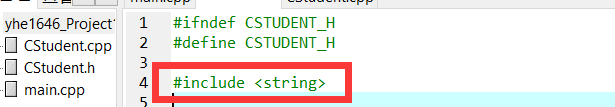
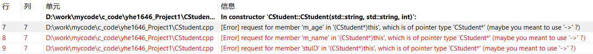
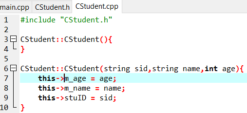

#  面向对象程序设计作业一

## 一、作业任务

1. 安装好codeblocks 或 smartC++或VS2011及以上版本
2. 创建XXXYYNN_Project1，其中XXX为姓名首字母，YY为入学年，NN为学号末两位
3. 保证主函数用cout输出helloworld正常
4. 手动或者开发环境添加CStudent类，头文件(\*.h)和源文件(\*.cpp)分开
5. 增加成员变量私有成员变量int m_age, string m_name, string m_stuID
6. 增加共有成员函数 void setName(string name), void setAge(int age),void setStuID(string Id)，及对应三个 getXXX函数。
7. 在主函数或文件中，增加相应的头文件， 声明两个学生对象，并调用相应的成员函数对这两个对象的属性进行设置，一个的属性信息用自己的信息进行赋值，。
8. 通过getAge()比较这两个学生的年龄，输出年龄者的姓名和学号。
9. 对编译结果和运行结果进行截屏，作业心得、问题及解决和截屏图片放入word中。
10. 项目压缩上交，压缩包名为 学号_姓名_hw2.zip/rar, word文件为 学号_姓名_hw2.doc/docx

## 二、[程序源代码](../../code/index.md)

## 三、作业内容

### （1）结果截图

     
    图1 正确编译结果

     
    图2 正确运行结果

### （2）问题与解决

#### 问题一

     
    图3 问题一截图

【问题解释】‘string’不是一个类型的名称，由于没有引入头文件string
【问题解决】引入头文件string

     
    图4 问题一解决

#### 问题二

     
    图3 问题二截图

【问题解释】这个this可能是个指针，编译器报错提醒我用‘->’代替‘.’试试
【问题解决】将所有this后面的‘.’替换成‘->’

     
    图4 问题二解决

## 四、作业心得

1. 对于c++中的部分变量类型、函数调用、类调用需要提前引入相应的头文件并进入相关的名称空间。
2. 在类的创建，为防止多次编译，节约系统资源，最好将类定义与类实现分别放在.h和.cpp两个文件中，且将类定义的一系列代码开头加宏定义语句：
    `#ifndef CSTUDENT_H`
    `#define CSTUDENT_H`
3. 且不忘记在末尾加宏定义语句：`#endif`。从而防止在不同文件引入.h文件时多次编译。
