#  面向对象程序设计作业二

## 一、作业任务

1. 根据课堂讲述，把附件中关于Vector类的工程，由简单到复杂改为多个递进的工程，并对每一步的知识点及注意事项进行说明。

## 二、作业要求

1. 不低于8个递进工程，每个工程单独压缩打包包名为：学号_CVector_序号.rar，word只用一个文档。
2. 每个工程对应word说明文档的一个小节，word文档有对代码及执行结果的说明。
3. 要求每个工程单独是编译成功且可以执行的。
4. 所使用的集成开发环境没有要求，但不能用C-free。
5. 截至日期3.31日前上交。

## 三、[程序源代码](../../code/index.md)

## 四、作业内容

### 【阶段一】

#### 1.1、阶段内容

* 这一阶段主要内容为如何自定义类构造函数以及类构造函数的重载。
* 在C++中对于函数来说只有函数名、返回值和形参完全相同才会认定为同一个函数，因此对于类构造函数而言，可以通过定义不同的形参的方式，实现类构造函数的重载，从而让同一个类拥有不同的构造方式。

#### 1.2、阶段结果

    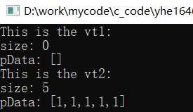 
    图1 构造函数重载后产生的两种类构造方式

### 【阶段二】

#### 2.1、阶段内容

* 这一阶段主要内容为在构造函数上使用初始化列表的相关表现。
* 构造函数后面加冒号是初始化表达式，冒号后面的内容其实就是初始化列表，如果是使用初始化列表的构造函数，则是显式的初始化类的成员；如果没有使用初始化列表的构造函数，就是对类成员进行赋值，但没有进行显式的初始化。如果对于内置类型的成员，这两种方式没有大的区别。但对于非内置类型成员变量，为避免两次构造，使用带初始化列表的类构造函数比较好。另外，对于成员类型是没有默认构造函数的类和const或引用类型的成员，必须用带有初始化列表的构造函数。前者会由于没有默认构造函数导致编译器调用会失败，后者是由于const和引用类型只能初始化不能赋值。
* C++初始化类成员时，是按照声明的顺序初始化的，而不是按照初始化列表中出现的顺序初始化的，因此声明顺序与初始化列表顺序不统一，可能会导致错误的初始化。

#### 2.2、阶段结果

（1）此时必须使用带初始化列表的构造函数，如果不使用就会报错。

    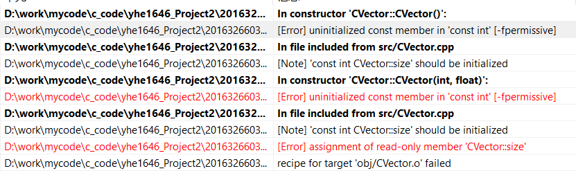 
    图2 对于拥有const型数据成员的类若不使用初始化列表的报错

（2）改写后，程序编译成功，结果如下，与之前的一致：

    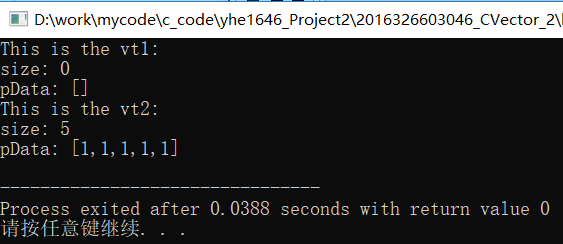 
    图3 改写后两种构造的结果

（3）这样改写后，由于x的声明在数据变量vSize之后，因此在初始化vSize时的x是不确定的，因此最后产生的结果中x并不是初始化列表中的2，而是随机的1，具体结果如下：

    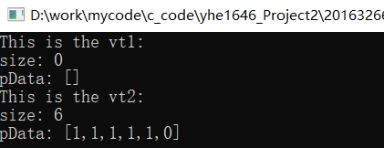 
    图4 初始化列表顺序导致的错误

### 【阶段三】

#### 3.1、阶段内容

* 这一阶段主要内容为如何自定义类析构函数以及其作用时间。
* 类析构函数，其调用与类构造函数相反，类构造函数是在创建类时调用，而析构函数是在销毁类时调用。根据试验，创建类指针不会调用构造和析构函数；直接创建类和通过类指针用new在内存中开辟空间时都会调用构造函数，区别是前者在程序结束后会随着类被自动销毁从而调用析构函数，后者不会随着程序结束自动销毁因此不会调用析构函数，后者只有通过delete主动销毁类指针指向的类才会调用析构函数；当函数的形参是一个类对象时，系统只会在该函数结束后随着形参的作用域结束销毁而调用析构函数，但缺少形参的构造函数的调用，猜测是调用拷贝构造函数；当函数形参是类对象的引用时，系统不会调用构造函数和析构函数，应该和创建类指针的机制的一样的，即系统会将形参指向实参，因此没有创建新的类对象，因此在该实参未销毁的情况下，不会调用其构造函数和析构函数。

#### 3.2、阶段结果

    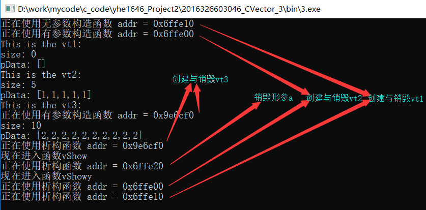 
    图5 构造函数与析构函数作用时间

### 【阶段四】

#### 4.1、阶段内容

* 这一阶段主要内容为自定义拷贝构造函数以及其相关注意点。
* 对于构造函数而言，只要第一个参数为（X&，const X&，volatile X&，const volatile X&）这四种类型之一，且没有其他参数或其他参数都有默认值，那么这个函数就是拷贝构造函数。拷贝构造函数可以重载，但如果存在一个参数为X&的拷贝构造函数，拷贝构造时就会优先调用这个拷贝构造函数，如果一个类没有定义拷贝构造函数，那编译器会根据上下文自动产生一个默认参数为const X&或X&的拷贝构造函数。对于系统自动产生的拷贝构造函数值得一提的是，如果，类数据成员存在指针时，编译器自动产生的拷贝构造函数会出错，因为编译器默认产生的拷贝构造函数是浅拷贝，即将新的类对象的数据成员指针与旧的类对象的数据成员指针指向同一块内存，当对象快结束时，会调用两次析构函数，从而导致指针悬挂现象，可能会引发比较恶劣的bug。另外，对于拷贝构造函数必须通过引用传递而不是通过值传递，是为了防止无限递归引用。

#### 4.2、阶段代码

（1）const类型拷贝构造函数与普通类型的拷贝构造函数共存的情况

    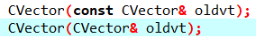 
    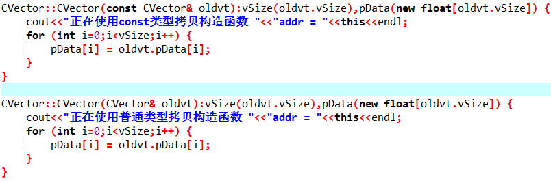 

（2）仅存在const类型的拷贝构造函数时

    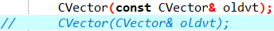 
    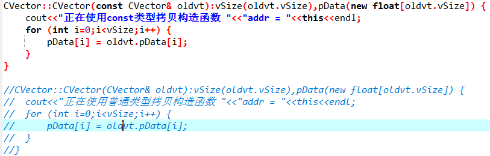 

（3）基本方式调用拷贝构造函数

    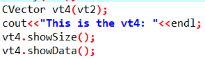 

#### 4.3、阶段结果

（1）优先调用普通类型的拷贝构造函数

    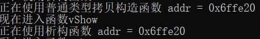 

（2）使用const类型的拷贝构造函数

    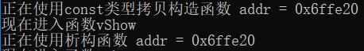 

（3）基本方式调用拷贝构造函数

    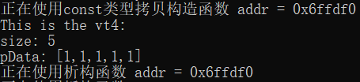 

### 【阶段五】

#### 5.1、阶段内容

* 这一阶段主要内容为赋值运算符重载。
* 一般的，赋值运算符重载函数的参数是函数所在类的const类型的引用，一方面在进行拷贝的时候，不希望新的类对象的改变导致旧的类对象一起改变，因此通过增加const对其进行限制；另一方面，使用const能接受const和非const的实参，而不加const只能接受const的实参，因此增加const能让拷贝构造函数的适用范围更大。另外，通过引用的方式传参，可以避免在函数调用时对实参的一次拷贝，对于规模比较大的类对象而言，可以比较显著的提高程序效率。
对于赋值运算符重载函数的返回值一般是被赋值者的引用，即*this，一方面可以避免函数返回时的一次拷贝，从而提高程序的效率；另一方面，可以对形似`[（x=y）=z]`的表达式进行连续赋值。
对于调用时机，其主要与拷贝构造函数的调用时机进行区分，其主要的区别是，类声明后进行赋值的时候调用赋值运算符重载函数，而类声明的同时进行初始化的话则调用拷贝构造函数。
* 当程序没有显示地提供一个以本类或本类引用为参数的赋值运算符重载函数时，编译器会自动生成这样一个赋值运算符重载函数；但如果定义的时一个非本类且非本类的引用为参数的赋值运算符重载函数时，编译器也会自动生成一个以本类或本类引用为参数的赋值运算符重载函数，这种情况下，如果有相匹配的构造函数，会优先调用赋值运算符重载函数，仅在只有相匹配的构造函数的情况下，才会调用这个构造函数。
* 另外，赋值运算符重载函数只能是类的非静态成员函数，这是由于之前系统默认的赋值运算符重载函数的产生机制，需要增加这一限制防止二义性。对于类继承来说，赋值运算符重载函数不能被继承。而且为了提高效率，并防止类数据成员的指针的自赋值导致的灾难性后果，因此需要避免赋值运算符重载函数的自赋值。

#### 5.2、阶段代码

（1）通过自定义的赋值运算符重载函数实现深拷贝的情况

    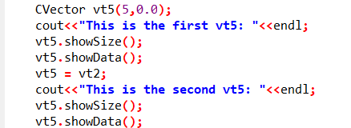 
    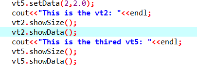 
    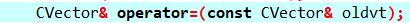 
    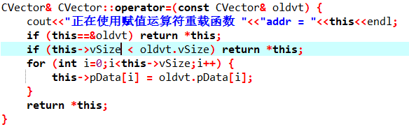 

（2）仅定义一个非本类且非本类的引用的赋值运算符重载函数的情况

    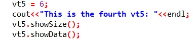 
    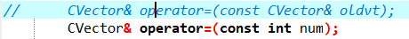 
    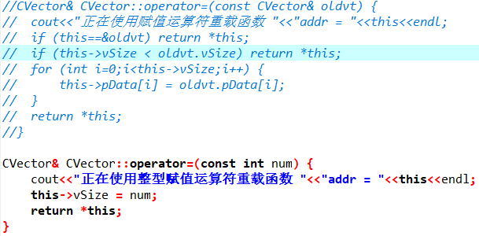 

#### 5.3、阶段结果

（1）深拷贝的赋值运算符重载函数效果演示。

    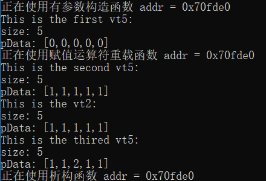 

（2）仅定义一个非本类且非本类的引用的赋值运算符重载函数的效果演示。

    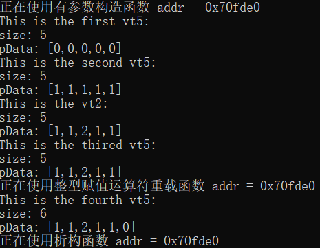 

### 【阶段六】

#### 6.1、阶段内容

* 这一阶段主要内容为常量成员函数与普通成员函数的区别以及inline关键字的作用与用法。
* 首先，仅类的成员函数才能在后面加上const，表示其为常量成员函数，表示在该函数内部不能改变类变量，不然就会报错。其一般用于打印或者获取类变量的函数。
* 然后，在C/C++中inline关键字是为了解决一些频繁调用的小函数大量消耗栈空间的问题，将类成员函数通过inline修饰表示其为内联函数。其会将程序中所有调用该内联函数的地方用该函数内语句替换，从而节省函数调用产生的资源消耗。对于inline关键字的使用是有限制的，其一是内联函数的内部不能包括which或switch等复杂的结构控制语句，其二是内联函数内部不能调用自身，而且inline函数只是对编译器的建议，最后是否真正内联，看编译器的意思。另外，inline是一种“用于实现的关键字”，而不是一种“用于声明的关键字”，因此关键字inline必须与函数定义体放在一起才能使函数成为内联函数。值得一提的是，在函数体内代码比较长或者有循环的情况下使用内联将导致内存消耗代价较高，对于类的构造函数和析构函数，由于其可能会有某些隐藏行为，因此不适合使用内联函数。

#### 6.2、阶段代码

（1）main.cpp中增加内容

    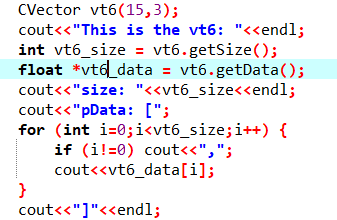 

（2）CVector.h中增加内容

    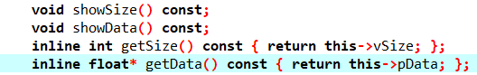 

（3）CVector.cpp中修改内容

    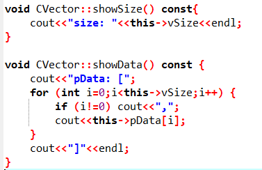 

#### 6.3、阶段结果

    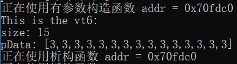 

### 【阶段七】

#### 7.1、阶段内容

* 这一阶段主要为类静态成员函数以及类静态数据变量的声明、初始化和访问。
* 类静态数据变量主要为了在解决数据共享的问题上一定程度的突破全局变量或对象的限制。在类中，静态成员是类的所有对象中共享的成员，而不是某个对象的成员，因此对于类静态成员的初始化需要在实现中进行，而不能在头文件中进行。在静态数据成员定义或说明的时候需在之前增加关键字static，并且类外初始化时不在前面加static，也不加该成员的private或public等访问控制符。
* 类静态成员函数与类静态数据变量一样，都属于类静态成员而不是对象成员。而且，在类静态成员函数的实现中不能直接引用类中说明的非静态成员，但可以引用类中说明的静态成员。

#### 7.2、阶段代码

（1）main.cpp中增加内容

    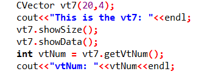 

（2）CVector.h中增加内容

     
     

（3）CVector.cpp中修改内容

    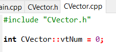 
    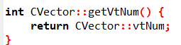 

#### 7.3、阶段结果

    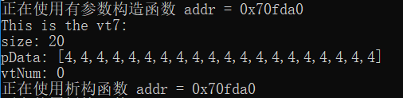 

### 【阶段八】

#### 8.1、阶段内容

* 这一阶段主要内容为统计各种创建方式的类对象的数量

#### 8.2、阶段结果

    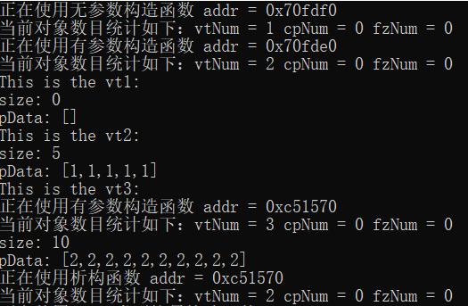 
    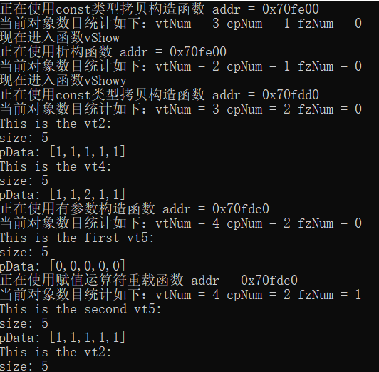 
    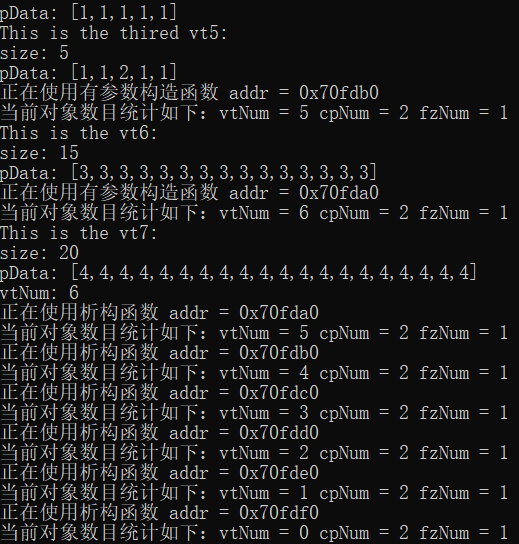 
     

