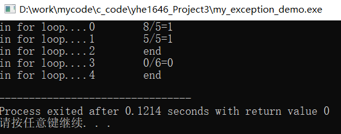
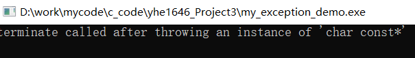
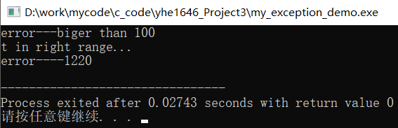
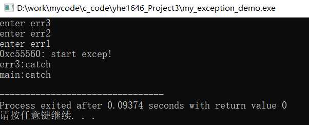

#  面向对象程序设计作业三-异常

## 〇、[程序源代码](../../code/index.md)

## 一、Homework8_part1(P305 1,2,3)

1. 什么是异常？C++为什么要引入异常处理机制？
   * 异常是指在程序运行阶段遇到的错误，导致程序无法正常的运行下去。例如，程序试图打开一个不可用的文件、请求过多的内存、或者遇到不能容忍的值等。
   * c++引入异常处理机制，一方面是为了给程序运行阶段产生的错误经行善后，消除其产生的隐患，避免影响程序其他部分的运行过程和结果，防止整个系统的奔溃。另一方面是增加程序的健壮性，尽可能减少程序运行中途退出导致的成本损失。
2. 简述try-throw-catch异常处理的过程。
   * 将某一段可能产生异常的代码段通过try{}包含起来，在代码段中可能发生异常的语句上增加throw语句弹出异常，由try{}之后的紧跟的若干个catch{}用于捕获throw弹出的异常。
   * 当该代码段中相应的语句产生异常并由throw弹出异常后，该语句之后的代码段语句将不再执行，直接将异常依次与之后catch中的异常类型匹配，若匹配成功则运行该catch中的语句，进行异常处理；若没有一个可以匹配则将异常交给上一层异常处理机制处理。
   * 通过catch(…){}可以捕捉任意类型的异常，但弊端是无法获取给异常具体内容。
3. 什么是异常类？
   * c++编译器将异常合并到语言中，在exception头文件中定义了exception类，用于作为其他异常类的基类。在代码中可以引发exception异常，也可以将exception作为基类。其有一个名为what()的虚拟成员函数，它返回一个字符串，该字符串的特征随实现而异。
   * 由此可以通过继承的方式将程序中出现的异常作为exception类的派生类实现，一方面可以使用exception类中以实现的一些功能，另一方面可以在一定程度上解决catch(…)能捕捉所有类型，但不知异常具体内容的问题。在功能函数出现意外情况时，方便查找错误类型，极大的提高了代码编写效率。

## 二、Homework8_part2(P305 4)

### 1、第一小题解释

* 此段代码，其异常处理是在for循环内部的，因此即使异常捕捉到了，处理完异常之后若循环未结束，程序依然会继续运行。
* 当i为2和4时，i+1分别为3和5，而a[3]和a[5]为0，此时弹出异常，因此跳过了运算直接输出end。

     

@import "../../code/experiment/1.3/1.cpp"

### 2、第二小题解释

* 对于源程序而言，直接是使用字符串，由于我的编译器直接将字符串解释为string，但异常捕获类型为char*，因此会出现异常捕获失败的情况，

     

* 因此我将字符串通过(char*)强转为char*型，结果如下：

     

@import "../../code/experiment/1.3/2.cpp"

### 3、第三小题解释

* 对于这个程序，首先运行main()函数，其中调用err3()函数，输出: `enter err3`后调用err2()函数，输出: `enter err2`后调用err1()函数，并通过throw使用excep异常类产生异常。该异常无法与err2()函数中的catch捕获向上层异常处理机制传递。然后在err3中被catch(…)捕获，输出: `err3:catch`并通过throw;对异常进行二次传递，将捕获的异常原原本本传给上一层异常处理机制。该二次传递的异常被main中catch(…)捕获，输出: `main:catch`

     

@import "../../code/experiment/1.3/3.cpp"
