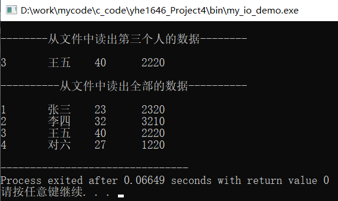
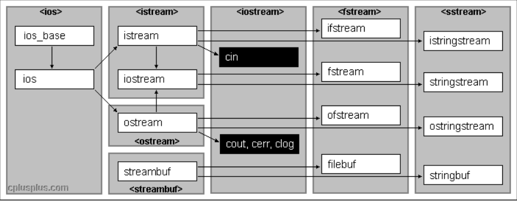

#  面向对象程序设计作业四-文件IO

## 〇、[程序源代码](../../code/index.md)

## 一、DemoCode

### 1、Eg9_7测试

* 对于源程序而言会由于缺少c语言中的头文件string.h导致无法找到函数strcpy而编译出错。

     

* 为了让编译通过，c++中对引入c中头文件优化成了头文件cstring由此与c++本身的string头文件相区分。

     

* 首先是构建一个基本的Person类用于测试。然后在主函数中开一个vector对象p用于存放从文件读出的Person对象，以及一个vector对象指针pos，用于遍历vector对象。
* 创建一个ofstream对象out，并连接程序可执行文件同目录下名为”person.dat”的文件，其中ios::out表示该对象用于写文件；ios::app表示文件不存在则创建，存在则追加；ios::binary表示以二进制方式写。
* 用循环不断获取用户输入构造s1并存入文件”person.dat”，直到用户结束输入后，关闭ofstream对象out连接的文件。
* 创建一个ifstream对象in，并连接之前保存的”person.dat”的文件，其中ios::in表示该对象用于读文件； ios::binary表示以二进制方式读。
* 创建一个Person对象s1，循环接收文件”person.dat”中保存的二进制数据，并将构建好的s1存入vector对象p中，并用vector对象指针遍历vector对象p，依次调用其中Person对象的display函数输出结果，最后关闭ifstream对象in连接的文件。

@import "../../code/experiment/1.4/3.cpp"

### 2、Eg9_8测试

* 在c++中，会将字符串默认解释为string类型，为了匹配测试代码防止出现类似以下的警告。

     

* 可以在字符串前加(char*)强制将字符串转为char*类型，从而消除警告。

     

* 首先是构建一个基本的Employee类用于测试，创建一个ofstream对象out并连接文件”employee.dat”，该对象以二进制方式向文件写入内容。
* 通过Employee类构建四个测试对象e1、e2、e3、e4，并依次写入文件”employee.dat”，构建第四个Employee对象e5，对e3的一部分进行篡改，使用out的seekp方法，将文件写指针指向文件e3对象存储初始位置，写入e5内容，然后关闭ofstream对象out连接的文件。
* 创建ifstream对象in并连接文件”employee.dat”，该对象通过二进制方式在文件中读数据。
* 创建一个临时Employee对象s1，通过in的seekp方法，将文件读指针指向e5对象存储初始位置，并保存在s1中，用其display函数输出结果。再通过in的seekp方法，将文件读指针指向文件开头，并通过循环逐个保存在临时的s1中并用其display函数输出，最后关闭ifstream对象in连接的文件。

@import "../../code/experiment/1.4/4.cpp"

## 二、Homework9_part1 (P321 1)

### （1）结果截图

1. C++预定义了哪几个输入/输出流对象？简述其作用

     
    图1 c++IO类关系

   * cin：表示标准输入的istream类对象，其从终端读入数据。
   * cout：表示标准输出的ostream类对象，其向终端写入数据。
   * cerr：表示标准错误输出（非缓冲方式），导出程序错误信息。
   * clog：表示标准错误输出（缓冲方式），导出程序错误信息。
   * ifstream：文件输入类对象，从istream派生而来，将文件绑定到程序输入。
   * ofstream：文件输出类对象，从ostream派生而来，将文件绑定到程序输出。
   * fstream：文件输入/输出对象，从iostream派生而来，将文件绑定到程序输入/输出。
   * stringstream：支持c++风格的串流输入输出的类对象，从iostream类和stringstreambase派生而来。
   * istringstream：支持c++风格的串流输入的类对象，从istream和stringstreambase派生而来。
   * ostringstream：支持c++风格的串流输出的类对象，从ostream和stringstreambase派生而来。

## 三、Homework9_part2(P321 3)

### 1、第一小题解释

* 首先创建fstream对象ou与in，将这两对象与文件”a.dat”相连接，区别是ou向文件中写数据，in向文件中读数据。
* 使用ou对象在文件中写入数据完毕后，使用close方法关闭并保存所连接的文件。然后循环在in对象读取文件中内容，暂存在char型数组buffer中并在终端输出，最后关闭ifstream对象in连接的文件。

     

@import "../../code/experiment/1.4/1.cpp"

### 2、第二小题解释

* 首先是构建一个基本的Worker类用于测试，创建一个ofstream对象out并连接文件”worker.dat”，该对象以二进制方式向文件写入内容。
* 通过Worker类构建对象数组man，其中有六个Worker对象，通过out依次将这些对象写入文件”worker.dat”，然后关闭ofstream对象out连接的文件。
* 创建ifstream对象in并连接文件”worker.dat”，该对象通过二进制方式在文件中读数据。
* 创建一个临时Worker对象s1，通过in的seekp方法，将文件读指针指向第三个对象存储初始位置，并保存在s1中，用其display函数输出结果。再通过in的seekp方法，将文件读指针指向文件开头，并保存在s1中，用其display函数输出，最后关闭ifstream对象in连接的文件。

     

@import "../../code/experiment/1.4/2.cpp"
