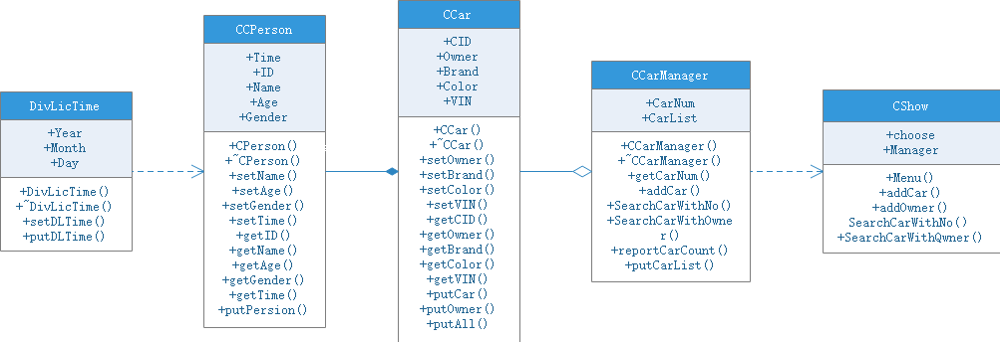
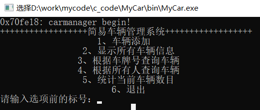
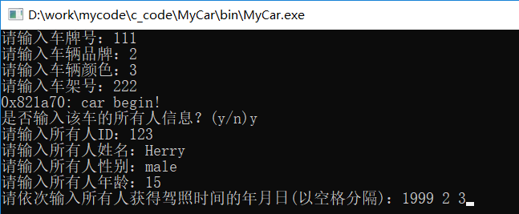
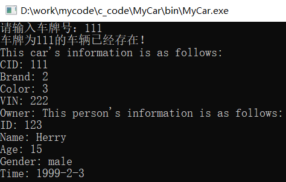
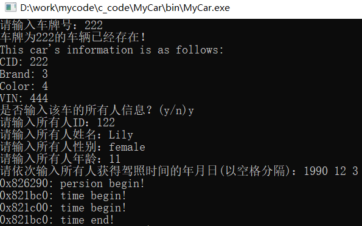
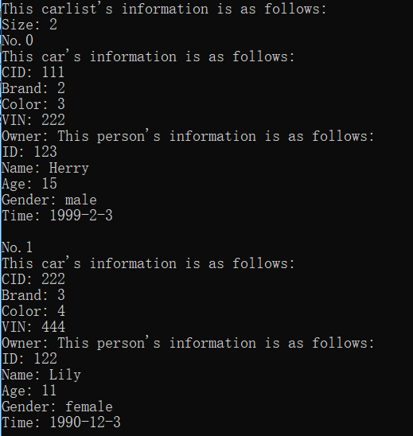
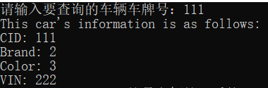
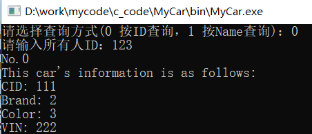
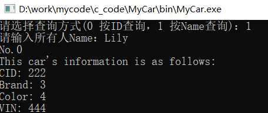

#  实验1: 类和对象

## 【实验内容】

简易车辆管理系统

## 【实验目的】

1. 掌握类的概念、类的定义格式、类与结构的关系、类的成员属性和类的封装性；
2. 掌握类对象的定义；
3. 理解类的成员的访问控制的含义，公有、私有和保护成员的区别；
4. 掌握构造函数和析构函数的含义与作用、定义方式和实现，能够根据要求正确定义和重载构造函数。能够根据给定的要求定义类并实现类的成员函数；

## 【功能要求】

使用类和对象开发一个可以对车辆进行简单管理的系统。

1. 可以创建Person对象、Car对象和CarManager对象
2. 可以增加车辆、根据车牌查找车辆、根据车主查找车辆并现实车辆的基本信息。
3. 除了主函数，不允许使用全局函数。
4. 可以统计一共有多少车辆。

## 【实验步骤及提示】

1. 对项目进行分析，设计主要的类及其成员，画出类图。
2. 创建项目，写好头文件和主函数，测试通过。
3. 添加CPerson类、CCar类、CCarManager类。
4. 在主函数中定义一个CCarManager对象，通过该对象的函数实现车辆管理。
5. CCarManager类具有addCar，SearchCarWithNo，SearchCarWithOwner，reportCarCount
   * 实现增、查和统计功能，存放车辆可以使用静态数组／动态数据或STL的vector，STL的vector要先自学，必要时可以增加表示车辆数目的变量。
6. CPerson需要具有年龄、性别、姓名、身份证号码、取得驾照时间等属性信息，构造和析构函数，以及必要的属性set／get函数。
7. CCar须具有车牌号、品牌、颜色、车架号、所有人等属性信息，构造和析构函数，
   * 必要的属性set／get函数，车辆基本信息输出函数，以及进行车辆查找检索的信息。
8. 要求CCarManager的车辆个数统计和CCar类的静态成员统计的个数相同。
9. 综合使用online、constant、static、new、delete、缺省参数等相关知识。
10. 根据功能逐个添加成员变量和成员函数，上述属性和函数不足时，可以按需增加；
11. 需要输入的信息，可以从命令行输入，也可以为了调试方便，先使用缺省参数。

## 【类的设计】

     

1. 对于整个车辆管理系统而言，实现了一个用于菜单显示与管理的类，即CShow类，其中有两个属性一个是选择属性choose，另一个是车辆管理类成员Manager。主要实现的方法包括菜单显示、车辆显示、按不同特征查询、车辆数统计。
2. 对于车辆管理的类为CCarManager，其中有两个属性一个是对当前存在车辆数目统计的CarNum，一个是用于存放车辆详细信息的vector数组CarList，其主要方法为相关车辆信息显示与按特征值查询的具体实现。
3. 对于记录车详细信息的类为CCar，其中属性包括车牌号CID、品牌Brand、颜色Color、车架号VIN、所有人Owner，以及相关属性改写、获取与显示方法的具体实现。
4. 对于记录所有人信息的类为CPerson，其中属性包括身份证号码ID、姓名Name、年龄Age、性别Gender、取得驾照时间Time，以及相关属性改写、获取与显示方法的具体实现。
5. 对于记录取得驾照时间的类为欸DivLicTime，其中属性包括年Year、月Month、日Day，以及相关属性改写、获取与显示方法的具体实现。
6. 这五个类之间，CPerson类包含DivLicTime类，DivLicTime类依赖CPerson类才能存在，即CPerson类被销毁其对应的DivLicTime类也被销毁，但DivLicTime类被销毁其对应的CPerson类不会被销毁
7. CCar类与CPerson之间为组合关系，CCar类只能对应一个CPerson类，但一个CPerson类能对应多个CCar类，对应的CCar类与CPerson类之间销毁其中一个类并不会同时销毁另一个类
8. CCar类与CCarManager类之间为聚集关系，CCarManager类集中了所有已存在的CCar类
9. CCarManager类与CShow类之间为依赖关系，CShow类的创建前必须创建CCarManager类。

## [【实验代码】](../../code/index.md)

## 【实验结果及分析】

### 1、主菜单

     

### 2、添加车辆

#### （1）车辆不存在

     

#### （2）车辆存在且存在所有人

     

#### （3）车辆存在但不存在所有人

     

### 3、显示所有车辆信息

     

### 4、按车牌号查询车辆信息

     

### 5、按所有人查询车辆信息

#### （1）按所有人ID查询

     

#### （2）按所有人Name查询

     

### 6、显示当前存在的车辆数目

     

## 【心得体会】

1. 为保证当某一个CPerson类的实体中某一属性被改变是，其对应的所有CCar类的实体中的所有人信息均会同步改变，因此在CCar中Owner属性对应的是指向对应CPerson的实体的指针。
2. 另一方面只允许单方面修改，即只能通过CPerson的实体改变实体中属性，不能通过其对应的CCar的实体改变其Owner指向的CPerson的实体信息，可以将Owner指针设置为const类型。
3. 所有人的实体可能已经在之前添加车辆时就已经创建过了，因此为了避免相同的所有人实体的重复创建，在每次创建时都会检查新创建的CCar实体对应的所有人实体是否存在，若存在就直接将新创建的CCar实体的Qwner指针指向该所有人实体，若没有才新创建所有人实体。
4. 通过类以及类方法的包装，极大的减少了代码量，并在一定程度上让实体之间的关系更清晰，提高了程序运行的效率。
