#  实验3: 虚函数与多态

## 【实验内容】

基于多态的简易车辆管理系统

## 【实验目的】

1. 基于类的继承、派生和多态，对不同种类的车辆进行统一管理

## 【功能要求】

1. 声明CPerson类、CDriver类继承CPerson类
2. 声明CVehicle类，CCar类、CBus类和CShip类继承CVehicle类。
3. 用CVehicleManager作为具有容器作用的类保存不同车辆的实体对象，用CPersonManager作为司机和车主的容器，存放Cpersion类及其派生类对象。可以通过这两个类对车、人进行管理
4. 除了主函数，不允许使用全局函数。
5. 与车辆管理有关的函数在CVehicle中声明为普通虚函数（或纯虚函数），在派生类中进行具体实现。与司机、车主管理有关的函数在CPerson中声明为普通虚函数。
6. CPersonManager类中不允许出现CPerson类的派生类标识符，CVehicleManager中不允许出现CVehicle类的派生类的标识符。
7. 在CPersonManager中遍历输出每个人的具体信息，在CVehile中遍历输出每个车辆的具体信息。查询司机、车主、车辆等都采用遍历查找。

## 【实验步骤及提示】

1. 对项目进行分析，设计主要的类及其成员，画出类图。
2. 创建项目，写好头文件和主函数，测试通过。
3. 添加CPerson类、CDriver、CVehicle类、CCar类、CBus类
4. 添加CPersonManager、CVehicleManager类。
5. 在主函数中定义一个CVehicleManager对象和CPersonManager对象。
6. 创建多个车主对象、司机对象、不同的车辆对象，分别加入到两个Manager对象中
7. 在CPerson及CVehicle类中增加和管理有关的虚函数
8. 在CPerson及CVehicle类的派生类中实现基类的虚函数
9. CVehicelManager类具有addVehicle，SearchVehicleWithNo，SearchVehicleWithOwner，reportVehicleCount，调用CPerson及CVehicle类中的虚函数实现功能。
10. 实现增、查和统计功能，manager类存放车辆/人可以使用静态数组／动态数据或STL的vector，STL的vector要先自学，必要时可以增加表示车辆/人数目的变量。注意STL的vcetor容器不能放入对象的引用，建议存放对象的指针。
11. CPerson需要具有年龄、性别、姓名、身份证号码、Cdriver取得驾照时间等属性信息，构造和析构函数，以及必要的属性set／get函数。
12. Cvehicle须具有车牌号、品牌、颜色、车架号、所有人、驾驶人等属性信息，构造和析构函数，必要的属性输入输出虚函数，在CVehicleManager 类中遍历输出车辆相关信息（包括派生类中新增的属性），以及进行车辆查找检索的信息。在CPersonManager中遍历输出所有派生类的信息（包括派生类新增的信息）
13. 要求CVehicleManager的车辆个数统计和CVehicle类的静态成员统计的个数相同,比较是否相等，分析原因。
14. 综合使用online、constant、static、new、delete、缺省参数等相关知识。
15. 根据功能逐个添加成员变量和成员函数，上述属性和函数不足时，可以按需增加；
16. 需要输入的信息，可以从命令行输入，也可以为了调试方便，先使用缺省参数。
17. 自己可以在不违背类的继承派生这个实验的大原则情况下，就车辆管理功能和类的设计实现进行改动和扩展。

## 【类的设计】

    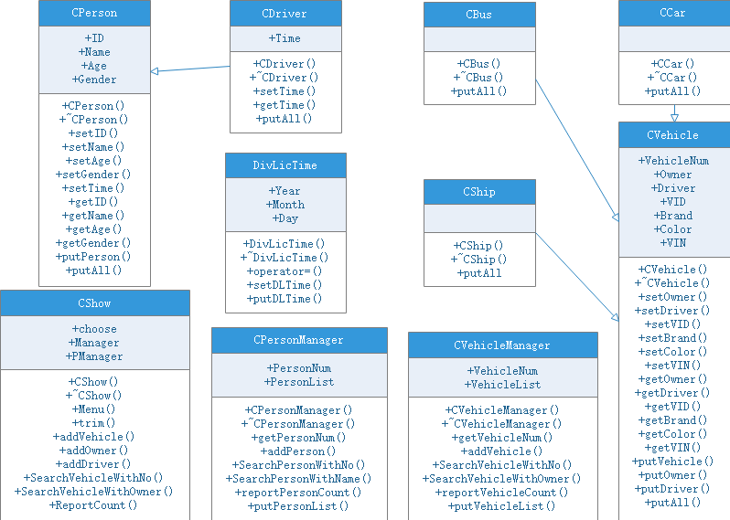 

1. 对于整个车辆管理系统而言，实现了一个用于菜单显示与管理的类，即CShow类，其中有三个属性一个是选择属性choose，另一个是车辆管理类成员Manager，再一个是人员管理类成员PManager。主要实现的方法包括菜单显示、增加所有人、增加驾驶人、按不同特征查询、数目统计。
2. 对于交通工具管理的类为CVehicleManager，其中有两个属性一个是对当前存在车辆数目统计的VehicleNum，一个是用于存放交通工具详细信息的vector数VehicleList，其主要方法为相关交通工具信息显示、按特征值查询与交通工具数目统计的具体实现。
3. 对于人员管理的类为CPersonManager，其中有两个属性一个是对当前存在人员数目统计的PersonNum，一个是用于存放人员详细信息的vector数PersonList，其主要方法为相关人员信息显示、按特征值查询以及人员数目统计的具体实现。
4. 对于交通工具设计其基类CVehicle，其中属性包括交通工具总数VehicleNum、所有人Owner、驾驶人Driver、车牌号VID、品牌Brand、颜色Color、驾车号VIN，以及相关属性改写、获取与显示方法的具体实现。
5. 对于记录小轿车的派生类为CCar，其继承CVehicle类，以及实现显示信息的虚函数，增加小轿车的信息显示；对于记录公交车的派生类为CBus，其继承CVehicle类，以及实现显示信息的虚函数，增加公交车的信息显示；对于记录船的派生类为CShip，其继承CVehicle类，以及实现显示信息的虚函数，增加船的信息显示。
6. 对于人员设计其基类CPerson，其中属性包括身份证号码ID、姓名Name、年龄Age、性别Gender，以及相关属性改写、获取与显示方法的具体实现。
7. 对于记录司机的派生类CDriver，其继承CPerson类，增加属性取得驾照事件Time，以及该属性的改写、获取方法的具体实现，还有显示信息的虚函数，增加额外信息的显示。
8. 对于记录取得驾照时间的类为DivLicTime，其中属性包括年Year、月Month、日Day，以及相关属性改写、获取与显示方法的具体实现。
9. 这几个类之间，除上述的继承外，CDriver类包含DivLicTime类，DivLicTime类依赖CPerson类才能存在，即CPerson类被销毁其对应的DivLicTime类也被销毁，但DivLicTime类被销毁其对应的CPerson类不会被销毁
10. CVehicle类与CPerson之间为组合关系，CVehicle类的Owner和Driver属性分别记录一个CPerson类，但同一个CPerson类能存在多个CVehicle类，对应的CVehicle类与CPerson类之间销毁其中一个类并不会同时销毁另一个类。
11. CVehicle类与CVehicleManager类之间为聚集关系，CPerson类与CPersonManager类之间也为聚集关系，CVehicleManager类集中了所有已存在的CVehicle类及其派生类，CPersonManager类集中了所有已存在的CPerson类及其派生类。
12. CVehicleManager类和CPersonManager类与CShow类之间为依赖关系，CShow类的创建前必须创建CVehicleManager类和CPersonManager。

## [【实验代码】](../../code/index.md)

## 【实验结果及分析】

### 1、主菜单

    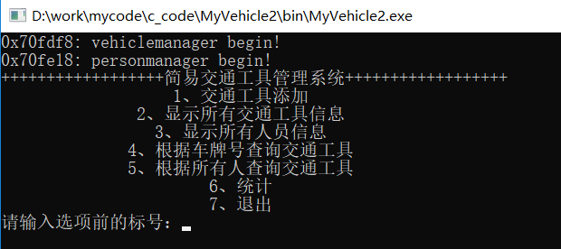 

### 2、添加车辆

#### （1）车辆不存在

    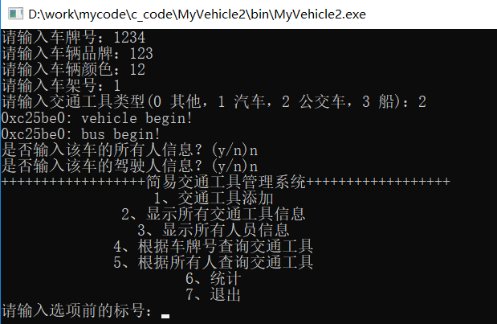 

#### （2）车辆存在但不存在所有人

    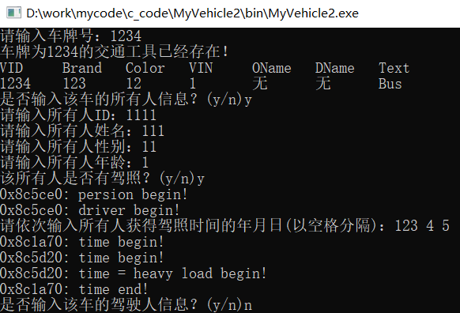 

#### （3）车辆存在且所有人存在但不存在驾驶人

    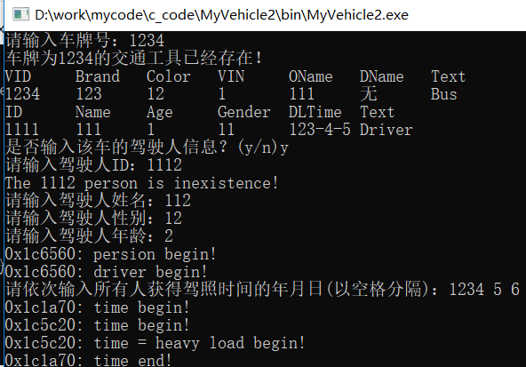 

#### （4） 车辆存在且所有人与驾驶人都存在

    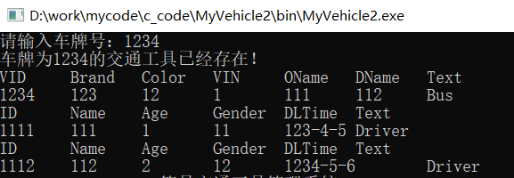 

### 3、显示所有车辆信息

    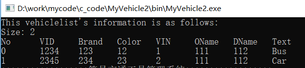 

### 4、显示所有人员信息

    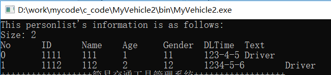 

### 5、按车牌号查询车辆信息

    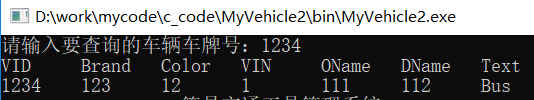 

### 6、按所有人查询车辆信息

#### （1）按所有人ID查询

    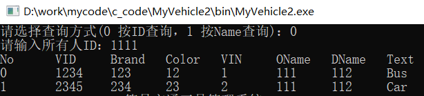 

#### （2）按所有人Name查询

    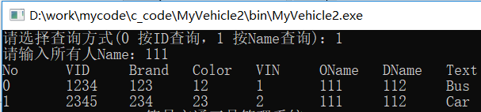 

### 7、显示当前存在的车辆数目

    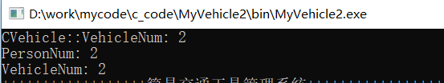 

## 【心得体会】

1. 对于继承而言，基类指针可以指向派生类对象，但派生类指针不可以指向基类对象。
2. 为了在使用基类指针销毁派生类对象时，不出现内存销毁不干净的情况，需要将基类的析构函数实现成虚函数，为了让派生类对象可以显示额外的信息，其显示函数也需要使用虚函数实现。
3. 为了节省内存，因此在管理类中存储的是基类的指针，当需要调用、修改或显示时只需要调用指针中地址的内存单元即可。
4. 在实现数量统计时，如果程序中申请了临时对象但没有加入相应的管理类时，就会出现静态变量统计数目与管理类中列表统计数目不匹配的情况。另外防止计数不匹配，需要主动实现构造函数、拷贝构造函数与析构函数中的加加减减。
