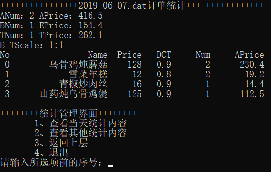
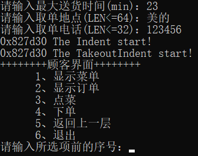

# [](../index.md) 实验4: 自助点餐系统

## 【题目】

自助点餐系统

## 【目的】

1. 通过设计一个小型的自助点餐系统，训练综合运用所学知识处理实际问题的能力，强化面向对象的程序设计理念，使自己的程序设计与调试水平有一个明显的提高。

## 【要求】

1. 每个学生必须独立完成；
2. 课程设计时间为1周；
3. 设计语言采用C++；
4. 学生有事离校必须请假。课程设计期间，无故缺席按旷课处理；缺席时间达四分之一以上者，未按规定上交实验报告的学生，其成绩按不及格处理。

## 【内容简介】

* 有一个小型餐厅，现在这个餐厅打算使用自助点餐系统，方便顾客自己点餐，并提供对餐厅销售情况的统计和管理功能。

## 【考核标准】

该系统为两种角色的用户提供服务，一种是餐厅管理员，一种是顾客。餐厅管理员根据账号、密码登录系统。顾客无需登录即可使用系统。

1. 顾客通过该餐厅在系统中提供的菜单为自己点餐，菜单以文件形式保存。系统能够根据顾客的要求正确打出订单，订单内容包括订单编号、菜品名称、每个菜品的价格、份数、折扣等；订单分两种，一种是在店消费，在店消费要求包括餐桌号，是否有包厢费，另一种是外卖，外卖要求包括送餐时间，送餐地点，客户手机号，外卖服务费。（要求用继承和多态实现），成绩≥60；
2. 系统退出后能保存当天的订单信息，要求每天一个文档，文档名按照日期命名。餐厅管理员可以根据订单编号查找删除修改某个订单,订单可以按照下单时间先后排序，成绩≥70；
3. 能够实现对餐厅菜式和价格的管理，包括对菜品和对应价格的增加、修改、删除、查找，折扣的设置，成绩≥80；
4. 系统可根据历史记录对销售情况进行统计，根据餐厅管理员的输入日期统计某天的销售情况并显示（包括一共接了多少单，销售额是多少，各个菜品的销售情况，外卖和在店销售的占比），成绩≥90；

要求：用面向对象的程序设计方法设计该系统。本系统涉及的基本对象有订单对象（包括外卖订单和在店消费订单）、订单管理对象、菜单对象、菜品对象、菜品管理对象、系统界面。实现对这些对象的合理抽象和封装，正确定义类之间的关系。界面合理，代码文件组织清晰，命名符合规范，代码注释清楚，课设报告书质量高。

## 一、需求分析

1. 系统分别为餐厅管理员与顾客提供服务，餐厅管理员需要根据账号、密码登陆系统，顾客无需登陆可以直接使用系统。
2. 订单管理：
   1. 订单信息（继承和多态）
      1. 订单-编号、内容（菜名、单价、份数、折扣、价格）、下单时间、总价 
      2. 堂食订单-餐桌号、是否包厢、订餐内容
      3. 外卖订单-送餐时间、送餐地点、客户手机号、外卖服务费、订餐内容
   2. 保存订单
   3. 删除订单
   4. 修改订单
   5. 按下单时间先后排序
3. 菜单管理
   1. 菜品信息-菜品编号、菜品名、单价、折扣
   2. 保存菜单
   3. 查看菜单
   4. 修改菜单
   5. 折扣设置
4. 统计管理
   1. 统计某天销售情况
      1. 菜品销售情况统计
         1. 各个菜品销售份数
         2. 各个菜品销售额
      2. 当天订单数
      3. 当天销售额
      4. 外卖堂食比
5. 用户管理：
   1. 餐厅管理员管理
      1. 菜单管理
      2. 订单管理
      3. 统计管理
   2. 顾客管理
      1. 查看菜单
      2. 点餐
      3. 查看订单
   3. 登陆管理
      1. 登陆验证
      2. 权限管理
      3. 用户登出
6. 系统管理
   1. 以文件形式保存菜单
   2. 系统退出保存当天的订单信息-文档名按日期命名

## 三、系统结构图

<center>
    </br>
</center>

## 四、类的设计

<center>
    </br>
</center>

## 五、业务流程图

<center>
    </br>
</center>

## 六、[程序代码与说明](../../code/index.md)

对于该系统的程序主要成分由三部分组成。

1. 系统基本功能逻辑实现
   * 第一部分是实现系统基本功能逻辑的类定义以及实现，其中包含八个类，分别是代表菜品的的Dish类（菜名、价格、折扣）、整合并管理菜品的MenuManage类（菜品列表）、代表订单条目的DishItem类（Dish类指针、数量、合计价格）、代表普通订单的Indent类（ID、下单时间、总价、订单条目列表）、代表堂食订单的EatinIndent类（桌号、是否包间）、代表外卖订单的TakeoutIndent类（送货时间、送货地点、手机号）、整合并管理订单的IndentManage类（订单列表）、计算并记录统计信息的CountManage类（订单数、堂食订单数、外卖订单数、总销售额、堂食销售额、外卖销售额、各菜品销售情况、信息记录时间）。
   * EatinIndent类与TakeoutIndent类继承Indent类，并通过虚函数virtual inline char getType();区分具体是那个类的对象。DishItem类分别与CountManage类和Indent类构成聚合关系。DishItem类与Dish类相关联。Indent类与IndentManage类构成聚合关系。Dish类与MenuManage类构成聚合关系。
2. 系统基本流程逻辑
   * 第二部分是实现系统基本流程逻辑的MShow类以及主函数文件。
3. 基本工具
   * 第三部分是一些基本工具的定义与实现，即也可以用于其他的项目。

## 七、运行结果与分析

### 1、系统初始化

<center>
    </br>
</center>

### 2、系统主界面

<center>
    </br>
</center>

### 3、餐厅管理员

#### 3.1、餐厅管理员界面

<center>
    </br>
</center>

#### 3.2、菜单管理

<center>
    </br>
</center>

##### 3.2.1、显示菜单

<center>
    </br>
</center>

##### 3.2.2、增加菜单

<center>
    </br>
    </br>
</center>

##### 3.2.3、修改菜单

<center>
    </br>
    </br>
    </br>
    </br>
</center>

##### 3.2.4、删除菜单

<center>
    </br>
</center>

##### 3.2.5、保存菜单

<center>
    </br>
</center>

##### 3.2.6、读取菜单

<center>
    </br>
</center>

#### 3.3、订单管理

<center>
    </br>
    </br>
    </br>
    </br>
</center>

##### 3.3.1、显示订单

<center>
    </br>
</center>

##### 3.3.2、修改订单

<center>
    </br>
    </br>
</center>

##### 3.3.3、删除订单

<center>
    </br>
    </br>
    </br>
    </br>
</center>

##### 3.3.4、保存订单

<center>
    </br>
</center>

##### 3.3.5、读取订单

<center>
    </br>
    </br>
    </br>
    </br>
</center>

#### 3.4、统计管理

<center>
    </br>
</center>

##### 3.4.1、查看当天统计内容

<center>
    </br>
</center>

##### 3.4.2、查看其他统计内容

<center>
    </br>
    </br>
    </br>
</center>

### 4、顾客

<center>
    </br>
    </br>
</center>

#### 4.1、显示菜单

<center>
    </br>
</center>

#### 4.2、显示订单

<center>
    </br>
</center>

#### 4.3、点菜

<center>
    </br>
    </br>
    </br>
</center>

#### 4.4、下单

<center>
    </br>
</center>

## 【心得体会】

1. 为了完全销毁vector中存放的指针指向对象的内存空间，在使用delete之后，需要将指针赋为nullptr，并使用vector自带的clear或erase函数彻底从vector中清除指针。
2. 对于对象而言，当需要进行的保存读取文件操作时，类中不能出现长度不定的成员，也不能使用指针，由于指针本身只保存类地址，而当将指针写入文件时只会将地址写入文件，而不会同时将地址对应的位置的数据存储起来。当下次读取时，仅仅将指针的地址恢复，此时地址对应的内存位置的数据是未知的，就有可能出现内存泄漏。解决这个问题的办法，一种是在构建类时避免用指针或类似string等不定长的类型作为成员；另一种是将类对象中数据单独保存并标记下次读取时，重新构建类对象。另外在读取二进制文件中的对象前，需提前创建对象或者申请与对象大小一致的内存空间，用于放对象的二进制数据，而不能直接使用空对象指针。
3. 如果需要cout格式化输出，则应增加头文件`#include <iomanip>`。若需要输出指定宽度的内容，可以在输出的变量前使用函数setw(num)，其中num为输出宽度，注意setw只对之后第一个变量有效，若还需对其他变量初始化，要再次使用`setw(num)`。
4. 对于Dev C++编译器而言，当类型是char型，凡是0x80以上，即最高位是1的数据，通过"%02x"打印后会在前面填充6个‘f’，即变成ffffff80这样的数据。此时将char换成unsigned char型则打印正常。
5、对于c++的时间类型而言，time_t转tm使用函数localtime()，tm转time_t使用函数mktime()。tm结构体格式如下：

```c++
struct tm
{
    int tm_sec;  /*秒，正常范围0-59， 但允许至61*/
    int tm_min;  /*分钟，0-59*/
    int tm_hour; /*小时， 0-23*/
    int tm_mday; /*日，即一个月中的第几天，1-31*/
    int tm_mon;  /*月， 从一月算起，0-11 1+p->tm_mon;  */
    int tm_year;  /*年， 从1900至今已经多少年 1900＋ p->tm_year;  */
    int tm_wday; /*星期，一周中的第几天， 从星期日算起，0-6*/
    int tm_yday; /*从今年1月1日到目前的天数，范围0-365*/
    int tm_isdst; /*日光节约时间的旗标*/
};
```
