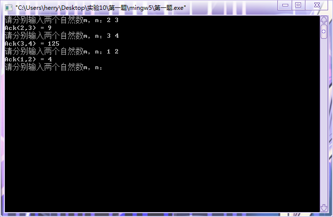
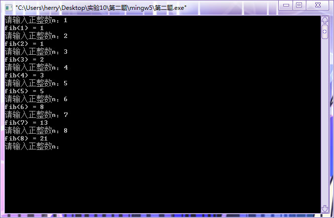
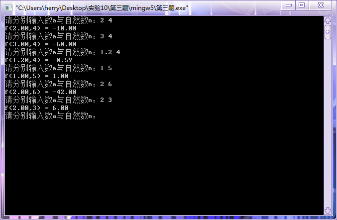
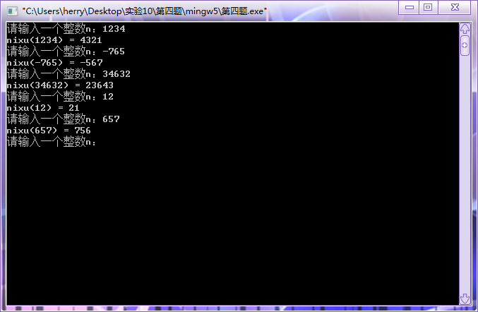
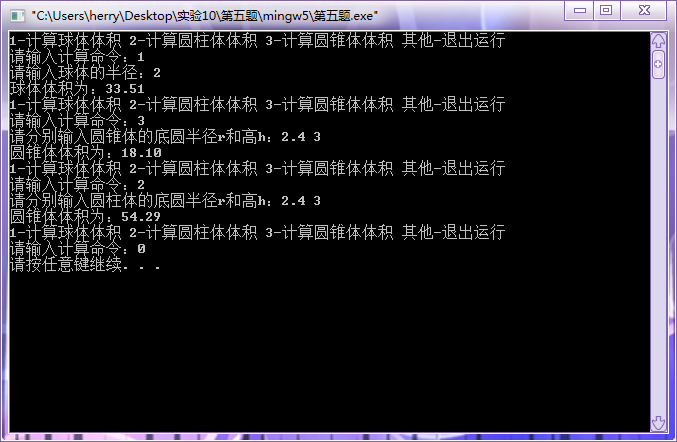

# [](../index.md) 实验十：递归函数的运用

## 一、实验目的

1. 掌握数据和地址的关系；
2. 掌握递归函数的定义、编写与使用；
3. 能够进行数组与指针的灵活应用；
4. 理解编译错误信息的含义，掌握简单C程序的查错方法；
5. 使用多组测试语句，并调试程序。

## 二、实验内容及要求

* 题目1：递归计算函数`Ack(m,n)`输入两个整数m和n (m>=0,n>=0)，输出函数`Ack(m,n)`的值。   * `Ack(m,n)`定义为：
  * $\left\{ {\begin{array}{c} {Ack(m,n)=Ack(m-1,1) \hspace*{10em} ,当m=0时} \\ {Ack(m,n)=Ack(m-1,1) \hspace*{6.5em} ,当n=0且m>0时} \\ {Ack(m,n)=Ack(m-1,Ack(m,n-1)) \hspace*{1em} ,当m>0且n>0时} \end{array}} \right.$
  * 输入：`2 3`。
  * 输出：`Ack(2,3)=9`。
* 题目2：编写递归函数实现Fibonacci数列，返回值为整型。
  * 输入：`6`。
  * 输出：`fib(6)=8`。
* 题目3：递归求子式和：`f(a,n)=a - a*a + a*a*a - a*a*a*a +……` （n代表前n项和）。
  * 输入：`2 4`。
  * 输出：`f(2,4)= -10.00`。
* 题目4：递归实现逆序输出整数。
  * 输入：`567`。
  * 输出：`765`。
  * 输入：`800`。
  * 输出：`8`。
* 题目5：编写圆形体体积计算器：设计一个常用的圆形体体积的计算器，采用命令输入1、2、3，分别选择计算球体、圆柱体、圆锥体的体积，并输入计算所需的相应参数。该计算器可支持多次反复运算，只要输入1、2、3即计算相应的圆形体的体积；如果输入其他数字，将结束计算。采用宏定义定义PI的值为3.141592654，采用文件模块的方式，编写三个文件，ball_cal、cylind_cal、cone_cal分别实现了球体、圆柱体、圆锥体的体积计算函数。
  * 运行结果：

    ```js
    1-计算球体体积 2-计算圆柱体体积 3-计算圆锥体体积 其他-退出运行
    请输入计算命令：1
    请输入球体的半径：2
    球体体积为：33.51
    1-计算球体体积 2-计算圆柱体体积 3-计算圆锥体体积 其他-退出运行
    请输入计算命令：3
    请输入圆锥体的底圆半径和高：2.4 3
    圆锥体体积为：18.10
    1-计算球体体积 2-计算圆柱体体积 3-计算圆锥体体积 其他-退出运行
    请输入计算命令：0
    ```

## 三、[程序源代码](../../code/index.md)

### 第一题

@import "../../code/experiment/1.10/1.c"

### 第二题

@import "../../code/experiment/1.10/2.c"

### 第三题

@import "../../code/experiment/1.10/3.c"

### 第四题

@import "../../code/experiment/1.10/4.c"

### 第五题

@import "../../code/experiment/1.10/5.c"

## 四、运行结果、分析与结论

### 第一题运行结果



### 第二题运行结果



### 第三题运行结果



### 第四题运行结果



### 第五题运行结果


