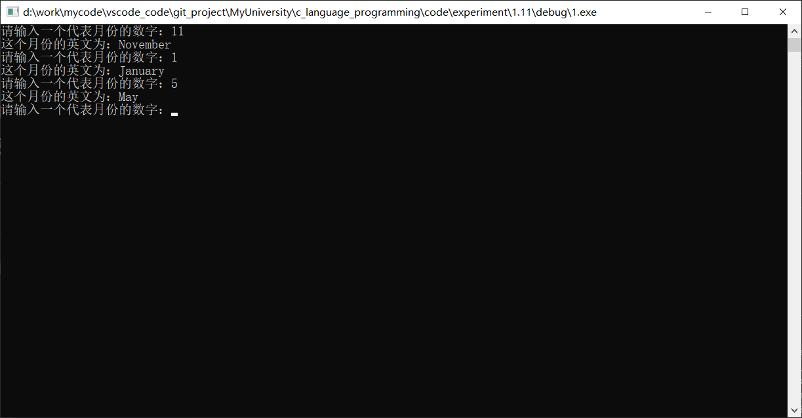
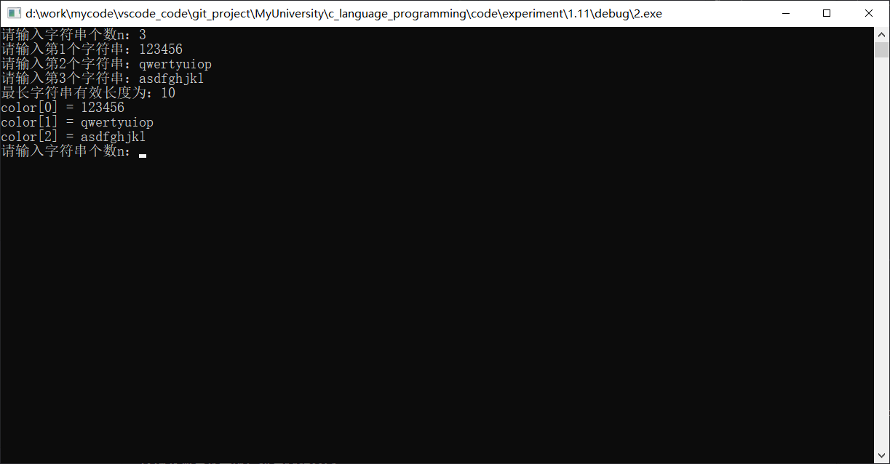
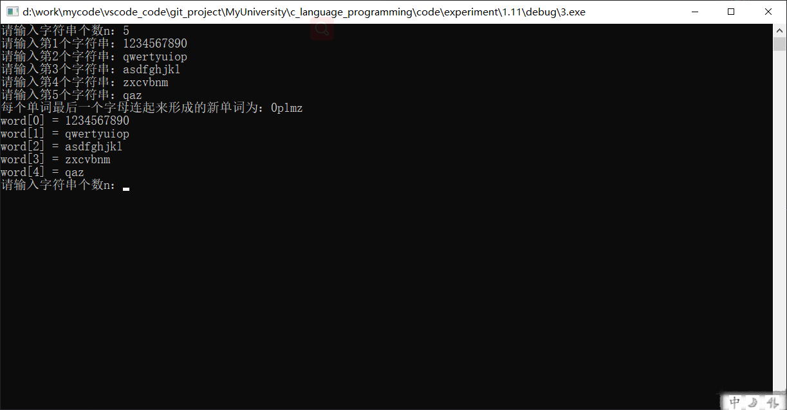
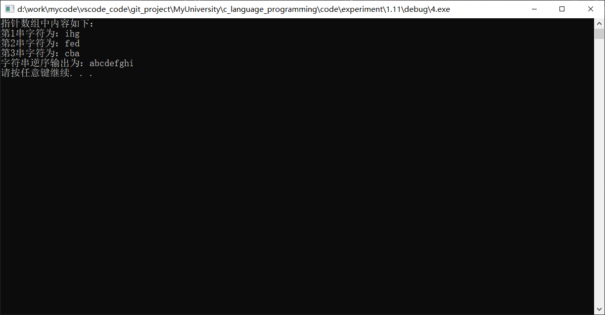

#  实验十一：字符串的运用

## 一、实验目的

1. 掌握数据和地址的关系；
2. 掌握字符串数组的定义、编写与使用；
3. 能够进行数组与指针的灵活应用；
4. 理解编译错误信息的含义，掌握简单C程序的查错方法；
5. 使用多组测试语句，并调试程序。

## 二、实验内容及要求

* 题目1：根据月份数字，输出对应的月份的英文。
* 题目2：求多个字符串中最长的字符串长度。
* 题目3：将多个字符串最后一个字符依序输出。
* 题目4：将多个字符串逆序处理，每个字符串逆序输出字符。
* 题目5：交换两数并求和。

## 三、[程序源代码](../../code/index.md)

### 第一题

@import "../../code/experiment/1.11/1.c"

### 第二题

@import "../../code/experiment/1.11/2.c"

### 第三题

@import "../../code/experiment/1.11/3.c"

### 第四题

@import "../../code/experiment/1.11/4.c"

### 第五题

@import "../../code/experiment/1.11/5.c"

## 四、运行结果、分析与结论

### 第一题运行结果

### 第二题运行结果

### 第三题运行结果

### 第四题运行结果

### 第五题运行结果

