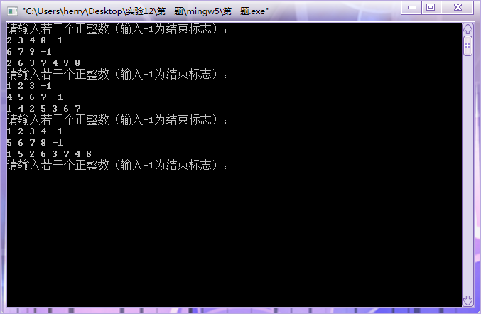
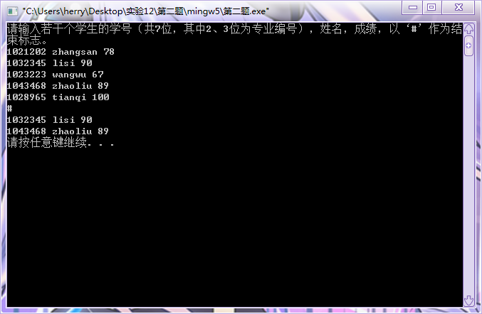
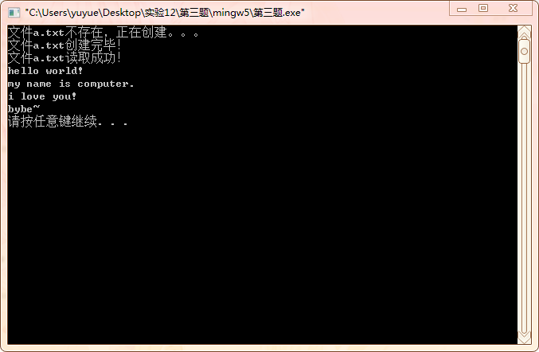
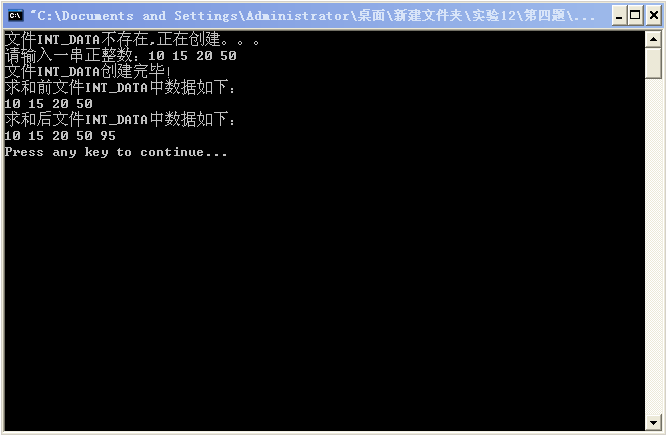
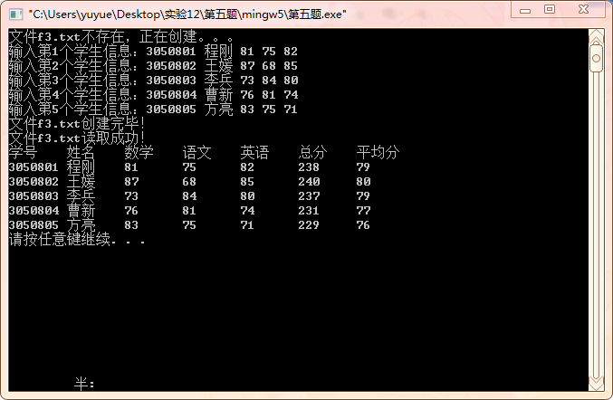

# [](../index.md) 实验十二：文件与链表的运用

## 一、实验目的

1. 掌握文件的建立与读取；
2. 掌握链表的定义、编写与使用；
3. 能够进行动态地址的申请释放；
4. 理解编译错误信息的含义，掌握简单C程序的查错方法；
5. 使用多组测试语句，并调试程序。

## 二、实验内容及要求

* 题目1：链表交叉：输入若干个正整数（输入-1为结束标志），建立两个链表，头指针分别为list1和list2。把两个链表的每个节点分别交叉后连成一个新链表输出。
  * 输入：
    * `2 4 6 8 -1`；
    * `3 5 7 -1`
  * 输出：`2 3 4 5 6 7 8`。
* 题目2：输入若干个学生的学号（共7位，其中2、3位为专业编号），姓名，成绩，以‘#’作为结束标志。将其生成一个链表，删除链表中专业编号为02的学生信息。
  * 输入：
    * `1021202 zhangsan 78`
    * `1032345 lisi 90`
    * `1023223 wangwu 67`
    * `1043468 zhaoliu 89`
    * `1028965 tianqi 100`
  * 输出：
    * `1032345 lisi 90`
    * `1043468 zhaoliu 89`
* 题目3：读取一个自创建的文本文件a.txt，显示在屏幕上。如果有大写字母，转换成小写字母后输出，并根据回车符统计文本文件的行数输出。
* 题目4：将文件中的数据求和并写入文件的末尾。
  * 文件INT_DATA中的数据：`10 15 20 50`。
  * 程序运行后，文件INT_DATA的数据：`10 15 20 50 95`。
* 题目5：统计成绩：从键盘输入以下5个学生的学号、姓名、数学、语文、英语成绩，写到文本文件f3.txt中，再从文件中读取数据，计算每个同学的总成绩和平均分，最后结果显示在屏幕上。输出：
  
    ```js
    学号    姓名 数学  语文  英语  总分  平均分
    3050801 程刚  81    75    82   238    79
    3050802 王媛  87    68    85   240    80
    3050803 李兵  73    84    80   237    79
    3050804 曹新  76    81    74   231    77
    3050805 方亮  83    75    71   229    76
    ```

## 三、[程序源代码](../../code/index.md)

### 第一题

@import "../../code/experiment/1.12/1.c"

### 第二题

@import "../../code/experiment/1.12/2.c"

### 第三题

@import "../../code/experiment/1.12/3.c"

### 第四题

@import "../../code/experiment/1.12/4.c"

### 第五题

@import "../../code/experiment/1.12/5.c"

## 四、运行结果、分析与结论

### 第一题运行结果



### 第二题运行结果



### 第三题运行结果



### 第四题运行结果



### 第五题运行结果


