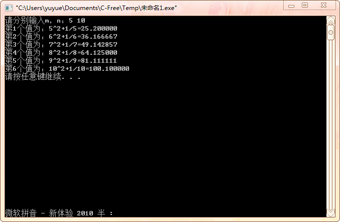
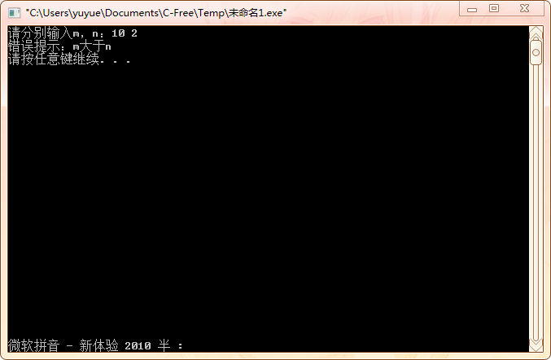
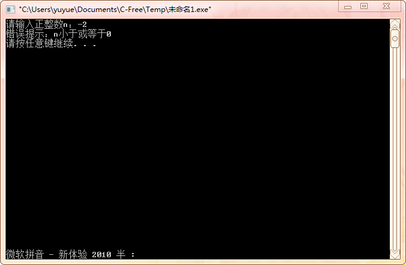

#  实验二：基本数据处理程序设计

## 一、实验目的

1. 掌握算术表达式和赋值表达式的使用；
2. 掌握基本输出函数的使用；
3. 能够编程实现简单的数据处理；
4. 理解编译错误信息的含义，掌握简单C程序的查错方法；
5. 学习调式程序。

## 二、实验内容及要求

* 题目1：输入两个正整数m和n，计算 $i^2+\frac{1}{i} \quad i\in[m,n]$
* 题目2：输入一个正整数n,计算 $\sum\limits_{i=1}^n{\frac{(-1)^{i-1}{i}}{2i-1}}$
* 题目3：输入一个正整数n,求 $\sum\limits_{i=1}^n{2^i}$
* 题目4：输入一个正整数n，求 $\sum\limits_{i=0}^n{i!}$

## 三、[程序源代码](../../code/index.md)

### 第一题

@import "../../code/experiment/1.2/1.c"

### 第二题

@import "../../code/experiment/1.2/2.c"

### 第三题

@import "../../code/experiment/1.2/3.c"

### 第四题

@import "../../code/experiment/1.2/4.c"

## 四、运行结果、分析与结论

### 第一题运行结果

分析与讨论：在计算1除以i时，1需写成1.0，把1/i转换成浮点型。

### 第二题运行结果

分析与讨论：在计算每一项时，需使用一个符号变量flag，且初始赋值为1.0，用来强制转换每一项为浮点型。

### 第三题运行结果

分析与讨论：此题若要使用函数pow()，需在文件开头引用头文件math.h。

### 第四题运行结果

分析与讨论：该题可以先自定义一个阶乘的函数，再在主函数里调用。

## 五、实验心得与体会

1. 如果数据类型不符，可以在数据前加（数据类型）进行数据类型的强制转换。
2. 调用本来就有的函数，需要在文件开头引用包含该函数的头文件。
3. 自定义函数如果写在调用该函数之前，可以不用写函数声明；如果写在调用该函数之后，必须在开头加上函数声明。
