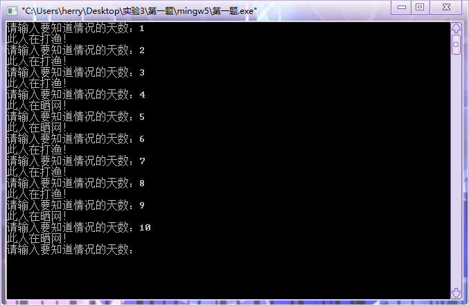
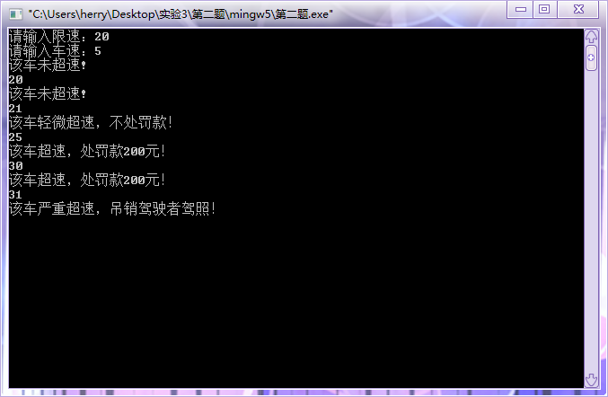
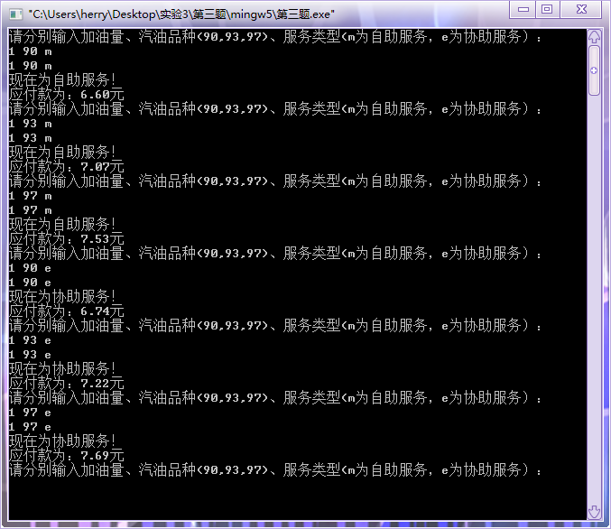

#  实验三：分支语句的运用

## 一、实验目的

1. 掌握算术表达式和赋值表达式的使用；
2. 掌握基本输出函数的使用；
3. 能够进行分支语句的简单应用；
4. 理解编译错误信息的含义，掌握简单C程序的查错方法；
5. 学习调式程序。

## 二、实验内容及要求

* 题目1：有句俗话说“三天打鱼两天晒网”。假设某人从某天起，开始“三天打鱼两天晒网”，问这个人在以后的第n天是“打鱼”还是晒网？
* 题目2：告诉公路超速处罚：行驶的机动车，超出本车道限速的10%处200罚款；若超出50%，就要吊销驾驶证。请输入两个整数，分别对应车速和限速，自动判断对机动车的处理。
* 题目3：假设90号汽油价格为6.95元/升， 93号汽油7.44元/升，97号汽油7.93元/升。为吸引顾客，某加油站推出自助服务和协助服务，分别可得到5%和3%的折扣。请编写程序，输入顾客的加油量a,汽油品种b(90,93,97)和服务类型c(m为自助服务，e为协助服务)，计算并输出应付款（保留小数点后2位）。

## 三、[程序源代码](../../code/index.md)

### 第一题

@import "../../code/experiment/1.3/1.c"

### 第二题

@import "../../code/experiment/1.3/2.c"

### 第三题

@import "../../code/experiment/1.3/3.c"

## 四、运行结果、分析与结论

### 第一题运行结果

### 第二题运行结果

### 第三题运行结果

