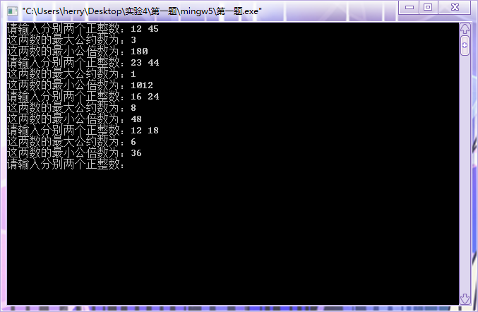
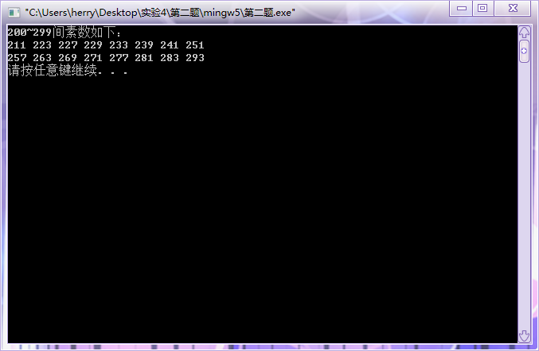
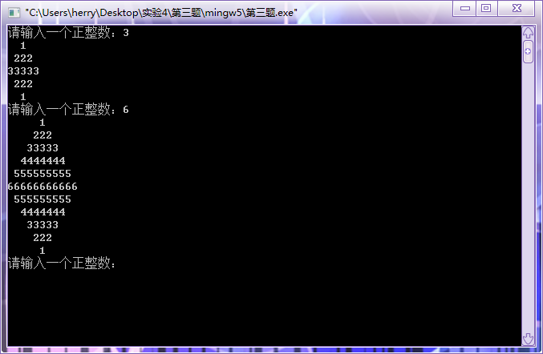
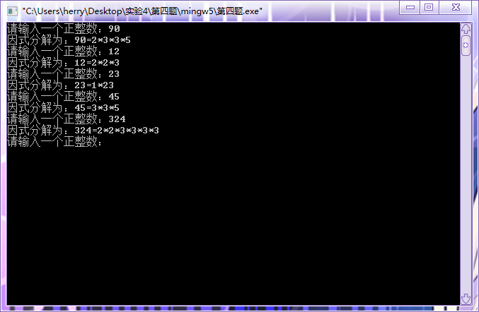

#  实验四：循环语句的运用

## 一、实验目的

1. 掌握算术表达式和赋值表达式的使用；
2. 掌握基本输入输出函数的使用；
3. 能够进行循环语句的简单应用；
4. 理解编译错误信息的含义，掌握简单C程序的查错方法；
5. 学习调试程序。

## 二、实验内容及要求

* 题目1：给两个正整数，求出其最大公约数与最小公倍数
* 题目2：一个整数如果不能被1和自身以外的所有整数所整除，那么这个数是素数。编写程序找出200~299之间的所有素数。（注意：200~299之间的所有素数，每8个数就换行。每一行第一个数字（如211  257）前无空格，每一行最后一个数字（如251  293）后面无空格。）
* 题目3：输入一个正整数n，输出由数字组成的菱形图案。其中，菱形图案当中一层的数字正好是输入的数字n。
题目4：输入一个正整数，分解质因数，输出该数质因数。例如，输入90，输出 $90=2*3*3*5$。

## 三、[程序源代码](../../code/index.md)

### 第一题

@import "../../code/experiment/1.4/1.c"

### 第二题

@import "../../code/experiment/1.4/2.c"

### 第三题

@import "../../code/experiment/1.4/3.c"

### 第四题

@import "../../code/experiment/1.4/4.c"

## 四、运行结果、分析与结论

### 第一题运行结果

### 第二题运行结果

### 第三题运行结果

### 第四题运行结果

