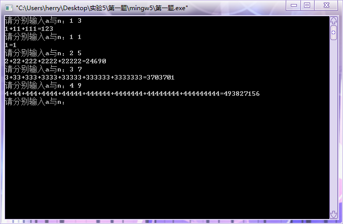
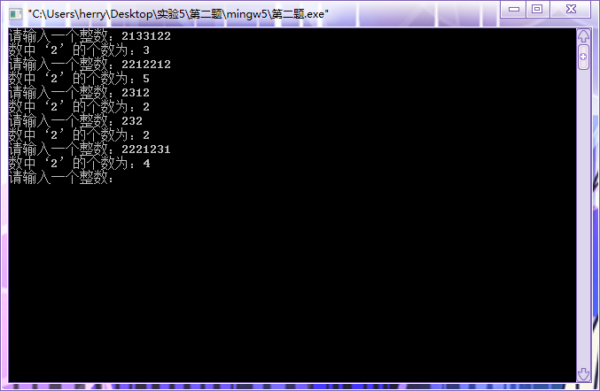
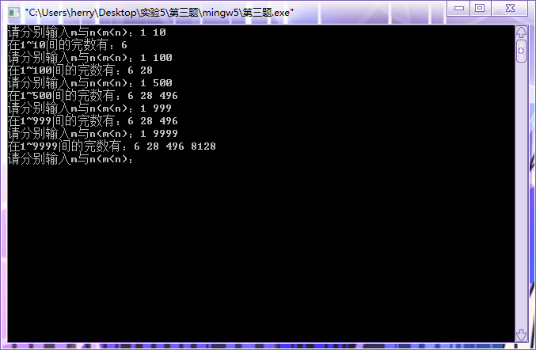
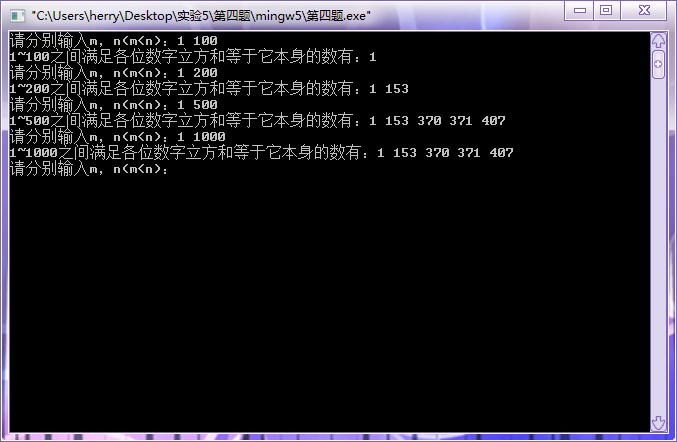
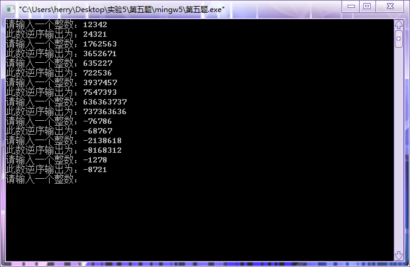

#  实验五：自定义函数的运用

## 一、实验目的

1. 掌握算术表达式和赋值表达式的使用；
2. 掌握基本自定义函数的编写与使用；
3. 能够进行分支与循环语句的简单应用；
4. 理解编译错误信息的含义，掌握简单C程序的查错方法；
5. 学习调试程序。

## 二、实验内容及要求

* 题目1：定义并调用函数fn(int a, int n),它的功能是返回aa....a（n个a），如fn(3,2)返回值是33。在主函数中，输入两个正整数a和n，求a + aa+aaa+...+aa....a(n个a)之和(假设数据都在整数大小范围内)。
* 题目2：定义并调用函数countdigit(number, digit),它的功能是统计整数number中数字digit的个数，如countdigit(10090, 0)的返回值是3. 在主函数中定义并调用该函数，统计任意一个输入整数中'2'的个数。
* 题目3：自定义函数factorsum(number),它的功能是返回number的因子和，如factorsum(12)的返回值是16（1+2+3+4+6）。 在主函数中，输入两个正整数m和n(m>=1, n<=1000)，调用factorsum函数，输出m-n之间的所有完数，完数就是因子和与它本身相等的数。
* 题目4：自定义函数is(number)判断number的各位数字立方和是否等于它本身，如is(121)返回值0，is(153)返回值1。 主函数输入两个正整数m和n(m>=1, n<=1000)，输出m-n之间的所有满足各位数字和等于它本身的数。
* 题目5：自定义函数reverse(number),它的功能是返回number的逆序数，如reverse(123)的返回值是321。 主函数中，输入一个任意整数，调用reverse函数，将该整数逆序输出。

## 三、[程序源代码](../../code/index.md)

### 第一题

@import "../../code/experiment/1.5/1.c"

### 第二题

@import "../../code/experiment/1.5/2.c"

### 第三题

@import "../../code/experiment/1.5/3.c"

### 第四题

@import "../../code/experiment/1.5/4.c"

### 第五题

@import "../../code/experiment/1.5/5.c"

## 四、运行结果、分析与结论

### 第一题运行结果

### 第二题运行结果

### 第三题运行结果

### 第四题运行结果

### 第五题运行结果

