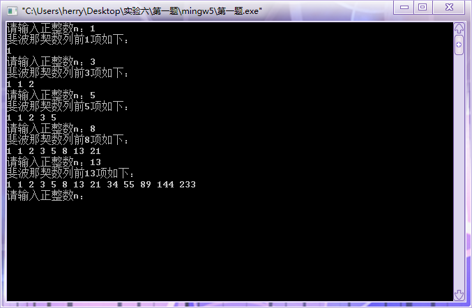
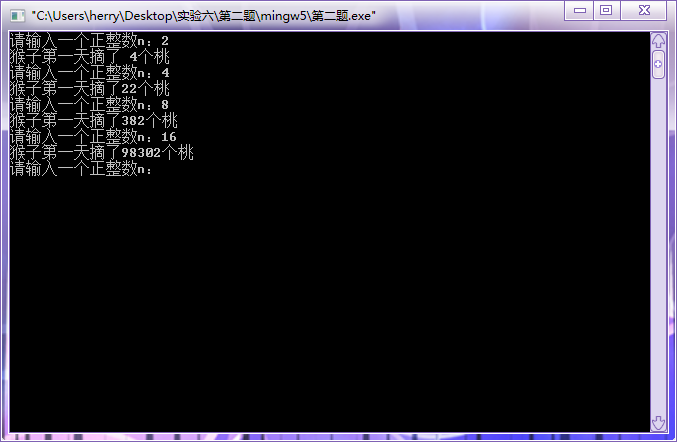
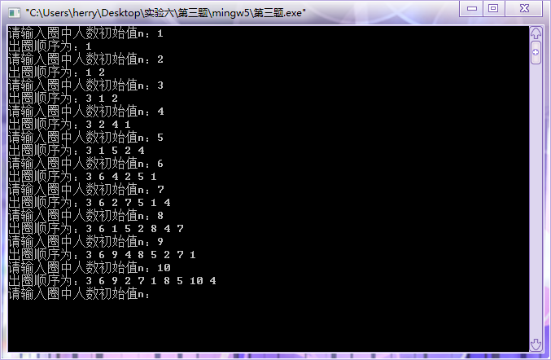
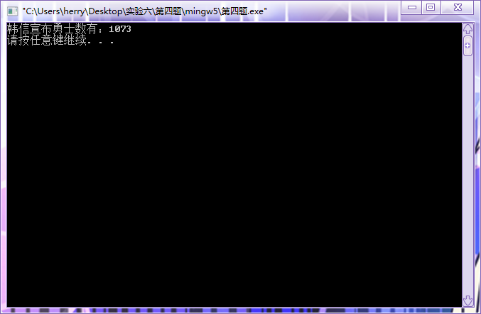
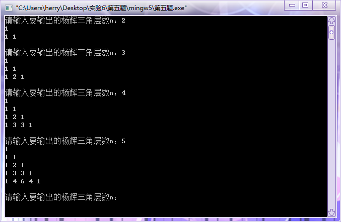
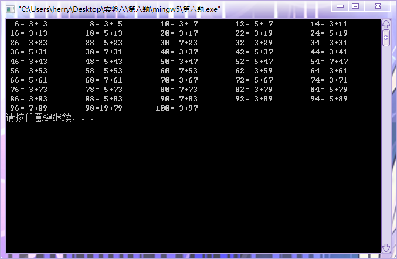
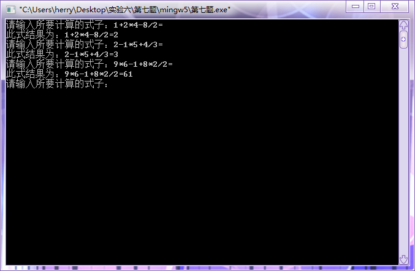

#  实验六：数组的运用

## 一、实验目的

1. 掌握算术表达式和赋值表达式的使用；
2. 掌握数组的定义、编写与使用；
3. 能够进行分支与循环语句的简单应用；
4. 理解编译错误信息的含义，掌握简单C程序的查错方法；
5. 学习调试程序。

## 二、实验内容及要求

* 题目1：输入n，求斐波那契数列前n项的值。斐波那契数列规律如下：1， 1， 2， 3， 5， 8， 13，21， 34，55......,从第三项开始，每一项都是前面两项的和。
* 题目2：猴子吃桃问题。猴子第一天摘下若干个桃子，当即吃了一半，还不过瘾，又多吃了一个。第二天早上又将剩下的桃子吃掉一半，又多吃了一个。以后每天早上都吃了前一天剩下的一半零一个。到第n天早上想再吃时，见只剩下一个桃子了。编写一个程序，求第一天共摘多少桃子。 
* 题目3：有n个人围成一圈，按顺序从1到n编好号。从第一个人开始报数，报到3的人退出圈子，下一个人从1开始报数，报到3的人退出圈子。如此下去，直到留下最后一个人。请按退出顺序输出退出圈子的人的编号。
* 题目4：秦朝末年，楚汉相争。有一次，韩信将1500名将士与楚王大将李锋交战。苦战一场，楚军不敌，败退回营，汉军也死伤四五百人，于是，韩信整顿兵马也返回大本营。当行至一山坡，忽有后军来报，说有楚军骑兵追来。只见远方尘土飞扬，杀声震天。汉军本来已十分疲惫，这时队伍大哗。韩信兵马到坡顶，见来敌不足五百骑，便急速点兵迎敌。他命令士兵3人一排，结果多出2名；接着命令士兵5人一排，结果多出3名；他又命令士兵7人一排，结果又多出2名。韩信马上向将士们宣布：我军有超过*名勇士，敌人不足五百，我们居高临下，以众击寡，一定能打败敌人。汉军本来就信服自己的统帅，这一来更认为韩信是“神仙下凡”、“神机妙算”。于是士气大振。一时间旌旗摇动，鼓声喧天，汉军步步逼近，楚军乱作一团。交战不久，楚军大败而逃。注意：输出一行，值为韩信宣布的勇士数(在1000与1100之间）
* 题目5：输入数据包含多个测试实例，每个测试实例的输入只包含一个正整数n（1<=n<=30），表示将要输出的杨辉三角的层数。对应于每一个输入，请输出相应层数的杨辉三角，每一层的整数之间用一个空格隔开，每一个杨辉三角后面加一个空行。
* 题目6：验证哥德巴赫猜想：任何一个不小于6的偶数均可表示为两个奇素数之和。例如6=3+3，8=3+5，…，18=5+13。将6～100之间的偶数都表示成2个素数之和，打印时一行打印5组。素数就是只能被1和自身整除的正整数，最小的素数是2。要求定义并调用函数prime(m)判断m是否为素数，当m为素数时返回1，否则返回0。
* 题目7：程序模拟简单运算器的工作：输入一个算式（没有空格），遇等号"="说明输入结束，输出结果。假设计算器只能进行加、减、乘、除运算，运算数和结果都是整数，4种运算符的优先级相同，按从左到右的顺序计算，每个输入数字的范围是0~9。

## 三、[程序源代码](../../code/index.md)

### 第一题

@import "../../code/experiment/1.6/1.c"

### 第二题

@import "../../code/experiment/1.6/2.c"

### 第三题

@import "../../code/experiment/1.6/3.c"

### 第四题

@import "../../code/experiment/1.6/4.c"

### 第五题

@import "../../code/experiment/1.6/5.c"

### 第六题

@import "../../code/experiment/1.6/6.c"

### 第七题

@import "../../code/experiment/1.6/7.c"

## 四、运行结果、分析与结论

### 第一题运行结果

### 第二题运行结果

### 第三题运行结果

### 第四题运行结果

### 第五题运行结果

### 第六题运行结果

### 第七题运行结果

