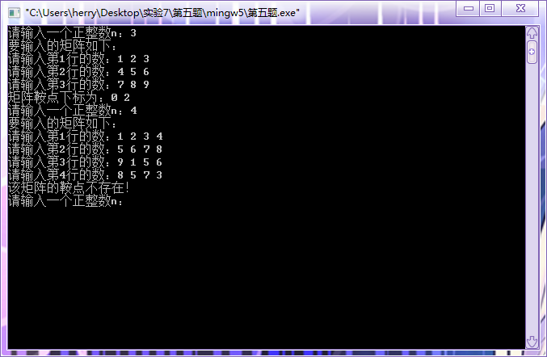

#  实验七：二维数组的运用

## 一、实验目的

1. 掌握算术表达式和赋值表达式的使用；
2. 掌握二维数组的定义、编写与使用；
3. 能够进行分支与循环语句的灵活应用；
4. 理解编译错误信息的含义，掌握简单C程序的查错方法；
5. 学习多组测试语句，并调试程序。

## 二、实验内容及要求

* 题目1：多组测试数据。第一行输入一个整数T表示测试数据组数，每组首先输入1个整数n,然后输入n个整数(不大于20），对于每组测试数据按照输入相反的顺序输出n个数据。
* 题目2：在给定的数组中删除一个数。多组测试，每组第一行输入1个整数n（n<20),然后是n个整数 第二行输入1个整数m 。删除在第一行的n个整数中第一次出现数字m并删除，然后按照顺序输出剩下的数。
* 题目3：每年5月份，省里都要举行程序设计竞赛。 为了让最优秀的学生去参加比赛，我们一般需要做一个选拔工作。 现在你来帮老师完成这个任务哦。多组测试数据，每组数据一行，该行先输入一个整数n （ n <= 30),表示参加选拔的同学人数。然后是n个整数表示选拔成绩。对于每组测试数据，请在一行从高到低输出他们的成绩。
* 题目4：输入一个m×n的矩阵，计算每行的和。将行号最高的行与矩阵的第一行进行位置交换，输出调整后的矩阵以及每行的和。先输入矩阵的行数、列数m和n（M，N均不超过10），另起一行后再输入一个m×n的整数矩阵，每列数据用空格隔开；每行数据用回车隔开。整理后的数据以及每行的和。
* 题目5：输入一个正整数n（1<= n <= 6）和n阶方阵a中的每一个元素，如果找到a的鞍点（鞍点的元素值在该行上最大，在该列上最小），就输出它的下标，否则输出“NO”（设a最多只有一个鞍点）。多组测试数据，每组输入一个正整数n，和n行n列的整数，每一行回车结束
* 题目6：把输入的字符按照反着顺序输出。多组测试数据，每组一行。按照输入的顺序反着输出各个字符
* 题目7：有一行电文，请将电文中大写字母按A→Z，B→Y，C→X, D→W,……，X→C，Y→B，Z→A，的规律译成密文，其他字符保持不变。多组测试数据，每组输入一行以回车结束的字符串（少于80个字符）。输出加密后的字符串。

## 三、[程序源代码](../../code/index.md)

### 第一题

@import "../../code/experiment/1.7/1.c"

### 第二题

@import "../../code/experiment/1.7/2.c"

### 第三题

@import "../../code/experiment/1.7/3.c"

### 第四题

@import "../../code/experiment/1.7/4.c"

### 第五题

@import "../../code/experiment/1.7/5.c"

### 第六题

@import "../../code/experiment/1.7/6.c"

### 第七题

@import "../../code/experiment/1.7/7.c"

## 四、运行结果、分析与结论

### 第一题运行结果

### 第二题运行结果

### 第三题运行结果

### 第四题运行结果

### 第五题运行结果

### 第六题运行结果

### 第七题运行结果

