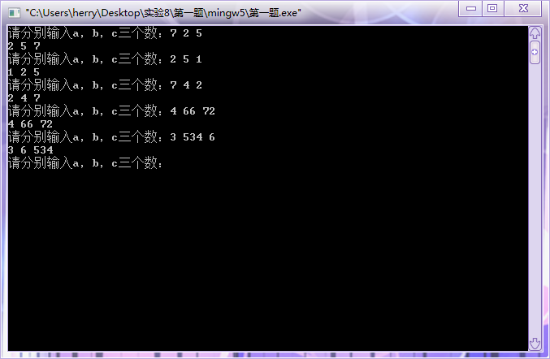
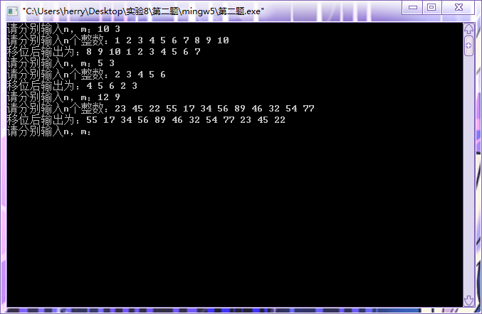
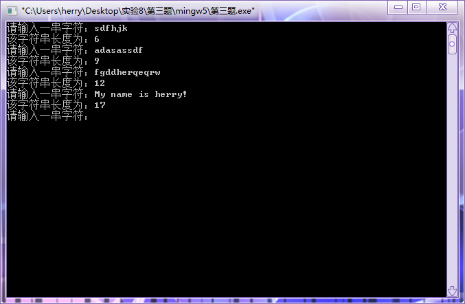
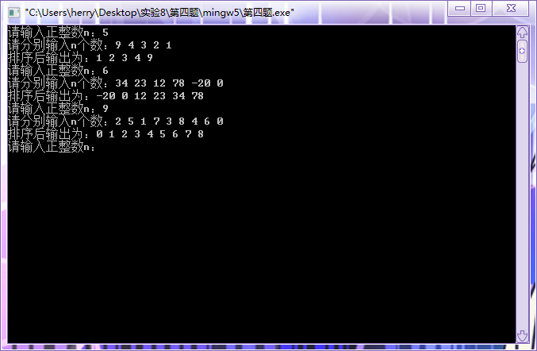
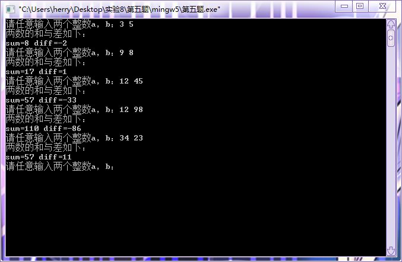

#  实验八：指针的运用

## 一、实验目的

1. 掌握数据和地址的关系；
2. 掌握指针的定义、编写与使用；
3. 能够进行指针的灵活应用；
4. 理解编译错误信息的含义，掌握简单C程序的查错方法；
5. 使用多组测试语句，并调试程序。

## 二、实验内容及要求

* 题目1：调用自定义交换函数`swap(int *p1, int *p2)`，完成三个整数从小到大排列。多组测试数据，每组输入三个任意整数。输出从小到大排列的三个数
* 题目2：调用自定义后移函数`move(int *a, int n, int m)`来进行循环移位，对n(n<20)个整数，使其前面各数顺序向后移m个位置，最后m个数变成最前面m个数，如下： n=10, m=3时：输入：1 2 3 4 5 6 7 8 9 10，输出：8 9 10 1 2 3 4 5 6 7。输入多组测试数据，每组先输入n(n < 20)和m(m < n)，再输入n个整数。输出循环移动m个数后的序列，数据间空格隔开。
* 题目3：自定义一个函数`int length（char *s)`,函数返回字符串s的长度。在main函数中输入字符串（长度小于80），调用该函数并输出其长度。多组测试数据，每组输入一个任意字符串(长度小于80)。输出字符串长度。
* 题目4：自定义函数`sort(int *p, int n)`，功能是对n个数排序。在main函数中，调用它，对输入的任意个数排序。多组测试数据，先输入n(n<100),再输入n个任意整数。输出从小到大排列后的数组。
* 题目5：自定义一个计算两个数和、差的函数`sumDiff(int op1, int op2, int *pSum, int *pDiff)`,功能是求两个数op1、op2的和、差，其中`*psum`和`*pdiff`是计算得出的和与差。在main函数中，调用它，计算输入的任意两个数的和与差。多组测试数据，每组输入两个任意整数。输出两个数的和与差，空格隔开。

## 三、[程序源代码](../../code/index.md)

### 第一题

@import "../../code/experiment/1.8/1.c"

### 第二题

@import "../../code/experiment/1.8/2.c"

### 第三题

@import "../../code/experiment/1.8/3.c"

### 第四题

@import "../../code/experiment/1.8/4.c"

### 第五题

@import "../../code/experiment/1.8/5.c"

## 四、运行结果、分析与结论

### 第一题运行结果

### 第二题运行结果

### 第三题运行结果

### 第四题运行结果

### 第五题运行结果

