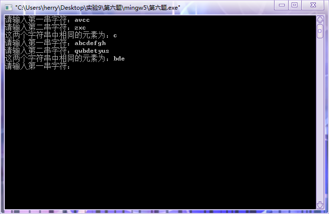

#  实验九：结构体的运用

## 一、实验目的

1. 掌握数据和地址的关系；
2. 掌握结构体的定义、编写与使用；
3. 能够进行函数与指针的灵活应用；
4. 理解编译错误信息的含义，掌握简单C程序的查错方法；
5. 使用多组测试语句，并调试程序。

## 二、实验内容及要求

* 题目1：输入一个字符串，将该字符串从第m个字符开始的全部字符复制成另一个字符串。m有用户输入，值小于字符串的长度。要求编写一个函数`mcopy(char *src, char *dst, int m)`来完成。多组测试数据，每组输入一个数字m和字符串(字符串长度小于80)。输出新生成的字符串
题目2：定义一个结构体变量（包括年、月、日）,输入一个日期，计算并输出该日是本年中的第几天. 多组测试数据，每组输入年-月-日。输出其在该年中对应的天数。
* 题目3：定义一个学生结构体，含学号（字符型）、姓名、成绩(整型)。从键盘输入数字n(n<20)，并输入n个学生的信息，输出最高分和最低分同学的信息。输入一个n,接着输入n个学生的信息。输出最高分和最低分同学的学号、姓名、成绩。
* 题目4：定义一个学生结构体，含学号（一维字符数组）、姓名、成绩（整型）。从键盘输入n(n<20)，再输入n个学生的信息，按学生成绩从小到大顺序输出学生信息。输入一个n,接着输入n个学生的信息。按成绩从小到大顺序输出学生信息。
* 题目5：设计函数`char* f(long int x,char *p);`x是待转化的十进制长整数，p指向某个字符数组的首元素，要求返回由长整型x转化为十六进制的字符串。
* 题目6：自编写一个函数`char* findSame(char *s1,char *s2);`它能够将两个字符串中的相同字符返回。

## 三、[程序源代码](../../code/index.md)

### 第一题

@import "../../code/experiment/1.9/1.c"

### 第二题

@import "../../code/experiment/1.9/2.c"

### 第三题

@import "../../code/experiment/1.9/3.c"

### 第四题

@import "../../code/experiment/1.9/4.c"

### 第五题

@import "../../code/experiment/1.9/5.c"

### 第六题

@import "../../code/experiment/1.9/6.c"

## 四、运行结果、分析与结论

### 第一题运行结果

### 第二题运行结果

### 第三题运行结果

### 第四题运行结果

### 第五题运行结果

### 第六题运行结果

