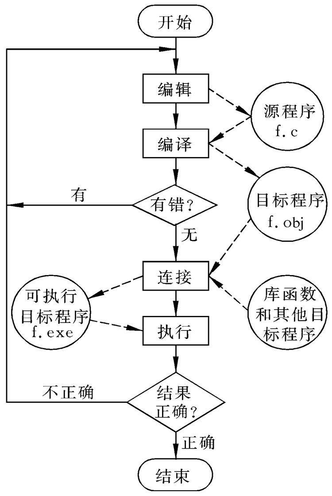

# The first PPT

---

presentation:
    enableSpeakerNotes: true
    slideNumber: true
  
---

<!-- slide -->

<font style="font-size: 96px;">
    第一章</br>
    <font color="#CC0000">C语言概述</font>
</font>

<!-- slide -->

<font color="#CC0000" style="font-size: 84px;">
   本章要点</br>
</font>
</br>

* C语言的特点
* C程序的结构
* 在计算机上运行C程序的方法

<!-- slide -->

<font color="#CC0000" style="font-size: 84px;">
   主要内容</br>
</font>
</br>

* 1.1 C语言出现的历史背景
* 1.2 C程序的特点
* 1.3 简单的C语言程序介绍
* 1.4 运行C程序的步骤和方法

<!-- slide -->

<font color="#CC0000" style="font-size: 72px;">
   1.1 C语言出现的历史背景</br>
</font>

* C语言是国际上广泛流行的高级语言。
* C语言是在B语言的基础上发展起来的。
* B （BCPL）语言是1970年由美国贝尔实验室设计的, 并用于编写了第一个UNIX操作系统,在PDP 7上实现。优点：精练,接近硬件，缺点：过于简单,数据无类型。
* 1973年贝尔实验室的D.M.Ritchie 在B语言的基础上设计出了C语言，对B取长补短，并用之改写了原来用汇编编写的UNIX，(即UNIX第5版），但仅在贝尔实验室使用。

<!-- slide -->

<font color="#CC0000" style="font-size: 72px;">
   1.1 C语言出现的历史背景</br>
</font>

* 1975年UNIX第6版发布,C优点突出引起关注。
* 1977年出现了《可移植C语言编译程序》 ，推动了UNIX在各种机器上实现 ，C语言也得到推广，其发展相辅相成。
* 1978年影响深远的名著《The C Programming Language》由 Brian W.Kernighan和Dennis M.Ritchie 合著,被称为标准C。
* 之后，C语言先后移植到大、中、小、微型计算机上,已独立于UNIX和PDP，风靡世界,成为最广泛的几种计算机语言之一。

<!-- slide -->

<font color="#CC0000" style="font-size: 72px;">
   1.1 C语言出现的历史背景</br>
</font>

* 1983年,美国国家标准化协会(ANSI)根据C语言各种版本对C的发展和扩充,制定了新的标准ANSI C ，比标准C有了很大的发展。
* 1988年K & R按照 ANSI C修改了他们的《The C Programming Language》。
* 1987年,ANSI公布了新标准——87 ANSI C。
* 1990年，国际标准化组织接受了87 ANSI C为ISO C 的标准(ISO9899—1990)。
* 1994年，ISO又修订了C语言标准。
* 目前流行的C语言编译系统大多是以ANSI C为基础进行开发的。

<!-- slide -->

<font color="#CC0000" style="font-size: 72px;">
   1.2 C语言的特点</br>
</font>

* 语言简洁、紧凑,使用方便、灵活。 32个关键字、9种控制语句,程序形式自由。
* 运算符丰富。34种运算符 。
* 数据类型丰富,具有现代语言的各种数据结构。
* 具有结构化的控制语句 ，是完全模块化和结构化的语言。 
* 语法限制不太严格,程序设计自由度大。

<!-- slide -->

<font color="#CC0000" style="font-size: 72px;">
   1.2 C语言的特点</br>
</font>

* 允许直接访问物理地址,能进行位操作,能实现汇编语言的大部分功能,可直接对硬件进行操作。兼有高级和低级语言的特点 。
* 目标代码质量高,程序执行效率高。只比汇编程序生成的目标代码效率低10％-20%。
* 程序可移植性好(与汇编语言比)。基本上不做修改就能用于各种型号的计算机和各种操作系统。

<!-- slide -->

<font color="#CC0000" style="font-size: 72px;">
   1.2 C语言的特点</br>
</font>

* 问题：既然有面向对象的C++语言，为什么还要学习C语言？
* 解释一：C++是由于开发大型应用软件的需要而产生的，并不是所有的人都要去编写大型软件。
* 解释二：面向对象的基础是面向过程。C++是面向对象的语言，C是面向过程的， C++学起来比C语言困难得多，所以不太适合程序设计的初学者。

<!-- slide -->

<font color="#CC0000" style="font-size: 72px;">
   1.3 简单的C语言程序介绍</br>
</font>

```c
#incldue <stdio.h>                     /* 文件包含 */
int main()                             /* 主函数 */
{                                      /* 函数体开始 */
    printf("This is a C program.\n");  /* 输出语句 */
    return 0;                          /* 返回语句 */
}                                      /* 函数体结束 */
```

* <font style="font-size: 32px;">output： This is a C program.
* 说明：main-主函数名 int-函数类型
* 每个C程序必须有一个主函数main
* { }是函数开始和结束的标志,不可省
* 每个C语句以分号结束
* 使用标准库函数时应在程序开头一行写：#include <stdio.h></font>

<!-- slide -->

```c
// 例1.2  求两数之和
#include <stdio.h>
int main() {                    /* 求两数之和 */
    int a, b, sum;              /* 声明，定义变量为整型 */
    a = 123; b = 456;
    sum = a+b;
    printf("sum is %d\n",sum);
    return 0;
}
```

* output: sum is 579
* 说明: /\*……\*/表示注释。注释只是给人看的,对编译和运行不起作用。所以可以用汉字或英文字符表示，可以出现在一行中的最右侧，也可以单独成为一行。

<!-- slide -->

```c
// 例1.3 求2个数中较大者。
#incldue <stdio.h>
int main() {
    int max(int x,int y) { int z; if (x>y) z=x; else z=y; return z; };
    int a, b, c; scanf("%d,%d",&a,&b);
    c = max(a,b); printf("max=%d\n",c);
    return 0;
}
```

* input: 8,5
* output: max=8
* 说明：本程序包括main和被调用函数max两个函数。max函数的作用是将x和y中较大者的值赋给变量z。return语句将z的值返回给主调函数main。

<!-- slide -->

<font color="#CC0000" style="font-size: 72px;">
   1.3 简单的C语言程序介绍</br>
</font>

* C程序
  * (1) C程序是由函数构成的。 这使得程序容易实现模块化。 
  * (2) 一个函数由两部分组成:
    * 函数的首部：例1.3中的max函数首部int max(int x,int y)
    * 函数体：花括号内的部分。若一个函数有多个花括号,则最外层的一对花括号为函数体的范围。
      * 声明部分：int a,b,c;
      * 执行部分：由若干个语句组成。

<!-- slide -->

<font color="#CC0000" style="font-size: 72px;">
   1.3 简单的C语言程序介绍</br>
</font>

* 注意：
* 函数的声明部分和执行部分都可缺省，例如：
void dump() {}
* 这是一个空函数,什么也不做,但是合法的函数。

<!-- slide -->

<font color="#CC0000" style="font-size: 72px;">
   1.3 简单的C语言程序介绍</br>
</font>

* 小结：
* (3) C程序总是从main函数开始执行的,与main函数的位置无关。
* (4) C程序书写格式自由,一行内可以写几个语句, 一个语句可以分写在多行上，C程序没有行号。
* (5) 每个语句和数据声明的最后必须有一个分号。
* (6) C语言本身没有输入输出语句。输入和输出的操作是由库函数scanf和printf等函数来完成的。C对输入输出实行“函数化”。

<!-- slide style="text-align:left" -->

<center>
    <font color="#CC0000" style="font-size: 72px;">
    1.4 运行C程序的步骤和方法</br>
    </font>
</center>
</br>

* 1.4.1 运行Ｃ程序的步骤
  * 上机输入与编辑源程序
  * 对源程序进行编译
  * 与库函数连接
  * 运行目标程序

<!-- slide -->

</img>

<!-- slide -->

<font color="#CC0000" style="font-size: 72px;">
   1.4 运行C程序的步骤和方法</br>
</font>

* 1.4.2上机运行Ｃ程序的方法
  * <font style="font-size: 36px;">目前使用的大多数C编译系统都是集成环境(IDE)的。可以用不同的编译系统对C程序进行操作。
  * 常用的有Turbo C 2.0、Turbo C++ 3.0、Visual C++等。
    * Turbo C++ 3.0：是一个集成环境，它具有方便、直观和易用的界面，虽然它也是DOS环境下的集成环境，但是可以把启动Turbo C++ 3.0 集成环境的DOS执行文件tc.exe生成快捷方式，也可以用鼠标操作。
    * Visual C++：也可以用Visual C++对C程序进行编译。</font>
