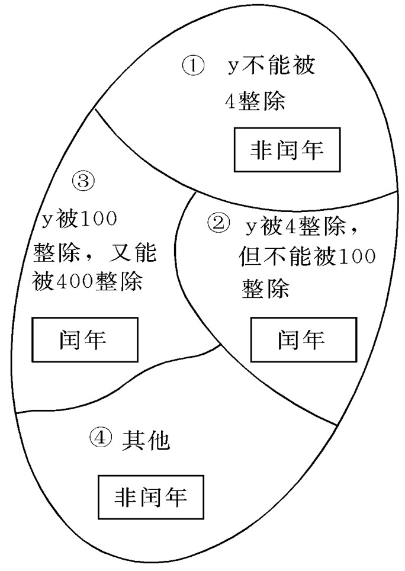

# The second PPT

---

presentation:
    enableSpeakerNotes: true
    slideNumber: true

---

<!-- slide -->

    第二章 
    程序的灵魂--算法

<!-- slide -->

   本章要点 

 

* 算法的概念
* 算法的表示
* 结构化程序设计方法

<!-- slide -->

   主要内容 

 

* 2.1 算法的概念
* 2.2 简单算法举例
* 2.3 算法的特性
* 2.4 怎样表示一个算法
* 2.5 化程序设计方法

<!-- slide style="text-align:left;" -->

一个程序应包括两个方面的内容:

* 对数据的描述：数据结构(data structure)
* 对操作的描述：算法(algorithm)

    著名计算机科学家沃思提出一个公式: 
    数据结构 + 算法 = 程序

    完整的程序设计应该是: 
    
        数据结构＋算法＋程序设计方法＋语言工具
    

<!-- slide style="text-align:left;" -->

    
        2.1 算法的概念 
    

广义地说，为解决一个问题而采取的方法和步骤，就称为“算法”。
对同一个问题，可有不同的解题方法和步骤

$例：求\sum\limits_{n=0}^{100}n$

* 方法1：1+2，+3，+4，一直加到100&emsp;加99次
* 方法2：100+(1+99)+(2+98)+…+(49 +51)+50
  &emsp;&emsp;&emsp;&ensp;= 100 + 49×100 +50&emsp;加51次

<!-- slide style="text-align:left;" -->

    
        2.1 算法的概念 
    

为了有效地进行解题，不仅需要保证算法正确，还要考虑算法的质量，选择合适的算法。希望方法简单，运算步骤少。

计算机算法可分为两大类别：

* 数值运算算法：求数值解，例如求方程的根、求函数的定积分等。
* 非数值运算：包括的面十分广泛，最常见的是用于事务管理领域，例如图书检索、人事管理、行车调度管理等。

<!-- slide style="text-align:left;" -->

    
        2.2 简单算法举例 
    

$例2.1：求1×2×3×4×5$

* 步骤1：先求1×2，得到结果2
* 步骤2：将步骤1得到的乘积2再乘以3，得到结果6
* 步骤3：将6再乘以4，得24
* 步骤4：将24再乘以5，得120

如果要求1×2×…×1000，则要写999个步骤，太繁琐

<!-- slide style="text-align:left;" -->

可以设两个变量：一个变量代表被乘数，一个变量代表乘数。不另设变量存放乘积结果，而直接将每一步骤的乘积放在被乘数变量中。设p为被乘数，i为乘数。用循环算法来求结果, 算法可改写：

* S1： 1→ p
* S2： 2 → i
* S3： p×i→ p
* S4： i+1 → i
* S5：如果i不大于5，返回重新执行步骤S3以及其后的步骤S4和S5；否则，算法结束。

最后得到p的值就是5!的值。

<!-- slide style="text-align:left;" -->

如果题目改为：求1×3×5×……×1000算法只需作很少的改动：

* S1：1→p
* S2：3 → i
* S3：p×i → p
* S4：i+2 → i
* S5：若i≤1000，返回S3。否则，结束。

算法精炼！

<!-- slide style="text-align:left;" -->

用这种方法表示的算法具有通用性、灵活性。S3到S5组成一个循环，在实现算法时 要反复多次执行S3，S4，S5等步骤，直到某一时刻，执行S5步骤时经过判断，乘数i已超过规定的数值而不返回S3步骤为止。此时算法结束，变量p的值就是所求结果。

<!-- slide style="text-align:left;" -->

例2.2  有50个学生，要求将他们之中成绩在80分以上者打印出来。设n表示学号， $n_1$代表第一个学生学号， $n_i$代表第i个学生学号。用g代表学生成绩 ， $g_i$代表第i个学生成绩，算法表示如下:

* S1：1 → i
* S2：如果gi ≥80，则打印ni ，否则不打印。
* S3：i+1 → i
* S4：如果i≤50，返回S2，继续执行。否则算法结束

变量i作为下标，用来控制序号(第几个学生，第几个成绩)。当i超过50时，表示 已对50个学生的成绩处理完毕，算法结束。

<!-- slide style="text-align:left;" -->

例2.3  判定2000～2500年中的每一年是否闰年，将结果输出。

分析：闰年的条件是：(1)能被4整除，但不能被100整除的年份都是闰年，如1996,2004年是闰年；(2)能被100整除，又能被400整除的年份是闰年。如1600,2000年是闰年。不符合这两个条件的年份不是闰年。

变量i作为下标，用来控制序号(第几个学生，第几个成绩)。当i超过50时，表示 已对50个学生的成绩处理完毕，算法结束。

<!-- slide style="text-align:left;" -->

设y为被检测的年份，算法可表示如下 ：

* S1：2000 → y
* S2：若y不能被4整除，则输出y “不是闰年”。然后转到S6。
* S3：若y能被4整除，不能被100整除，则输出y “是闰年”。然后转到S6。
* S4：若y能被100整除，又能被400整除，输出y“是闰年”，否则输出“不是闰年”。 然后转到S6。
* S5: 输出y “不是闰年”。
* S6：y+1 → y
* S7：当y≤2500时，转S2继续执行，如y＞2500，算法停止。

<!-- slide style="text-align:left;" -->

以上算法中每做一步都分别分离出一些范围(巳能判定为闰年或非闰年)，逐步缩小范围，直至执行S5时，只可能是非闰年。
“其它” 包括能被4整除，又能被100整除，而不能被400整除的那些年份(如1990) 是非闰年

    

<!-- slide style="text-align:left;" -->

$例2.4：求 \newcommand{\FS}[2]{\displaystyle\frac{#1}{#2}}1-\FS{1}{2}+\FS{1}{3}-\FS{1}{4}+\dotsc\dotsc-\FS{1}{99}+\FS{1}{100}$

* S1：sign=1
* S2：sum=1
* S3：deno=2
* S4：sign=(-1)×sign
* S5：term=sign×(1/deno)
* S6：sum=sum+term
* S7：deno=deno+1
* S8：若deno≤100返回S4，否则算法结束

单词作变量名，以使算法更易于理解：
sum表示累加和，deno是英文分母（denom inator）缩写，sign代表数值的符号，term代表某一项。  

<!-- slide style="text-align:left;" -->
例2.5  对一个大于或等于3的正整数，判断它是不是一个素数。

概念：所谓素数，是指除了1和该数本身之外，不能被其它任何整数整除的数。例如，13是素数。因为它不能被2，3，4，…，12整除。

分析：判断一个数n(n≥3)是否素数的方法：
  将n作为被除数，将2到(n-1)各个整数轮流作为除数，如果都不能被整除，则n为素数。
