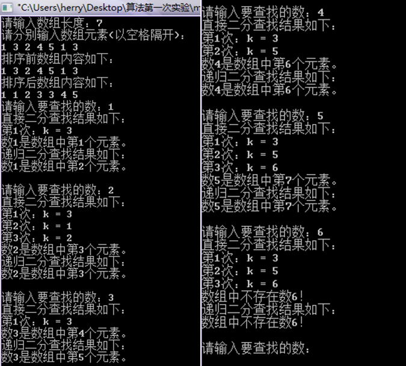
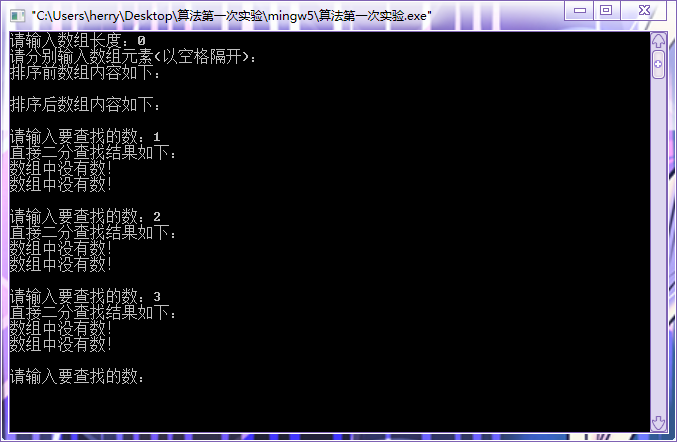

#  实验1: 二分搜索算法

## 一、实验目的

1. 理解分治算法的概念和基本要素；
2. 理解递归的概念；
3. 掌握设计有效算法的分治策略；
4. 通过二分搜索技术学习分治策略设计技巧；；

## 二、实验要求

1. 使用二分搜索算法查找任意N个有序数列中的指定元素。
2. 通过上机实验进行算法实现。上机实验进行算法实现。
3. 保存和打印出程序的运行结果，并结合程序进行分析，上交实验报告。
4. 至少使用两种方法进行编程。

## 三、实验原理

&emsp;&emsp;二分搜索算法也称为折半查找法，它充分利用了元素间的次序关系，采用分治策略，可在最坏的情况下用O(log n)完成搜索任务。
&emsp;&emsp;【基本思想】将n个元素分成个数大致相同的两半，取a[n/2]与欲查找的x作比较，如果x=a[n/2]则找到x，算法终止。如果x<a[n/2]，则我们只要在数组a的左半部继续搜索x（这里假设数组元素呈升序排列）。如果x>a[n/2]，则我们只要在数组a的右半部继续搜索x。
&emsp;&emsp;二分搜索法的应用极其广泛，而且它的思想易于理解。第一个二分搜索算法早在1946 年就出现了，但是第一个完全正确的二分搜索算法直到1962年才出现。Bentley在他的著作《Writing Correct Programs》中写道，90%的计算机专家不能在2小时内写出完全正确的二分搜索算法。问题的关键在于准确地制定各次查找范围的边界以及终止条件的确定，正确地归纳奇偶数的各种情况，其实整理后可以发现它的具体算法是很直观的。
&emsp;&emsp;方法一：直接查找；
&emsp;&emsp;方法二：递归查找；

## 三、[程序源代码](../../code/index.md)

## 四、运行结果与分析

     
     

## 五、心得与体会

1. 使用二分法找数，主要考虑一方面是数组边界，另一方面考虑是循环退出条件。
2. 如果数组一开始选择左闭右闭区间，在最后两个相邻数判断时会出现无法退出循环的请况，原因在于两相邻数之和相除永远为小的数，若小的数不符合，则循环无法跳出。为了跳出循环，需额外增加判断语句。
3. 因此数组选择左闭右开，每次二分都把数组恒分为小于中间数或大于等于中间数，其循环退出条件为区间内是否有数，为区分数组中没有该数的情况，需嵌套判断区间中最后的数是否符合。
