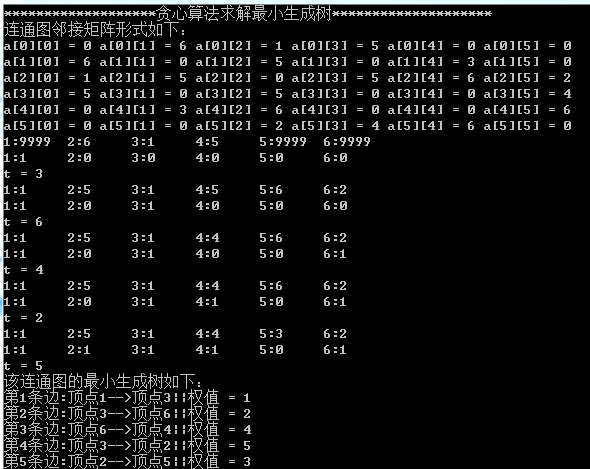
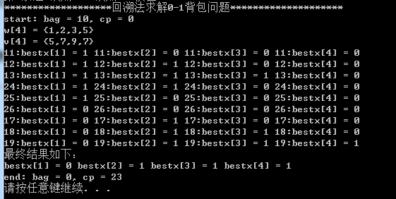

#  实验3: 贪心算法与回溯法

## 一、实验目的

1. 理解贪心算法与回溯法的概念；
2. 掌握贪心算法与回溯法的基本要素；
3. 掌握贪心算法与回溯法的解题步骤与算法柜架；
4. 通过应用范例学习贪心算法与回溯法的设计技巧与策略；

## 二、实验要求

1. 使用贪心算法解决最小生成树问题。
2. 使用回溯法解决0-1背包问题。
3. 通过上机实验进行贪心算法与回溯算法实现。
4. 保存和打印出程序的运行结果，并结合程序进行分析，上交实验报告。

## 三、实验原理

### 3.1 贪心算法

&emsp;&emsp;贪心算法（又称贪婪算法）是指，在对问题求解时，总是做出在当前看来是最好的选择。也就是说，不从整体最优上加以考虑，他所做出的仅是在某种意义上的局部最优解。贪心算法不是对所有问题都能得到整体最优解，但对范围相当广泛的许多问题他能产生整体最优解或者是整体最优解的近似解。

### 3.2 贪心算法的基本思想

1. 建立数学模型来描述问题。
2. 把求解的问题分成若干个子问题。
3. 对每一子问题求解，得到子问题的局部最优解。
4. 把子问题的解局部最优解合成原来解问题的一个解。

### 3.3. 回溯法

&emsp;&emsp;回溯法是一个既带有系统性又带有跳跃性的的搜索算法。它在包含问题的所有解的解空间树中，按照深度优先的策略，从根结点出发搜索解空间树。算法搜索至解空间树的任一结点时，总是先判断该结点是否肯定不包含问题的解。如果肯定不包含，则跳过对以该结点为根的子树的系统搜索，逐层向其祖先结点回溯。否则，进入该子树，继续按深度优先的策略进行搜索。回溯法在用来求问题的所有解时，要回溯到根，且根结点的所有子树都已被搜索遍才结束。而回溯法在用来求问题的任一解时，只要搜索到问题的一个解就可以结束。这种以深度优先的方式系统地搜索问题的解的算法称为回溯法，它适用于解一些组合数较大的问题。

### 3.4 回溯法的基本思想

&emsp;&emsp;确定了解空间的组织结构后，回溯法就从开始结点（根结点）出发，以深度优先的方式搜索整个解空间。这个开始结点就成为一个活结点，同时也成为当前的扩展结点。在当前的扩展结点处，搜索向纵深方向移至一个新结点。这个新结点就成为一个新的活结点，并成为当前扩展结点。如果在当前的扩展结点处不能再向纵深方向移动，则当前扩展结点就成为死结点。换句话说，这个结点不再是一个活结点。此时，应往回移动（回溯）至最近的一个活结点处，并使这个活结点成为当前的扩展结点。回溯法即以这种工作方式递归地在解空间中搜索，直至找到所要求的解或解空间中已没有活结点时为止。

### 3.5 回溯法解题步骤

1. 针对所给问题，定义问题的解空间；
2. 确定易于搜索的解空间结构；
3. 以深度优先的方式搜索解空间，并且在搜索过程中用剪枝函数避免无效搜索；

## 三、[程序源代码](../../code/index.md)

## 四、运行结果与分析

     
    贪心算法解决最小生成树

     
    回溯法解决0—1背包问题

## 五、心得与体会

1. 本次实验让我对贪心算法与回溯法有了更深刻的理解。
2. 对最小生成树的理解不再局限于上学期对算法的掌握，而是实际运用的熟练，这次存储连通图的方式邻接矩阵，其实在连通图在边稀疏的情况下，用邻接表可以节省更多空间，而且在生成最小生成树时也能获得相对比较快的速度。除了贪心用的Prim算法外，还可以用Kruskal算法解该问题，经过我在草稿上的推演，这种算法更适合求边稀疏的图。
3. 在使用回溯法求0-1背包问题是我不在局限用递归方法，而是使用while()命令进行迭代求解，让代码表达更加清晰明了。
