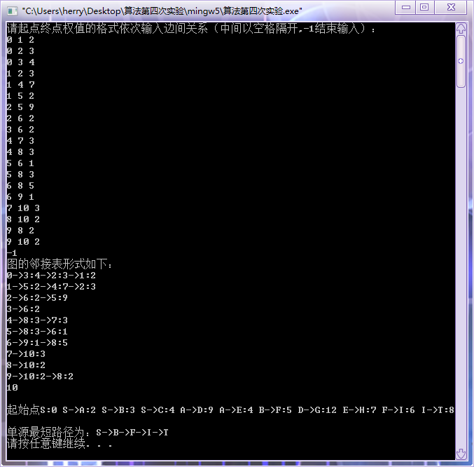

#  实验4: 单源最短路径问题

## 一、实验目的

1. 理解分支限界法的剪枝搜索策略；
2. 掌握分支限界法的算法柜架；
3. 掌握分支限界法的算法步骤；
4. 通过应用范例学习动态规划算法的设计技巧与策略；

## 二、实验要求

1. 使用分支限界法解决单源最短路径问题。
2. 通过上机实验进行算法实现。
3. 保存和打印出程序的运行结果，并结合程序进行分析，上交实验报告。

## 三、实验原理

### 3.1 分支限界法的基本思想

#### 3.1.1 分支限界法与回溯法的不同

1. 求解目标：回溯法的求解目标是找出解空间树中满足约束条件的所有解，而分支限界法的求解目标则是找出满足约束条件的一个解，或是在满足约束条件的解中找出在某种意义下的最优解。
2. 搜索方式的不同：回溯法以深度优先的方式搜索解空间树，而分支限界法则以广度优先或以最小耗费优先的方式搜索解空间树。

#### 3.1.2 分支限界法基本思想

&emsp;&emsp;分支限界法常以广度优先或以最小耗费（最大效益）优先的方式搜索问题的解空间树。
&emsp;&emsp;在分支限界法中，每一个活结点只有一次机会成为扩展结点。活结点一旦成为扩展结点，就一次性产生其所有儿子结点。在这些儿子结点中，导致不可行解或导致非最优解的儿子结点被舍弃，其余儿子结点被加入活结点表中。
&emsp;&emsp;此后，从活结点表中取下一结点成为当前扩展结点，并重复上述结点扩展过程。这个过程一直持续到找到所需的解或活结点表为空时为止。

#### 3.1.3 常见的两种分支限界法

1. 队列式(FIFO)分支限界法
   按照队列先进先出（FIFO）原则选取下一个节点为扩展节点。
2. 优先队列式分支限界法
   按照优先队列中规定的优先级选取优先级最高的节点成为当前扩展节点。

## 三、[程序源代码](../../code/index.md)

## 四、运行结果与分析

     

## 五、心得与体会

1. 通过这个实验让我对分支界限法有了更深刻的理解，能够通过该方法删去明显不符合条件的路径，在较小时间复杂度的情况下求得一条最短路径。
2. 透过邻接表的方式保存图的信息，很好的减少了空间复杂度，且在遍历时更加容易。
