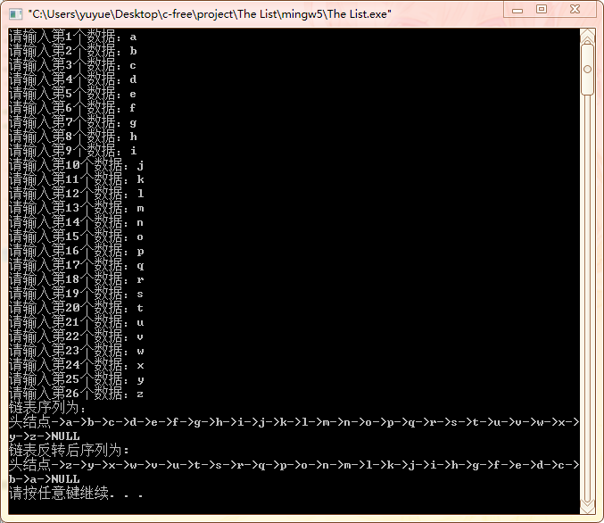

#  实验1: 链表的建立与操作

## 一、实验目的

1. 掌握链表数据结构的建立及操作。

## 二、实验要求

1. 利用链表的原空间进行链表的反转 。

## 三、实验内容

1. 设计一个将输入数据建立成链表、并依次输出链表数据、利用原空间把链表反转的程序。

## 四、实验步骤

1．掌握链表的数据结构
2．建立空链表
3．用头插法向链表插入数据，实验数据:链表数据为a，b，c,……,x，y，z
4．依次输出链表中的数据
5．利用链表原空间进行对链表进行反转
6．依次输出反转后的链表数据，以判断反转操作的正确性，注意反转后，链表的第一个和最后一个元素是否正确
7．把链表的数据元素改为学生结构体或者学生类，测试并解决发现的问题，使得程序正确。

## 五、[程序源代码](../../code/index.md)

## 六、运行结果与分析

     

## 七、心得与体会

1. 再输入单个字符用代码`scanf("%c",&a);`时，需要用`getchar();`吸收空格。
2. L是头指针，其储存头结点的地址，即`L->next`指向第一个结点。
3. 在进行链表反转时，指针需要先连再断，防止链表中间断链。
