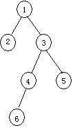
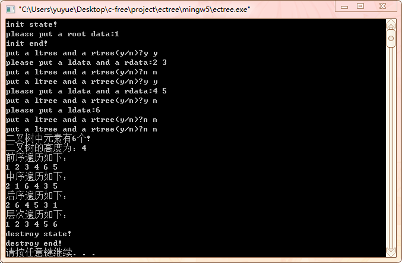

#  实验2: 树的二叉链表表示及其遍历

## 一、实验目的

1. 掌握二叉树的链式存储结构及其遍历

## 二、实验要求

1. 二叉树的链式存储实现方法。

## 三、实验内容

1. 【基本任务】用二叉链表存储结构表示下图所示二叉树的，
并用递归方法输出三种遍历结果。
2. 【进阶任务】在完成以上基本要求的基础上，实现层次遍历
（思想：利用队列的思想，根结点不空则入队，队不空则出队并遍历队首结点，然后分别判断队首结点的左右子树是否为空，不空则入队；直至队列为空。则遍历完成。（为了简单可以采用顺序存储队列）。）

     

## 四、实验步骤

1. 掌握二叉树的数据结构
2. 初始化二叉树
3. 建立二叉树，实验数据: 1，2，3，4，5，6
4. 用递归实现二叉树的前序遍历、中序遍历，后序遍历。
5. 用队列的原理实现二叉树的层次遍历
6. 销毁二叉树
7. 把二叉树的数据元素改为学生结构体或者学生类，测试并解决发现的问题，使得程序正确。  

## 五、[程序源代码](../../code/index.md)

## 六、运行结果与分析

     

## 七、心得与体会

1. 再输入单个字符用代码`scanf("%c",&a);`时，需要用`getchar();`吸收空格。
2. 在函数中想改变主函数的数值需把其地址传入函数
3. 进行层次遍历的队列构建时，数据域中存放二叉树结点的地址.
4. 出入队分别判断其满或空。
