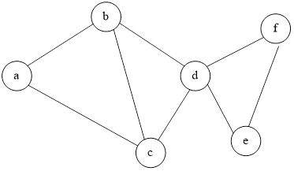
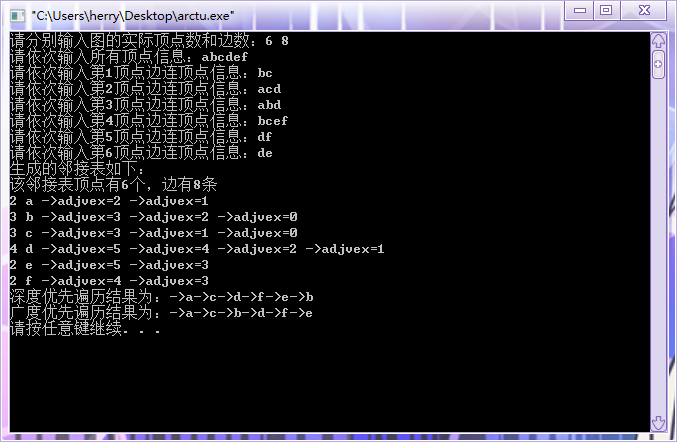

# [](../index.md) 实验3: 图的建立与操作

## 一、实验目的

1. 在熟悉图的存储、遍历、及其应用的基础上，通过键盘输入数据，建立一个无向图的邻接表，输出该邻接表，并计算每个顶点的度。达到巩固图的存储思想及其存储实现。

## 二、实验要求

&emsp;&emsp;完成下图的邻接表表示，并计算每个顶点的度。
&emsp;&emsp;【附加要求】进行深度优先和广度优先遍历

<center>
    </br>
</center>

## 三、实验提示

### 3.1 类型定义（邻接表存储）

```c++
#define MAX_VERTEX_NUM 8 //顶点最大个数

typedef struct ArcNode
{
int adjvex;
struct ArcNode *nextarc;
int weight; //边的权
}ArcNode; //表结点

#define VertexType char //顶点元素类型

typedef struct VNode
{
int degree;//顶点的度，入度
VertexType data;
ArcNode *firstarc;
}VNode/*头结点*/,AdjList[MAX_VERTEX_NUM]; 

typedef struct{
AdjList vertices;
int vexnum,arcnum;//顶点的实际数，边的实际数
}ALGraph;
```

## 四、实验步骤

1. 输入图中顶点信息，完成邻接表的VNode内容的初始化。
2. 根据图中边的信息，把各边的信息链到firstarc指针链上，同时统计degree
3. 输出邻接表。
4. 分别用深度优先与广度优先遍历邻接表。

## 五、[程序源代码](../../code/index.md)

## 六、运行结果与分析

<center>
    </br>
</center>

## 七、心得与体会

1. 为防止出现未知错误，在使用输入函数时，后面需要用`getchar();`吸收多余字符
2. 邻接表的广度优先遍历可以使用类队列的数据结构实现层次遍历
3. 邻接表在建立时，需要防止边连接的错漏
4. 在使用malloc申请内存之后，若内存不需要了需用`free()`函数释放内存
