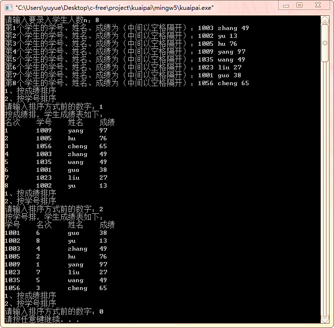

#  实验4: 快速排序

## 一、实验目的

1. 在掌握各种排序方法的排序过程的基础上，完成快速排序算法程序设计。
2. 能够对排序算法进行基本的复杂度分析。

## 二、实验要求

&emsp;&emsp;设计一个算法，在顺序表存储结构上实现快速排序。排序数据为学生的考试成绩单。成绩单由学生的学号、姓名和成绩组成，设计一个程序对给定的n个学生的成绩单按照名次列打印出每个学生的名次、学号、姓名和成绩。
&emsp;&emsp;【附加要求】不采用运算法重载的方式，而是定义compare函数指针，通过传给quicksort函数指针，完成排序。
&emsp;&emsp;【快速排序】在待排序记录序列中任取一个记录作为枢轴，以它作为比较的“基准”，将待排序划分为左右两个子序列，使行左边子序列中记录的关键字均小于等于枢轴，右边子序列中各记录的关键字都大于等于枢轴。对所划分的两组分别重复上述过程，直到各个序列的记录个数为1时为止。

## 三、实验步骤

1. 输入待排序的记录，初始化学生信息
2. 选择排序方式（按学号排序或按成绩排序）
3. 排序
   1. 并选择第一个记录的关键字作为pivotkey记录 ，存储在学生信息顺序表的第零个位置
   2. 从high指向的记录开始,向前找到第一个关键字的值小于Pivotkey的记录,将其放到low指向的位置。
   3. 再从low指向的记录开始,向后找到第一个关键字的值大于Pivotkey的记录,将其放到high指向的位置。
   4. 重复2、3，直到low=high，将枢轴记录放在low或high指向的位置
   5. 返回中间值，把学生信息顺序表一分为二，分别重复2、3、4，进行递归操作，直到整个记录有序为止。
   6. 输出排序记录，完成比较。
4. 在选择排序方式时，输入字符0，退出程序。

## 四、[程序源代码](../../code/index.md)

## 五、运行结果与分析

     

## 六、心得与体会

1. 为防止出现未知错误，在使用输入函数时，后面需要用`getchar();`吸收多余字符。
2. 在编程时，可以在一趟排序完成后可以输出顺序表，通过比较观察，进行纠错与代码优化
3. 若用非递归实现快速排序，可以构建一个特殊的栈来存储中间数据。
4. 在使用malloc申请内存之后，若内存不需要了需用`free()`函数释放内存
