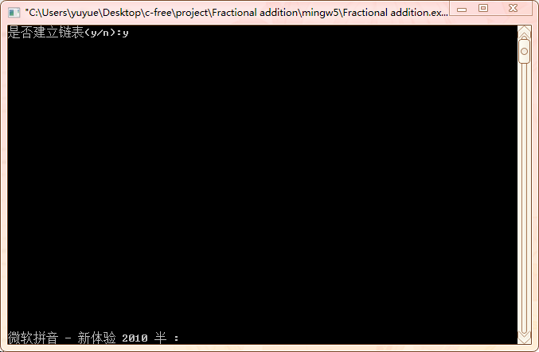

#  Fractional Addition程序测试

## 一、[程序源代码](../../code/index.md)

## 二、实验截图

### 2.1 链表初始化

     

### 2.2 一个分数的化简

#### 2.2.1 化为最简真分数

     

#### 2.2.2 化为最简带分数

     

### 2.3 多个分数的加法

#### 2.3.1 其和为真分数

     

#### 2.3.2 其和为整数

     

#### 2.3.3 其和为带分数

     

