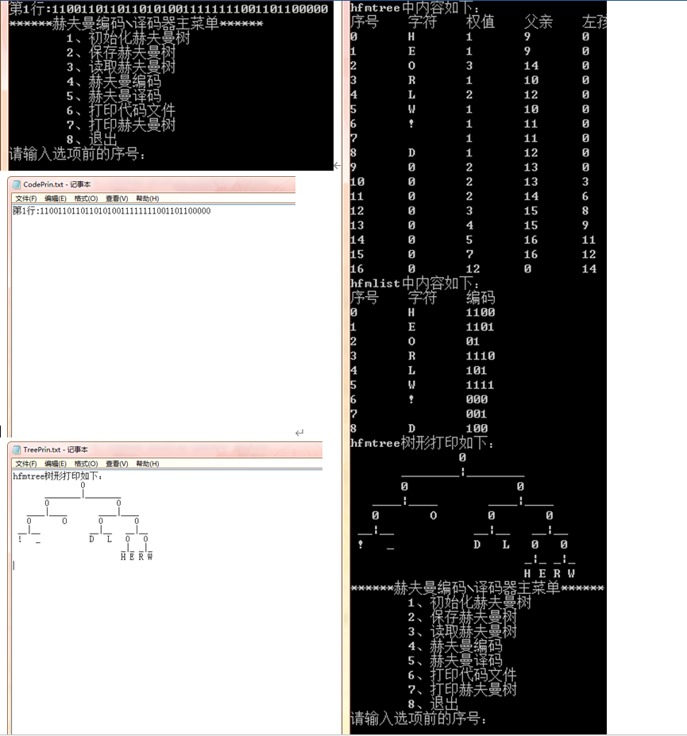

#  实现赫夫曼编码、译码以及树形打印

## 一、需求分析

1. 初始化哈夫曼树以及哈夫曼编码表
2. 实现储存/读取哈夫曼树以及哈夫曼编码表
3. 实现哈夫曼编码/译码并保存编码与译文
4. 打印并保存哈夫曼编码后的译文代码（每行50个字符）
5. 树形打印哈夫曼树并保存

## 二、概要设计

1. 头文件head.h中包括引用系统库里的头文件，宏定义，储存结构
定义和函数声明。
2. 文件main.app中包括主函数和菜单函数，实现打印菜单和功能选
择。
3. 文件huffmantree.app包括与哈夫曼树相关的函数，实现初始化哈
夫曼树以及哈夫曼编码表。
4. 文件BandY.appbao包括编码与译码的函数，实现哈夫曼编码与译
码并保存编码与译文。
5. 文件SandL.app包括储存与读取的函数，实现哈夫曼树与哈夫曼编
码表的储存与读取。
6. 文件dayin.app包括打印相关的函数，实现打印哈夫曼编码后的译
文代码与树形打印哈夫曼树并保存。
7. 除头文件外，其他文件由头文件相联系。

## 三、程序说明

&emsp;&emsp;该程序一开始运行进入主菜单：

1. 为初始化哈夫曼树
初始化哈夫曼树，先输入编码表的字符个数，然后按“码+权”（例：A64）的方式依次输入权码。若输入正确会提示成功；不符时会提示选项不存在，请输入1再输入y删除错误生成的哈夫曼树，在输入1重新初始化。
2. 为保存哈夫曼树
保存哈夫曼树的前提是内存中存在哈夫曼树，否则会提示并返回主菜单。
3. 为读取哈夫曼树
读取哈夫曼树的前提是.exe程序同目录存在文件hfmTree.txt，否则会提示并返回主菜单。
4. 为编码
编码先检查.exe同目录下文件ToBeTran.txt是否存在，存在则直接读取，不存在则提示并要求输入待编码字符串（不要输入初始化时未定义的字符）；再检查内存中是否存在哈夫曼树，存在则直接编码并保存在文件CodeFile.txt中；不存在会读取哈夫曼树。
5. 为译码
译码先检查.exe同目录下文件CodeFile.txt是否存在，存在则直接读取，不存在则先编码；再检查内存中是否存在哈夫曼树，不存在会读取哈夫曼树；存在则直接译码并保存在文件TextFile.txt中。
6. 为打印编码后字符串
打印编码后字符串先检查.exe同目录下文件CodeFile.txt是否存在，存在则直接读取，不存在则先编码；再检查内存中是否存在哈夫曼树，不存在会读取哈夫曼树；存在则直接编码并保存在文件CodePrin.txt中。
7. 为树形打印哈夫曼树
树形打印哈夫曼树先检查内存中是否存在哈夫曼树，不存在会读取哈夫曼树；不存在则直接打印哈夫曼树与编码表的数组形式，还有哈夫曼树的树状形式并保存在文件 TreePrin.txt中。
8. 为退出
9. 其他输入报错并提示重新输入。

## 四、[程序源代码](../../code/index.md)

## 五、详细设计与调试分析

### 5.1 初始化哈夫曼树

1. 先通过主菜单输入1进入函数`void init_hfmtree(hfmtree *HT);`
2. 按提示输入权码表
3. 接着进入函数`void init_body(hfmtree *HT,quanma *qm);`，初始化树的主体，即申请2n-1个结构体hfmnode的空间大小的数组T，前n个为叶子结点并通过权码表赋予权码，其他为其他结点并初始化。再通过函数`void select1(htnode *T,int n,int *s1,int *s2);`在T[0,n]中选择weight最小的结点s1与第二小的结点s2，分别作为一个其他结点的左右孩子，左右孩子weight之和为这个结点的weight，之后在选择中删除作为孩子两个结点并把这个父结点加入选择。由此直到哈夫曼树的主体构建完成，会提示`init_tree successed!`。（本函数还会计算每个结点的深度，主要为树状打印做准备。）
4. 再进入函数`void init_list(hfmtree *HT);`，初始化编码表，通过树的主体，从叶子结点反向追踪到根节点，并依次给每个字符申请动态地址用以储存其编码。编码表构建完毕后，会提示`init_list successed!`。
5. 哈夫曼树初始化后会提示`Init_hfmtree successed!`，并返回主菜单。

6. 若内存中存在哈夫曼树再输入1会提示是否删除，若输入y或Y则会进入函数`void free_hfmtree(hfmtree *HT);`，这个函数包含删除树主体的函数`void free_body(hfmtree *HT);`与删除编码表的函数`void free_list(hfmtree *HT);`，会提示后返回主菜单。

### 5.2 保存/读取哈夫曼树

1. 保存通过函数`void save_hfmtree(hfmtree *HT);`实现，主要使用库函数fprintf进行储存。通过if语句判断，若内存中不存在哈夫曼树则会报错并返回主菜单；若存在文件hfmTree.txt，则要求选择是否覆盖。
2. 读取通过函数`void load_hfmtree(hfmtree *HT);`实现，主要根据文件保存格式读取树的主体部分，有效内容用库函数fscanf读取，无效内容用库函数fgets或fgetc消除。通过if语句判断，若不存在文件hfmTree.txt则会报错并返回主菜单，若读取成功则通过树的主体经过函数`void init_list(hfmtree *HT);`，初始化编码表；若内存中存在哈夫曼树，则要求选择是否覆盖。

### 5.3 编码/译码

1. 编码通过函数`void save_codefile(hfmtree *HT);`实现，读取文件ToBeTran.txt中待编码的字符，再逐个字符对照编码表把对应的编码写入文件CodeFile.txt，编码完成输出报文与编码且返回主菜单。通过if语句判断，若文件ToBeTran.txt不存在则要求输入待编码字符串（不要输入初始化时未定义的字符）；若内存中不存在哈夫曼树则读取哈夫曼树。
2. 译码通过函数`void load_codefile(hfmtree *HT);`实现，读取文件CodeFile.txt中待译码的字符，根据读取内容逐个字符在根结点中开始遍历，‘0’往左子树走，‘1’往右子树走，直到遍历到叶结点，在文件TextFile.txt中打印叶结点字符，并重新从根结点开始遍历，如此重复直到读取内容读到最后，译码完成输出编码与译文且返回主菜单。通过if语句判断，若文件CodeFile.txt不存在则先编码；若内存中不存在哈夫曼树则读取哈夫曼树。

### 5.4 打印

1. 打印文件编码通过函数`void dayin_hfmcode(hfmtree *HT);`实现，先读取文件CodeFile.txt，再按五十个字符一行打印在屏幕上并保存在文件CodePrin.txt中，打印完成返回主菜单。通过if语句判断，若文件CodeFile.txt不存在则先编码。
2. 树形打印哈夫曼树通过函数`void dayin_hfmtree(hfmtree *HT);`实现，先在屏幕上输出内存中数组形式的树主体和编码表，再通过队列把哈夫曼树每个结点按层次遍历储存在数组p中，同时根据每个结点的深度统计每层的字符个数。通过分析我找到不管是字符、空格还是分隔符的打印都遵行相似的规律，即“2深度-a+b”，a根据实际规律选择（基本是打印字符所在层数“+1”或“-1”），b可能是“+1”、“-1”、“0”,详细内容见源代码里文件dayin.app里函数`void dayin_hfmtree(hfmtree *HT);`的定义。叶子节点打印相对应字符，其他节点打印标识符‘0’通过if语句判断，若内存中不存在哈夫曼树则读取哈夫曼树。

### 5.5 其他函数

1. 函数`void change(int *a,int *b);`通过位运算‘^’，实现两个整型变量位置的交换。
2. 函数`int chengfang(int n,int m);`通过for语句实现乘方。

## 六、实验心得与体会（总结）

&emsp;&emsp;整个数据结构课程设计制作下来，个人感觉最困难有三点：
&emsp;&emsp;其一是初始化哈夫曼树时，哈夫曼树的储存方式的选择，如何完整而便捷储存哈夫曼树。我先设计了结构体hfmtree，里面包括叶子结点的个数、结点总个数、树的主体的首地址和编码表的首地址，再分别设计结构体hfmnode作为每个结点的储存方式和二维指针hfmlist作为编码表的储存方式，为我之后的功能实现做好了准备。
&emsp;&emsp;其二是读取时，如何在保证文件可读性的情况下精确略过文件中无效内容，读取其中有效内容。我是用fgets与fgetc文件读取函数和printf屏幕显示函数，逐步逐行判断读取是否正确，并对应修改代码，由此最终保证读取文件不出错，为之后的功能调试提供了极大的方便。
&emsp;&emsp;其三是树形打印哈夫曼树的设计，我在打印时发现直接打印无法确定每个结点字符的位置，除非在储存哈夫曼树时就顺便计算每个结点所在的层数和每层的序号，但如此会极大的复杂代码与储存结构。因此之后我在用队列遍历哈夫曼树时把其补成了满二叉树，没有结点的位置用‘-1’代替，如此就解决了结点位置问题。之后再根据我分析出的规律与if判断打印出了树形哈夫曼树。
&emsp;&emsp;除此以外，我在主菜单选择与判断界面加入了类似输入错误可以重新输入的功能。类似代码和效果如下：

&emsp;&emsp;历时两周时间完成这一课程设计，让我收获颇丰，对结构体、文件处理函数、内存、多文件管理都有了更深入的理解。
