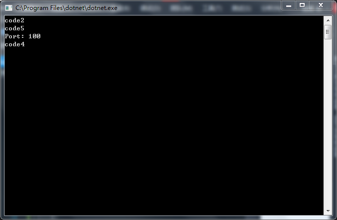

# [](../index.md) 实验2: 继承、多态与委托

## 一、实验目的

1. 掌握C#中各种成员的写法；
2. 掌握C#继承和多态概念；
3. 掌握C#委托和事件的用法；
4. 掌握常用接口的使用方法。

## 二、[程序源代码](../../code/index.md)

## 三、实验内容

### 1、定义以下结构与类

1. Point结构，包含：
两个double类型实例变量x和y，代表点的二维坐标；
一个Point类型静态常量Orign，代表原点；
带两个double参数的构造方法；
重写ToString方法，输出格式Point(x: 1.0, y:1.0)
2. Shape抽象类，包含：
一个double类型属性Area，可读取面积；
一个double类型属性Perimeter，可读取周长；
一个方法Contains(double x, double y)，判断参数所组成的点是否在图形内。
以上均为抽象成员。
3. Rect类，继承Shape抽象类并实现所有抽象成员，并包含：
一个Point2D类型的属性TopLeft，代表矩形的左上角点；
两个double类型属性Width和Height，代表矩形长和宽；
重写ToString方法，输出格式Rect[TopLeft: Point(x: 1.0, y:1.0), Width:1.0, Height: 1.0]
4. Circle类，继承Shape抽象类并实现所有抽象成员，并包含：
一个Point2D类型的属性Center，代表圆心坐标；
一个double类型属性Radius，可读写圆半径；
一个构造方法，接收指定坐标和半径；
一个无参构造方法，调用上个构造方法，创建一个默认圆，圆心在原点，半径为1。
重写ToString方法，输出格式Cirle[Center: Point(x: 1.0, y:1.0), Radius: 1.0, Area: 3.14259]
5. 在Main方法中创建矩形与圆，声明为Shape变量，测试其成员。

### 2、单例类的编写

设计模式（Design Pattern）是一套被反复使用、多数人知晓的、经过分类的、代码设计经验的总结。使用设计模式的目的：为了代码可重用性、让代码更容易被他人理解、保证代码可靠性。
前人总结的一种典型模式是单例模式（Singleton），其设计意图是保证一个类仅有一个实例，并提供一个访问它的全局访问点。

1. 首先，该Singleton的构造函数必须是私有的，以保证客户程序不会通过new()操作产生一个实例，达到实现单例的目的；
2. 因为静态变量的生命周期跟整个应用程序的生命周期是一样的，所以可以定义一个私有的静态全局变量instance来保存该类的唯一实例；
3. 必须提供一个全局函数访问获得该实例，并且在该函数提供控制实例数量的功能，即通过if语句判断instance是否已被实例化，如果没有则可以同new（）创建一个实例；否则，直接向客户返回一个实例。
4. 在Main方法中得到两个单例类实例，检查它们是否相等。

### 3、练习接口的使用

1. Array类的Sort方法需要数组中的元素实现IComparable接口。设计一个Person类，带有Name和Salary属性，还带有Birthday属性（DateTime类型），使之实现IComparable接口（其中定义了方法int CompareTo(object p)），按Name进行比较。
2. 上题Person类只能按一种方式来比较。如果需要以其它方式对Person对象进行排序，就需要自己创建一个类PersonComparer，实现IComparer接口（其中定义了方法int Compare(object a, object b)），它独立于要比较的类，因此需要两个参数进行比较。
写个一PersonComparer类，继承IComparer，内部包含一个Type属性。当Type为0时按Salary进行比较，使得能够按Birthday进行排序。
3. 测试类如下，生成如下Person数组，调用Sort方法进行两种方式的排序。

```c#
    class Program
    {
        public static void Test()
        {
            Person[] persons = new Person[] {
new Person { Name = "Damon", Salary = 10, Birthday = new DateTime(1990, 5, 1) },
new Person { Name = "Niki", Salary = 15 , Birthday = new DateTime(1995, 10, 4) },
new Person { Name = "Ayrton", Salary = 12 , Birthday = new DateTime(1992, 6, 23) },
new Person { Name = "Graham", Salary = 13 , Birthday = new DateTime(1994, 9, 15) }
            };

            Console.WriteLine("Order by name:");
            Array.Sort(persons);
            foreach (var p in persons)
                Console.WriteLine(p);
            Console.WriteLine();

            Console.WriteLine("Order by salary:");
            Array.Sort(persons, new PersonComparer(0));
            foreach (var p in persons)
                Console.WriteLine(p);
            Console.WriteLine();

            Console.WriteLine("Order by birthday:");
            Array.Sort(persons, new PersonComparer(1));
            foreach (var p in persons)
                Console.WriteLine(p);
            Console.WriteLine();
        }
}
```

### 4、分析题

以下代码模拟一个服务类，Server类实现了服务器的创建逻辑，子类只要在生成实例对象时传递一个端口号即可创建一个监听该端口的服务，该代码意图如下：

1. 通过SimpleServer的构造函数接收端口参数。
2. 子类的构造函数默认调用父类的构造函数。
3. 父类的构造函数调用子类的getPort方法获得端口号。
4. 父类构造函数建立端口监听机制（以Console.WriteLine替代）。
5. 对象创建完毕，服务监听启动，正常运行。
运行该程序，多运行几次，查看输出结果，写出你认为的code 1 – 5的执行顺序。

```c#
    class Ex2_test
    {
        public int i = 0;
        static void Main(string[] args)
        {
            Server s = new SimpleServer(1000);
        }
    }

    abstract class Server
    {
        protected const int DEFAULT_PORT = 40000;//code1
        public Server()
        {
            int port = getPort();//code2
            Console.WriteLine("Port: " + port);
        }
        protected abstract int getPort();
    }

    class SimpleServer : Server
    {
        private int port = 100;//code3
        public SimpleServer(int _port)
        {
            port = _port;//code4
        }
        protected override int getPort()
        {
            return (new Random()).NextDouble() > 0.5 ? port : DEFAULT_PORT;//code5
        }
    }
```

【代码运行顺序】
Code1 => Code3 => Code2 => Code5 => Code4
<center>
    </br>
</center>

## 三、实验心得与体会

1. 了解并掌握了如何使用抽象类定义端口和调用端口
2. 若要防止方法中的属性初值定义影响同类中其他方法的同种属性，可在该属性加this前缀。
3. 继承IComparer须使用库 System.Collections ，使用端口需重写ToString()方法。
