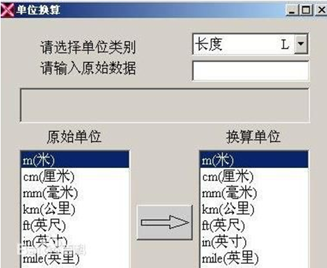

# [](../index.md) 实验4: LINQ与WPF

## 一、实验目的

1. 掌握扩展方法的编写；
2. 掌握Lambda表达式的写法；
3. 掌握基本LINQ命令的用法；
4. 熟悉使用WPF进行界面编程的基本过程；
5. 掌握WPF布局、控件、事件的使用。

## 二、[程序源代码](../../code/index.md)

## 三、实验内容

### 1、编写一个静态类MyExtensions，扩展.NET Framework基本类型的功能

1. 定义一个扩展方法IsPalindrome，方法定义为：`public static bool IsPalindrome(this string str)`它扩展string类的功能，用于判断字符串是否为回文（指顺读和倒读内容都一样的文本）。
2. 定义一个扩展方法ReverseDigits，允许int将自己的值倒置，例如将整型1234调用ReverseDigits，返回结果为4321。
测试类如下：

```c#
class Program
{
    static void Main()
    {
            string s = "abc";
            Console.WriteLine(s + " is " + (s.IsPalindrome()?"":"not ") + "palindrome");
            s = "abcba";
            Console.WriteLine(s + " is " + (s.IsPalindrome() ? "" : "not ") + "palindrome");
            int i = 1234;
            Console.WriteLine("Reverse of " + i + " is " + i.ReverseDigits());
    }
}
```

【实验结果】
<center>
    </br>
</center>

### 2、编写Lambda表达式

.NET已定义的Func<out TResult>是一个泛型委托，它封装一个方法，该方法不具有参数，且返回由 TResult 参数指定的类型的值。它的基本用法是：

```c#
            Func<int> f1 = () => DateTime.Now.Year;
            Console.WriteLine(f1());
```

该泛型委托有好几个同名兄弟类型，如`Func<in T, out TResult>，Func <in T1, in T2, out TResult>`等（直到T9）等，按上面的例子完成：

1. 写一个Lambda表达式赋给Func<int, double> f2，使其完成取平方根功能。
2. 写一个Lambda表达式赋给Func<int, int, double> f2，使两个值平方先平方，再相加，再开方。
3. 用任意参数类型，再写一个Predicate型Lambda表达式，并使用。
4. .NET已定义Action、Action<T>、Action<T1,T2>…等委托，它们封装的方法，有0至9个参数，但没有返回值，试写出两个Action<String>和Action<int, List<int>>的Labmda表达式，并调用它们。
5. 还有Predicate<T>委托，它封装一个方法，带一个参数，返回布尔值，试写出两个带不同参数类型的Predicate型Lambda表达式。

【实验结果】
<center>
    </br>
</center>

### 3、利用LINQ技术查询Racer对象

已有Racer类和冠军车手数据，进行以下查询，并打印结果：

1. 查询来自巴西的所有世界冠军，并按胜利场数降序排列。
输出结果时，可用Console.WriteLine("{0:A}", racer)。使用方法语法重写这个查询。
2. 体会LINQ的推迟查询：首先建立查询query2，查出所有胜利场数超过，用foreach循环并打印；然后将所有英国（UK）车手的国名改为“United Kingdom”；再次用foreach循环并打印。观赛同一查询的不同执行结果。
3. 查出首发场数超过100，并且胜利场数超过20的车手的姓名（包含名和姓）。
4. 基于现有数据，统计德国人的胜利总场数。
5. 进行投影查询，输出人名与首发胜率，人名包含名和姓，首发胜率为Wins除以Starts。

【实验结果】
<center>
    </br>
</center>
<center>
    </br>
</center>

### 4、使用WPF技术，进行合理布局，设计一个窗体应用程序，完成一些常用度量单位的转换，基本模板如下图

<center>
    </br>
</center>

另外要求：

1、 在原始数据和换算结果后加两个TextBlock，绑定到原始单位和换算单位。
2、 当在TextBox输入内容时，换算结果内容清空。
3、 如果原始数据格式有误，要提示用户。
其中：

* 中间的Button用下面的方式面出来：

```c#
<Button Width="100" Height="40">
    <Canvas>
        <Path Stroke="Blue" Data="M -30, -5 l 40,0 l0,-6 l 20,10 l-20,10 l0,-6 l-40,0 Z">
        </Path>
    </Canvas>
</Button>
```

* 为在后台代码中访问控件，需要给它命名，如`<ListBox x:Name="lstSource"></ListBox>`
* 响应ComboBox的SelectionChanged事件，获取到选定内容的方法是：

```c#
            ComboBox cb = sender as ComboBox;
            ComboBoxItem item = cb.SelectedItem as ComboBoxItem;
            string selected = item.Content.ToString();
```

* 然后通过switch语句分别处理长度、重量等选项。

4、 对于长度等单位，可构建如下字典对象辅助转换：

```c#
Dictionary<string, double> length = new Dictionary<string, double>
        { {"m(米)", 1 },  {"cm(厘米)", 0.01 }, {"mm(毫米)", 0.001 }};
```

但温度不行，需自行转换。

## 三、实验心得与体会

1. 通过此次实验，让我祖略掌握了如何扩展`.NET Framework`基本类型的功能。
2. 了解了如何使用C#自身功能编写Lambda表达式
3. 掌握了利用LINQ技术查询Racer对象
4. 初步学会了如何使用WPF技术编程
