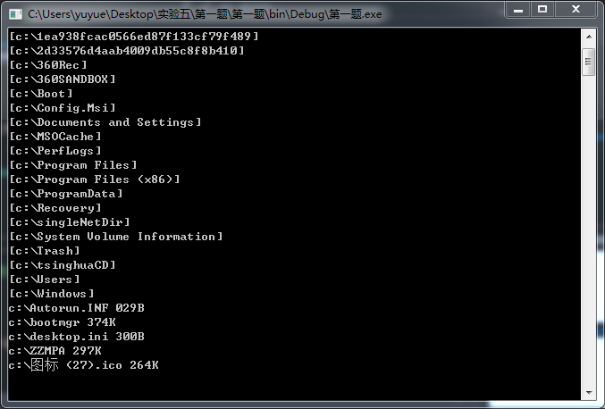
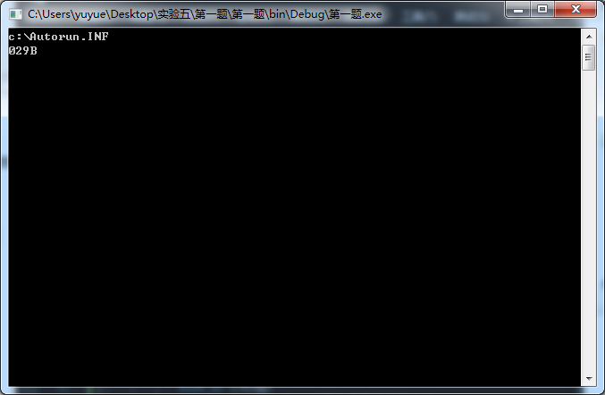
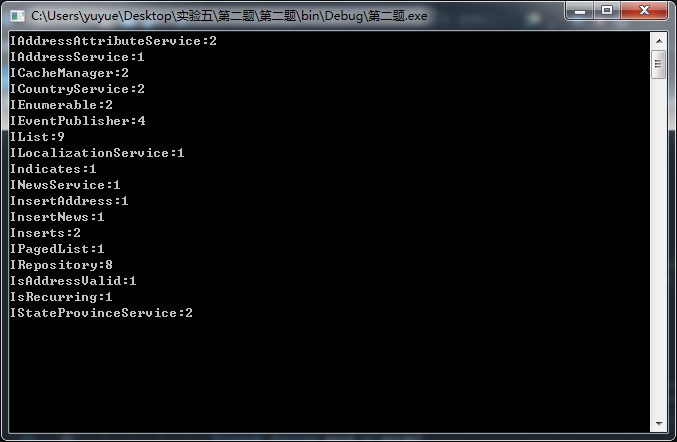

# [](../index.md) 实验5: 文件与流

## 一、实验目的

1. 掌握文件类的使用；
2. 掌握文件流的操作；
3. 掌握二进制数据、文本数据的读写；
4. 掌握对象的序列化；
5. 继续应用WPF技术进行界面编程。

## 二、[程序源代码](../../code/index.md)

## 三、实验内容

### 1、要求用户输入一个目录名或文件名

* 如果输入的是有效目录，列出该目录下所有文件和目录：对于目录，名字用[]括起来；对于文件，在文件名后用三个数字加一个字母表示其文件大小，如123B, 123K, 123M等。
* 如果输入的是有效文件，列出该文件大小，即123B, 123K, 123M等。

【具体实现】
<center>
    </br>
    </br>
</center>

### 2、在Code目录下存放着一些文件。遍历该目录，统计其中各个接口的出现次数，保存在SortedDictionary<string, int>中。现假定接口名称都如IList、ICacheManager（以I字符开头，第二字符大写）

提示：按照目录→文件→行→单词→字符的层次关系，逐步深入。
目录：目录名、Directory或DirectoryInfo
文件：文件名、File或FileInfo
行：StreamReader.ReadLine()
单词：String.Split()
字符：String[0]

【具体实现】
<center>
    </br>
</center>

### 3、写一个记事本程序

1、设计界面，向窗体添加下拉式菜单、多格式文本框、打开文件对话框、保存文件对话框。
2、依次为“文件”下的“新建”、“打开”、“保存”菜单项的Click事件添加事件处理函数。
3、实现文本文件的打开、编辑和保存功能；
提示

* 窗口可用DockPanel进行布局，让菜单和工具栏都位于顶部，即：DockPanel.Dock="Top"。
* 文本文件的编辑可以使用TextBox控件。
* 使用命令绑定，让菜单项和工具栏同时与一个操作相关联。

在MainWindow.xaml的Window标签下加：

```xml
    <Window.CommandBindings>
        <CommandBinding Command="ApplicationCommands.New" Executed="NewCommand_Executed"/>
        <CommandBinding Command="ApplicationCommands.Open" Executed="OpenCommand_Executed"/>
        <CommandBinding Command="ApplicationCommands.Save" Executed="SaveCommand_Executed"/>
    </Window.CommandBindings>
```

在菜单项添加：

```xml
                <MenuItem Header="新建(_N)" Command="New"/>
```

在工具栏添加：

```xml
            <Button Content="新建" Command="New"/>
```

就可绑定命令。同时Ctrl+O等键盘组合也默认与Open命令相绑定。

* 添加bool类型_saved字段，标记当前内容是否已保存。
* 打开文件时，弹出打开文件对话框，操作代码如下：

```c#
            OpenFileDialog dlg = new OpenFileDialog();
            dlg.DefaultExt = "*.txt";
            dlg.Filter = "Text Files (*.txt)|*.txt";
            bool? result = dlg.ShowDialog();
            if (result == true)
            {
                string fileName = dlg.FileName;
```

自此可对该文件名进行操作。

4、 保存文件时，实际可实现“另存为”功能。弹出保存文件对话框，操作代码如下：

```c#
            SaveFileDialog saveFileDialog = new SaveFileDialog();
            saveFileDialog.Filter = "文本文件|*.txt|所有文件|*.*";
            saveFileDialog.FilterIndex = 0;
            bool? result = saveFileDialog.ShowDialog();
            if (result == true)
            {
                string strFile = saveFileDialog.FileName;
```

## 三、实验心得与体会

1. 本次实验让我对文件类与流的使用有了更清晰的认知，掌握了如何对一个文件中内容的遍历与对特定字符串的统计。
2. 学习了如何使用WPF制作下拉式菜单，并了解了如何使菜单选项与系统快捷方式绑定。
3. 通过模仿与比较了解了C#中文件保存与读取的相关技巧，对IO处理有了更深入的理解。
