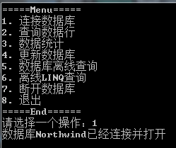
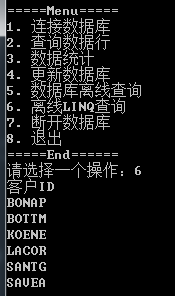
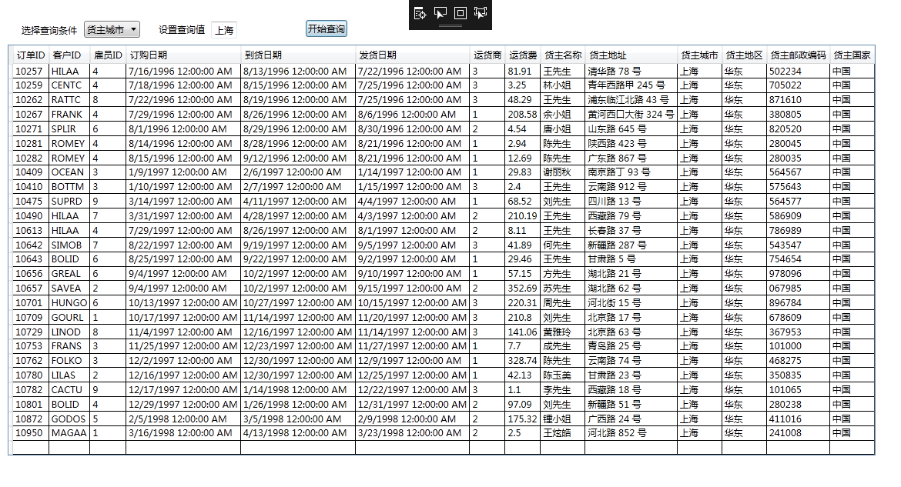

# [](../index.md) 实验6: 数据库编程

## 一、实验目的

1. 掌握ADO .NET数据离线与在线访问模型；
2. 掌握应用LINQ进行数据查询；
3. 继续应用WPF技术进行界面编程。

## 二、[程序源代码](../../code/index.md)

## 三、实验内容

### 1、基于ADO.NET技术进行数据操作

已提供一个控制台程序的框架。参考案例程序，连接上数据库，进行各种操作，补全该程序。
一些可用的SQL语句：

```sql
select * from 客户 where 城市='南京'
select count(*) from 客户 where 城市='南京'
update 客户 set 城市='天津' where 客户ID='ALFKI'
```

可自由选择所查询的数据库表和参数。注意，SQL中字符串需加单引号。

```c#
    class Test
    {
        static string _mdbFile = "D:/Northwind.mdb";
        static OleDbConnection _connection;
        static OleDbDataAdapter _adapter;
        static DataSet _dataset;

        public static void Main(string[] argv)
        {
            while (true)
            {
                int index = 1;
                Console.WriteLine("=====Menu=====");
                Console.WriteLine(index++ + ". 连接数据库");
                Console.WriteLine(index++ + ". 查询数据行");
                Console.WriteLine(index++ + ". 数据统计");
                Console.WriteLine(index++ + ". 更新数据库");
                Console.WriteLine(index++ + ". 数据库离线查询");
                Console.WriteLine(index++ + ". 离线LINQ查询");
                Console.WriteLine(index++ + ". 断开数据库");
                Console.WriteLine(index++ + ". 退出");
                Console.WriteLine("=====End======");
                Console.Write("请选择一个操作：");

                string input = Console.ReadLine();
                int choice;
                bool isDigit = int.TryParse(input, out choice);
                if (!isDigit || choice >= index || choice < 1)
                {
                    Console.WriteLine("错误选项");
                }

                if (choice == index - 1)
                    break;

                switch (choice)
                {
                    case 1:
                        ConnectToDB();
                        break;
                    case 2:
                        QueryWithReader();
                        break;
                    case 3:
                        QueryScalar();
                        break;
                    case 4:
                        UpdateOnLine();
                        break;
                    case 5:
                        QueryOffLine();
                        break;
                    case 6:
                        LINQQuery();
                        break;
                    case 7:
                        CloseDB();
                        break;
                }
                Console.WriteLine();
            }
        }

        public static bool IsConnected()
        {
            if (_connection == null || _connection.State != ConnectionState.Open)
            {
                Console.WriteLine("数据库未连接");
                return false;
            }
            return true;
        }

        public static void ConnectToDB()
        {
            string connString = @"Provider=Microsoft.ACE.OLEDB.12.0; Data Source=" + _mdbFile;
            _connection = new OleDbConnection(connString);
            //补全
        }

        public static void QueryWithReader()
        {
            if (!IsConnected())
                return;

            var command = _connection.CreateCommand();
            //补全
        }

        public static void QueryScalar()
        {
        }

        public static void UpdateOnLine()
        {
        }

        public static void QueryOffLine()
        {
        }

        public static void LINQQuery()
        {
        }

        public static void CloseDB()
        {
        }
}
```

【实验结果】
<center>
    </br>
    </br>
    </br>
    </br>
    </br>
    </br>
    </br>
</center>

### 2、使用提供的Northwind.mdb数据库，利用DataGrid控件进行数据库查询与更新

1、新建WPF工程与窗口。
2、添加“选择查询条件”标签，再加一个ComboBox，设置其元素包含“客户”表的主要字段名（公司名称、联系人姓名、城市）。
3、添加“设置查询值”标签，再加一个Combobox，供输入查询用的值；添加“开始查询”按钮；添加一个DataGrid控件。
4、定义GetAllGuests()方法，获取数据，放入DataGrid控件的ItemsSource字段。在窗体装载（Load）时调用它，作为DataGrid控件的数据源，展示“客户”表中所有信息。
5、定义GetAllColumns方法，获取某列中数据。在用户选择查询条件后，调用该方法，将所得数据作为“查询值Combobox”的数据源。获取列名的方法：

```c#
            OleDbDataReader reader = command.ExecuteReader();
            reader.Read();
            List<string> columns = new List<string>();
            for(int i=0; i<reader.FieldCount; i++)
            {
                columns.Add(reader.GetName(i));
            }
            comboColumn.ItemsSource = columns;
```

6、定义DataView GetSelectedGuest()方法。点击查询按钮后，将查询所得数据展现出来。
7、在下方添加一个标签控件，在点击DataGrid控件中某行时，响应CellClick事件。查询“订单”表，在标签控件中显示“xx客户共有xx个订单”信息。
获取客户ID:

```c#
            DataRowView data = gridData.SelectedItem as DataRowView;
            if (data == null)
                return;
            string id = data["客户ID"].ToString();
```

【实验结果】
<center>
    </br>
</center>

## 三、实验心得与体会

1. 这次实验让我对通过C#操作数据库操作有了一定了解，较熟练掌握数据库的连接、读取、查找、修改与断开的相关方法。
2. 能通过WPF设计数据库界面，查询数据库指定标签的内容。
3. 为之后数据库方面的学习打下了一定的基础。
