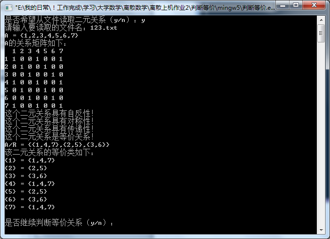

# [](../index.md) 实验2: 二元关系性质及其闭包运算

## 一、实验目的

1. 掌握二元关系在计算机上的表示方法，并掌握如果判定关系的性质。掌握求关系闭包的方法。

## 二、实验内容

1. 编程判断一个二元关系是否为等价关系，如果是，求其商集。
    （a={1，2，3，4，5，6，7}，R为模3同余）
    A/R = {{1,4,7},{2,5},{3,6}}
2. 编程求一个关系的闭包，传递闭包用warshall或邻接矩阵乘法方法。
    （书上P52例2.13为例）
3. 编程求一个关系的最大相容类（书上P45第10题为例）

## 三、实验过程

### 3.1 算法分析

* A上的二元关系用一个n×n关系矩阵R= 表示，定义一个n×n数组r[n][n]表示n×n矩阵关系。
* 若R对角线上的元素都是1，则R具有自反性。

    ```c++
    // 如果R是自反关系，则返回1；否则返回0
    int i;
    for (i = 1;i <= n;i++)
    {
        if (q[i][i] != 1)
            return 0;
    }
    return 1;
    ```

* 若R是对称矩阵，则R具有对称性。对称矩阵的判断方法是：

    ```c++
    // 如果R是对称关系，则返回1；否则返回0
    int i, j;
    for (i = 1;i <= n;i++)
    {
        for (j = i;j <= n;j++)
        {
            if (q[i][j] != q[j][i])
                return 0;
        }
    }
    return 1;
    ```

* 关系的传递性判断方法

    ```c++
    // 如果R是传递关系，则返回1；否则返回0
    int i, j, k;
    for (i = 1;i <= n;i++)
    {
        for (j = 1;j <= n;j++)
        {
            if (q[i][j] != 1)
            continue;
            else
            for (k = 1;k <= n;k++)
            {
                if (q[j][k] != 1)
                continue;
                else
                {
                    if (q[i][k] != 1)
                    return 0;
                }
            }
        }
    }
    return 1;
    ```

* 求商集的方法：商集是由等价类组成的集合。已知R是等价关系，下面的算法是把等价类分行打印出来。
  * 语言算法：按行遍历二维数组R，一行中为1的属于一个等价类，通过数组a标记，在根据数组a中的标记输出商集与等价类。

## 四、[程序源代码](../../code/index.md)

## 五、运行结果与分析

<center>
    </br>
    </br>
    </br>
</center>
