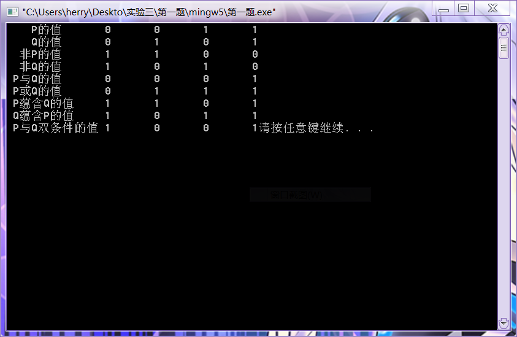
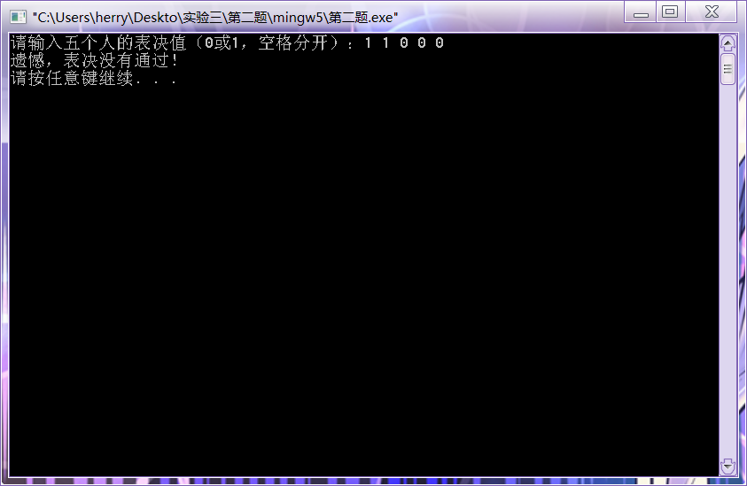
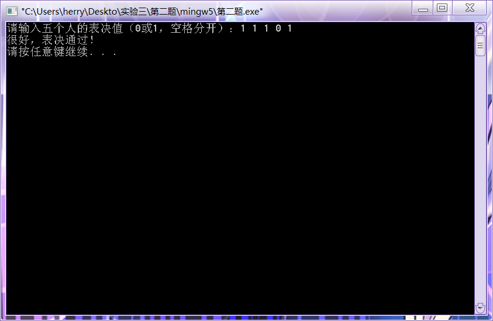
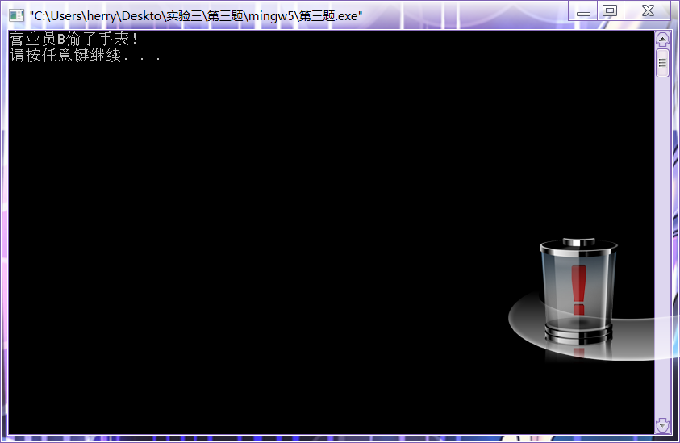

#  实验3: 逻辑学实验

## 一、实验目的

【通过编程实现逻辑学在计算机的表示和运算】

1. 实现二元合取、析取、蕴涵和等价表达式的计算。熟悉连接词逻辑运算规则，利用程序语言实现逻辑这几种逻辑运算
2. 加深对五个基本联结词（否定、合取、析取、条件、双条件）的理解、掌握利用基本等价公式化简公式的方法
3. 加深对命题逻辑推理方法的理解

## 二、实验内容

1. 从键盘输入两个命题变元P和Q的真值，求它们的合取、析取、蕴涵和等价四种运算的真值。要求对输入内容进行分析，如果不符合0、1条件需要重新输入，程序有良好的输入输出界面。
2. 用化简命题逻辑公式的方法设计一个表决开关电路。用化简命题逻辑公式的方法设计一个5人表决开关电路，要求3人以上（含3人）同意则表决通过（表决开关亮）。
3. 命题逻辑推理的方法解决逻辑推理问题。根据下面的命题，试用逻辑推理方法确定谁是作案者，写出推理过程。
   1. 营业员A或B偷了手表；
   2. 若A作案，则作案不在营业时间；
   3. 若B提供的证据正确，则货柜末上锁；
   4. 若B提供的证据不正确，则作案发生在营业时间；
   5. 货柜上了锁。

## 三、实验原理

1. 联结词逻辑运算
   * 合取：p，q都为1的时候为1，其他为0
   * 析取：p，q都为0的时候为0，其他为1
   * 蕴含：p为1，q为0时为0，其他为1
   * 双条件：p，q同真同假
2. 命题逻辑公式化简
   * 写出5人表决开关电路真值表，从真值表得出5人表决开关电路的主合取公式（或主析取公式），将公式化简成尽可能含五个基本联结词最少的等价公式。
   * 上面公式中的每一个联结词是一个开关元件，将它们定义成C语言中的函数。
   * 输入5人表决值（0或1），调用上面定义的函数，将5人表决开关电路真值表的等价公式写成一个函数表达式。
   * 输出函数表达式的结果，如果是1，则表明表决通过，否则表决不通过。
3. 命题逻辑推理
   * 符号化上面的命题，将它们作为条件，营业员A偷了手表作为结论，得一个复合命题。
   * 将复合命题中要用到的联结词定义成C语言中的函数，用变量表示相应的命题变元。将复合命题写成一个函数表达式。
   * 函数表达式中的变量赋初值1。如果函数表达式的值为1，则结论有效， A偷了手表，否则是B偷了手表。
   * 用命题题变元表示：
     * A:营业员A偷了手表
     * B:营业员B偷了手表
     * C:作案不在营业时间
     * D:B提供的证据正确
     * E:货柜末上锁
   * 则上面的命题符号化为 (A||B) && (!A||C) && (!D||E) && (D||!C) && !E
   * 要求找到满足上面式子的变元A，B的指派便是结果。

## 四、[程序源代码](../../code/index.md)

## 五、运行结果与分析

### 5.1 联结词逻辑运算

     

### 5.2 命题逻辑公式化简

     
     

|A|B|C|D|E|A+B+C+D+E|-|-|
|:-:|:-:|:-:|:-:|:-:|:-:|:-:|:-:|
|0|0|0|0|0|0|0|-|
|0|0|0|0|1|0|1|-|
|0|0|0|1|0|0|1|-|
|0|0|0|1|1|0|2|-|
|0|0|1|0|0|0|1|-|
|0|0|1|0|1|0|2|-|
|0|0|1|1|0|0|2|-|
|0|0|1|1|1|1|3|>=3|
|0|1|0|0|0|0|1|-|
|0|1|0|0|1|0|2|-|
|0|1|0|1|0|0|2|-|
|0|1|0|1|1|1|3|>=3|
|0|1|1|0|0|0|2|-|
|0|1|1|0|1|1|3|>=3|
|0|1|1|1|0|1|3|>=3|
|0|1|1|1|1|1|4|>=3|
|1|0|0|0|0|0|1|-|
|1|0|0|0|1|0|2|-|
|1|0|0|1|0|0|2|-|
|1|0|0|1|1|1|3|>=3|
|1|0|1|0|0|0|2|-|
|1|0|1|0|1|1|3|>=3|
|1|0|1|1|0|1|3|>=3|
|1|0|1|1|1|1|4|>=3|
|1|1|0|0|0|0|2|-|
|1|1|0|0|1|1|3|>=3|
|1|1|0|1|0|1|3|>=3|
|1|1|0|1|1|1|4|>=3|
|1|1|1|0|0|1|3|>=3|
|1|1|1|0|1|1|4|>=3|
|1|1|1|1|0|1|4|>=3|
|1|1|1|1|1|1|5|>=3|

### 5.3 命题逻辑推理

     

