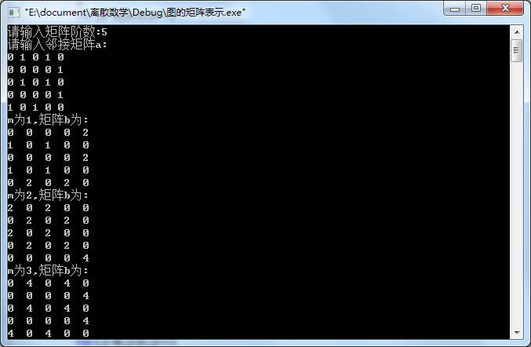
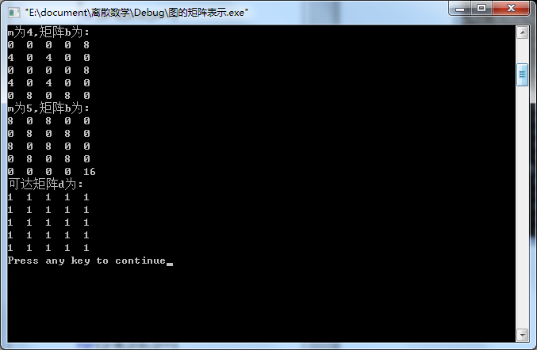
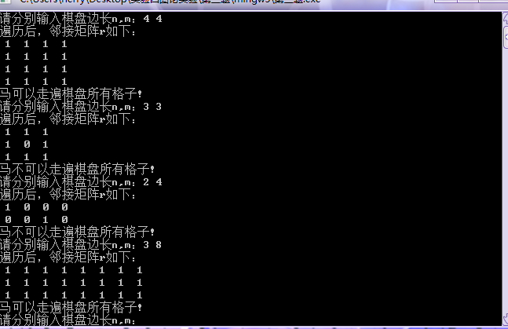

# [](../index.md) 实验4: 图的实验

## 一、实验目的

1. 熟悉图的矩阵表示方法——邻接矩阵、可达矩阵和关联矩阵
2. 掌握判断欧拉图的方法
3. 熟悉图的连通性应用

## 二、实验内容

1. 利用邻接矩阵得到的可达矩阵来求解图的连通性质
2. 判断一个图是不是，如果是，求出所有欧拉路
3. 利用邻接矩阵得到的可达矩阵来求解图的连通性质 按照马走日的走法，该马是否可以遍历图中所有格子，可否得到什么规律

|-|-|-|-|
|-|-|-|-|
|-|-|-|-|
|-|-|-|-|
||-|-|-|

## 三、实验原理

1. 图的连通性判别
   * 可达矩阵表示图中任意两个节点间的可达关系，而邻接矩阵表示图中任意两个节点的邻接关系。求解邻接矩阵\ A^1，A2，A3……An可知任意两个节点之间是否存在互相连通的路，从而判断是否可达
2. 欧拉图判定和应用
   * 用关系矩阵$R=(r_{ij})_{n\times n}$表示图。
   * 对无向图而言，若所有结点的度都是偶数，则该图为欧拉图。

    ```c++
    // 如果 flag  该无向图是欧拉图
    flag=1;
    for(i=1;i<=n && flag;i++)
    {
        sum=0;
        for(j=1;j<=n;j++)
            if(r[i][j]) sum++;
        补充代码****（替换为“if (sum%2!=0) flag = 0;”）
    }
    ```

   * 对有向图而言，若所有结点的入度等于出度，则该图为欧拉图。

    ```c++
    // 如果 flag  该有向图是欧拉图
    flag=1;
    for(i=1;i<=n && flag;i++)
    {
        sum1=0;
        sum2=0;
        for(j=1;j<=n;j++)
            if(r[i][j]) sum1++;
        for(j=1;j<=n;j++)
            if(r[j][i]) sum2++;
        补充代码****;（替换为“if (sum1 != sum2) flag = 0;”）
    }
    ```

   * 求出欧拉路的方法：欧拉路经过每条边一次且仅一次。可用回溯的方法求得所有欧拉路。

    ```c++
    int count=0,cur=0,r[N][N]; // r[N][N]为图的邻接矩阵，cur为当前结点编号，count为欧拉路的数量。
    int sequence[M];// sequence保留访问点的序列，M为图的边数
    输入图信息;
    void try1(int k) //k表示边的序号
    {
        int i,pre=cur; //j保留前一个点的位置,pre为前一结点的编号
        for (i=0;i<N;i++)
            if (r[cur][i]) //当前第cur点到第i点连通
            {
                //删除当前点与第i点的边，记下第k次到达点i，把第i个点设为当前点
                r[cur][i]=0;cur=sequence[k]=i;  
                if (k<M) try1(k+1); //试下一个点
                else prt1();//经过了所有边，打印一个解
                //上面条件不满足，说明当前点的出度为0，回溯，试下一位置
                r[pre][i]=1;cur=pre;  
            }
    }
    ```

3. 国际象棋的都走遍4*4的格子吗
   * 构造4*4的矩阵各个坐标格子之间的走日步的直接可达性矩阵（也就是图）
   * 判断图中任意两点是否可以到达

## 四、[程序源代码](../../code/index.md)

## 五、运行结果与分析

### 5.1 图的连通性判别

<center>
    </br>
    </br>
</center>

### 5.2 欧拉图判定和应用

### 5.3 国际象棋的都走遍4*4的格子吗

<center>
    </br>
</center>
