# [](../index.md) 作业1: wireshark基础操作

## 一、wireshark 安装与使用

### 1.1 wireshark安装包下载

&emsp;&emsp;通过浏览器进入[wireshark官网下载页面](https://www.wireshark.org/download)，由于本电脑为Windows 64位系统，因此如图 1所示选择win64目录，再根据图 2下载wireshark最新正式版exe安装包。

<center>
    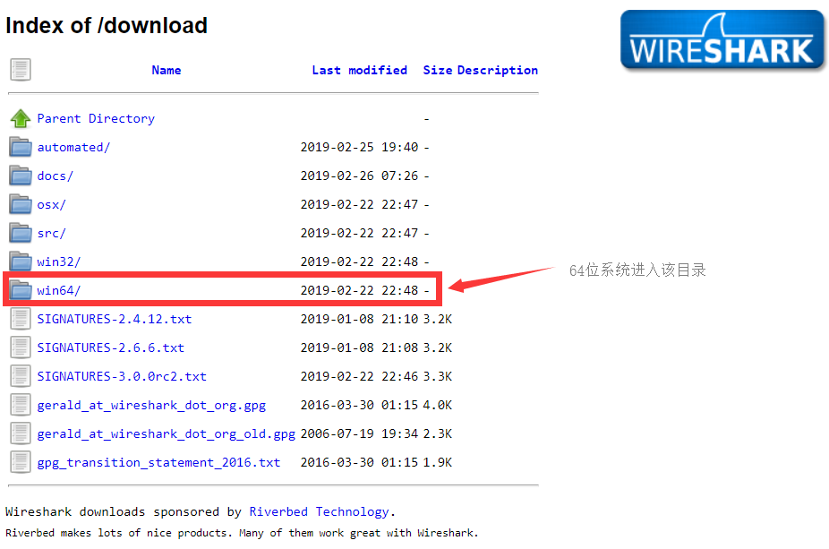</br>
    图 1 wireshark官网下载页面
    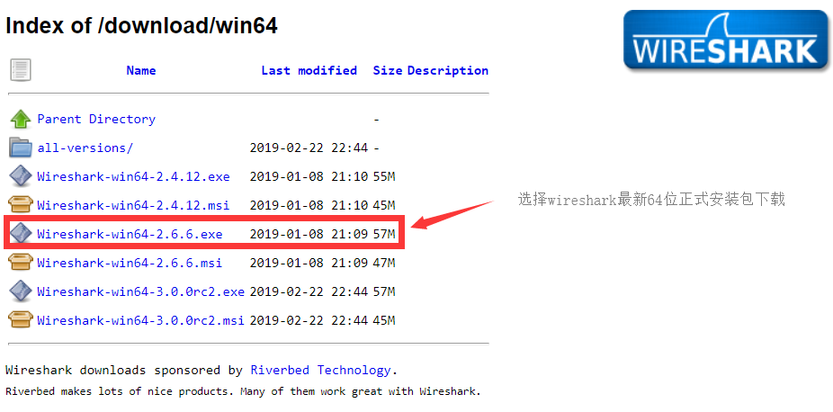</br>
    图 2 wireshark 64位版目录
</center>

### 1.2 wireshark安装

&emsp;&emsp;双击打开wireshark安装包，然后根据下方图示逐步设置并进行安装。

<center>
    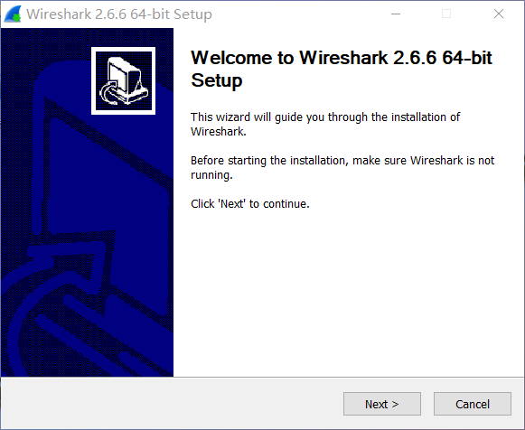</br>
    图 3 安装初始界面
    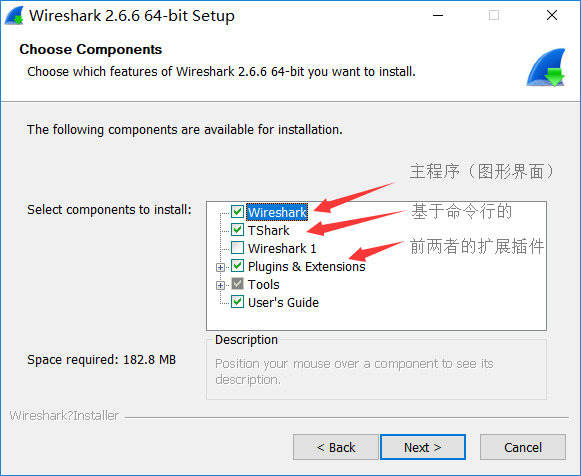</br>
    图 4 安装内容选择
    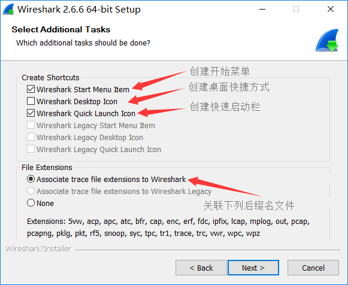</br>
    图 5 安装基本设置
    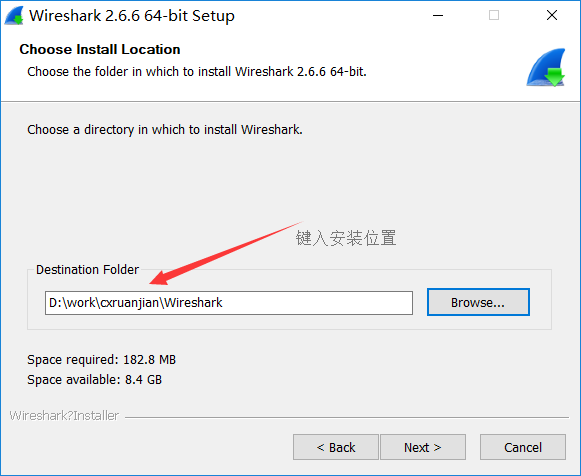</br>
    图 6 安装路径设置
    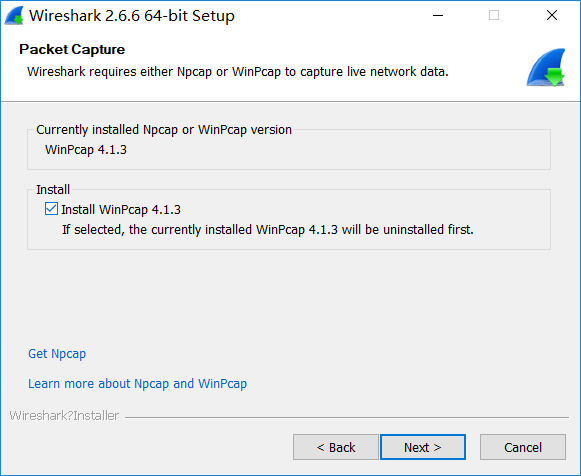</br>
    图 7 安装依赖软件WinPcap
    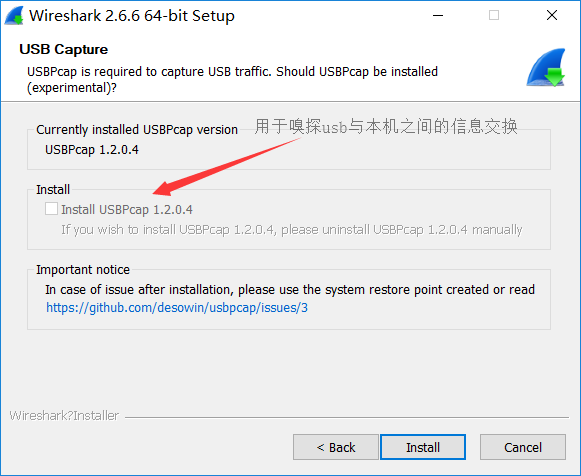</br>
    图 8 安装依赖软件USBPcap
</center>

### 1.3 wireshark软件使用

&emsp;&emsp;开始安装，并根据提示同时安装依赖软件WinPcap与USBPcap，安装完成后重启电脑完成软件最终配置。

<center>
    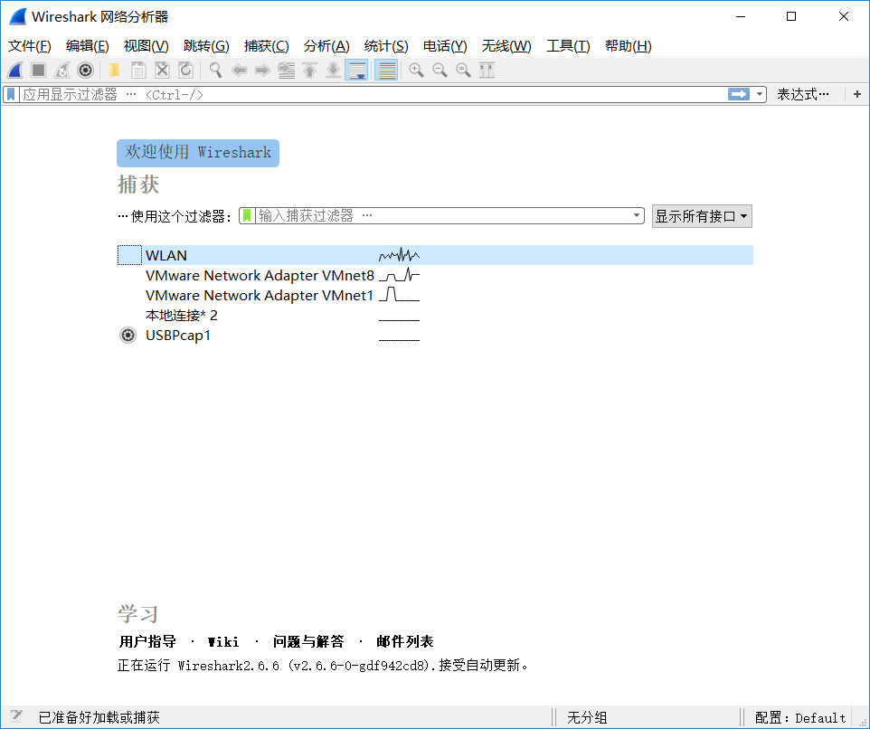</br>
    图 9 wireshark欢迎界面
    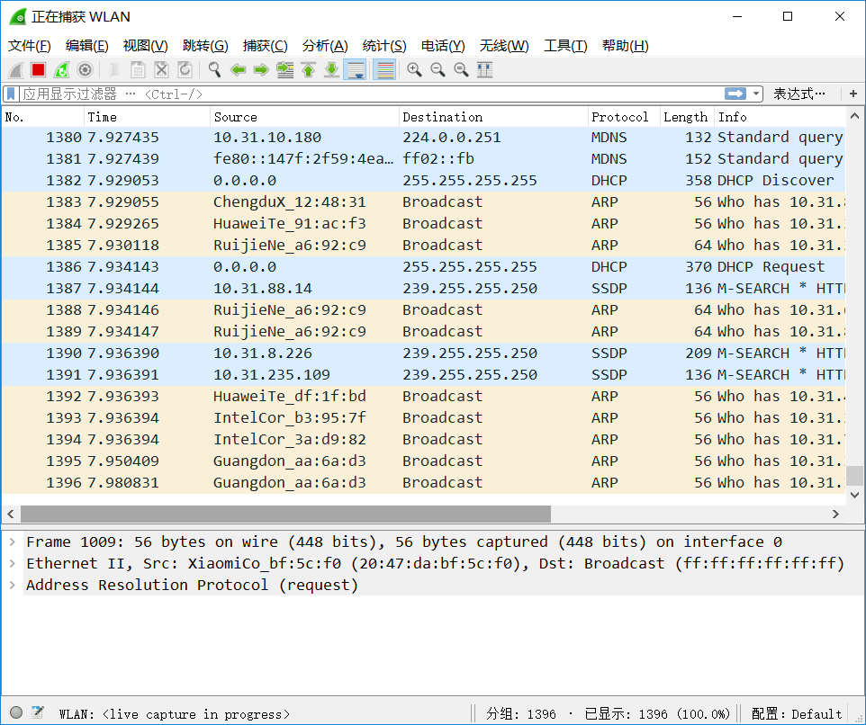</br>
    图 10 wireshark嗅探界面
</center>

## 二、wireshark 插件的编写与使用

### 2.1 基于lua编写wireshark自定义插件

&emsp;&emsp;使用lua语言编写一个用于解析student信息包的插件，student信息包基于UPD协议，其服务端监听UDP10002端口，客户端端口任意。

【报文格式】

* 协议中前16个字节是固定的标识符idenifier：
  11 11 22 22 33 33 44 44 55 55 66 66 77 77 88 88
* 第17~24个字节表示该学生的昵称
* 第25~37个字节表示该学生的学号
* 第38个字节表示该学生的性别
* 第39、40个字节表示该学生的年龄
* 第40个字节之后表示该学生的个性签名

【插件源码】

```lua
-- @brief Student Protocol dissector plugin
-- @author yuyue
-- @date 2019.02.27

-- create a new dissector
local NAME = "student"
local PORT = 10002
local student = Proto(NAME, "Student Protocol")

-- create fields of student
local fields = student.fields
fields.name = ProtoField.string(NAME .. ".name", "Name")
fields.sid = ProtoField.string(NAME .. ".sid", "Student Id")
fields.sex = ProtoField.string(NAME .. ".sex", "Sex")
fields.age = ProtoField.string(NAME .. ".age", "Age")
fields.stext = ProtoField.string(NAME .. ".stext", "Student Text")


-- dissector packet
function student.dissector(tvb,pinfo,tree)
    local tvb_len = tvb:len()
    if (tvb_len<40) then return false end
    local v_identifier = tvb(0,16)
    if ((tvb(0,1):uint()~=17) or (tvb(1,1):uint()~=17) or (tvb(2,1):uint()~=34) or (tvb(3,1):uint()~=34)
        or (tvb(4,1):uint()~=51) or (tvb(5,1):uint()~=51) or (tvb(6,1):uint()~=68) or (tvb(7,1):uint()~=68)
        or (tvb(8,1):uint()~=85) or (tvb(9,1):uint()~=85) or (tvb(10,1):uint()~=102) or (tvb(11,1):uint()~=102)
        or (tvb(12,1):uint()~=119) or (tvb(13,1):uint()~=119) or (tvb(14,1):uint()~=136) or (tvb(15,1):uint()~=136))
        then return false end
    local subtree = tree:add(student, tvb())
    local offset = 16

    -- show protocol name in protocol column
    pinfo.cols.protocol = student.name

    -- dissect field one by one, and add to protocol tree
    local name = tvb(offset, 8)
    subtree:add(fields.name, name)
    subtree:append_text(", name: " .. name:string())
    offset = offset + 8
    subtree:add(fields.sid, tvb(offset, 13))
    offset = offset + 13
    subtree:add(fields.sex, tvb(offset, 1))
    offset = offset + 1
    subtree:add(fields.age, tvb(offset, 2))
    offset = offset + 2
    subtree:add(fields.stext, tvb(offset, tvb_len-offset))
end

-- register this dissector
DissectorTable.get("udp.port"):add(PORT, student)
```

### 2.2 wireshark自定义插件的使用和调试

&emsp;&emsp;先将插件源码放入名为student.lua的文本文件中，然后将该文件移动到wireshark软件安装目录下的plugins文件夹中的版本号对应的文件夹中，并重启wireshark软件，或者按下图所示操作，也可以按快捷键Ctrl+Shift+L载入Lua插件。

<center>
    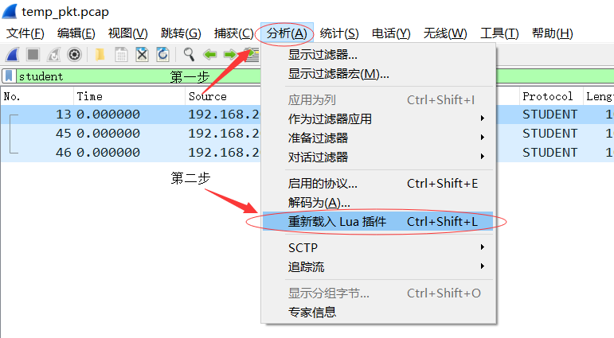</br>
    图 11 载入Lua插件
</center>

&emsp;&emsp;然后通过xcap软件，编辑遵循student协议的student信息包如下图所示：

<center>
    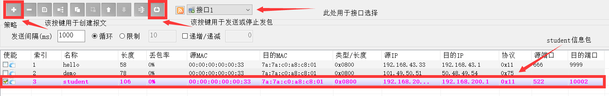</br>
    图 12 创建和发送student信息包
</center>

&emsp;&emsp;测试用student信息包中数据如下：

<center>
    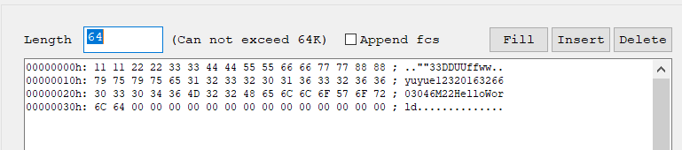</br>
    图 13 student信息包中数据
</center>

&emsp;&emsp;Wireshark中若插件安装成功，其在xcap发包时会捕获相应的student信息包，并用student协议进行解析，最终解析结果如下：

<center>
    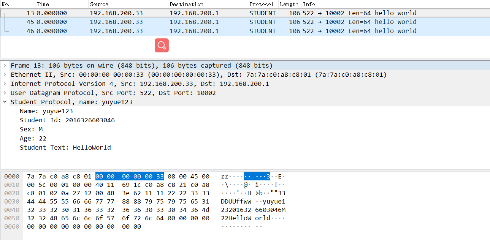</br>
    图 14 捕获student信息包解析后数据
</center>
