# [](../index.md) 作业10: 用Wireshark分析802.11协议

## 一、802.11协议内容简述

### 1.1 802.11协议简介

&emsp;&emsp;802.11协议共有三种类型的帧，包括管理帧、控制帧以及数据帧。每一种帧下面还有各种子类型。
&emsp;&emsp;802.11协议是在数据链路层的协议，在数据链路层中使用bit来表示信息，也是用bit来标识数据包的开始与结束，所以该协议的格式不要求一个固定的长度。这一特性在增加802.11帧的灵活性的同时提高了其复杂性。
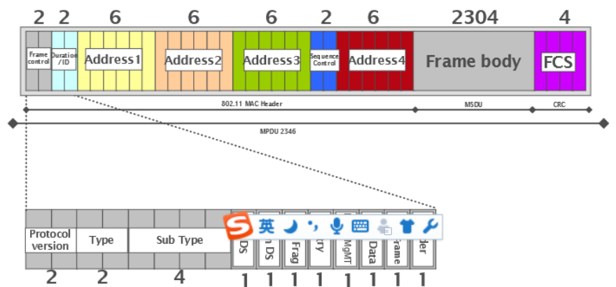

### 1.2 802.11帧长度不定的原因

1. mac地址数目不定，根据帧类型不同，802.11帧的mac地址数会不一样。比如说 ACK帧仅有一个mac地址，而数据帧有3个mac地址，而在WDS模式下，帧头有4个mac地址。
2. 802.11的管理帧所携带的信息长度不定。在管理帧中，不仅仅只有一些类似于mac地址，分片标志之类的这些信息，而且另外还会包括一些其它的信息，这些信息有关于安全设置的，有关于物理通信的，比如说我们的SSID名称就是通过管理帧获得的。AP会根据不同的情况发送包含有不同信息的管理帧。
3. 加密(wep,wpa等)信息，QOS信息，若有加密的数据帧格式和没有加密的数据帧格式还不一样，加密数据帧格式还多了个加密头，用于解密用，带QOS和不带QOS也同理。

### 1.3 802.11协议各种帧内容简析

#### 1.3.1 管理帧：用于STA与AP之间的协商、关系的控制，如关联、认证、同步等

* Frame Control：帧控制结构
  * Protocol Version：协议版本，通常为0
  * Type：帧类型（00）
  * Subtype：决定帧子类型
    * Association request：连接请求（0000）
    * Association response：连接响应（0001）
    * Reassociation request：重连接请求（0010）
    * Reassociation response：重连接响应（0011）
    * Probe request：探测请求（0100）
    * Probe response：探测响应（0101）
    * Beacon：信标，被动扫描时AP 发出，notify（1000）
    * ATIM：通知传输指示消息（1001）
    * Disassociation：解除连接，notify（1010）
    * Authentication：身份验证（1011）
    * Deauthentication：解除认证，notify（1100）
  * To DS：表明该帧是否是BSS向DS发送的帧
  * From DS：表明该帧是否是DS向BSS发送的帧
  * More Fragment：若长帧被分段是否还有其它的帧，有则为1
  * Retry(重传域)：表示该分段是先前传输分段的重发帧。
  * Power Management：传输帧以后，站所采用的电源管理模式
    * 为1：STA处于power_save模式
    * 为0：STA处于active模式
  * More Data：表示有很多帧缓存到站中。
    * 为1：至少还有一个数据帧要发送给STA
    * 为0：没有数据帧要发送给STA
  * Protected Frame：表示根据WEP算法对帧主体进行加密
    * 为1：被加密过
    * 为0：没被加密过
  * Order：长帧分段传送中接受者是否应该严格照顺序处理
    * 为1：需要
    * 为0：不需要
* Duration/ID：持续时间/标识，表明占用信道时间，以及NAV计算
* Address Fields：地址域
  * Destination Address：目的地址
  * Source Address：源地址
  * BSS ID
* Sequence Control：序列控制域，用于过滤重复帧
  * MSDU：12位序列号
  * MMSDU：4位片段号
* Frame Body：发送或接收的数据，数据帧格式差异较大
  * Probe Request
    * SSID：标示所属网络的BSSID，即Wi-Fi的接入点名称
    * Supported Rate：支持速率
    * Extended Supported Rate：扩展支持速率
  * Probe Response
    * Timestamp：同步BSS工作站目前已作用微秒数
    * Beacon interval：Beacon信号，宣布 802.11网络的存在
    * Capability information: 发送Beacon信号通知网络性能
    * SSID：标示所属网络的BSSID，即Wi-Fi的接入点名称
    * PH Parameter Set：跳频参数，802.11跳帧网络需要
    * DS Parameter Set：直接序列参数，指明网络使用信道数
    * CF Parameter Set：免竞争参数，支持免竞争接入点信标
    * IBSS Parameter Set：IBSS 参数集合，指明ATIM window
    * Country: 国家识别码
    * FH Hopping Parameters
    * FH Pattern Table
    * Power Constraint：功率限制，即所允许的最大传输功率
    * Channel Switch Announcement：信道切换宣告，换信道
    * Quiet：禁声，避免与特定的军事雷达技术彼此干扰
    * IBSS DFS IBSS：动态选项，传递 IBSS DFS 信息元素
    * TPC Report：发射功率控制报告，指明链路的衰减情况
    * ERP：扩展物理层
    * Supported Rates：支持速率
    * Extended Supported Rate：扩展支持速率
    * Robust Security Network：RSN强健安全网络
  * Beacon
    * Timestamp：同步BSS工作站目前已作用微秒数
    * Beacon interval：Beacon信号，宣布 802.11网络的存在
    * Capability information: 发送Beacon信号通知网络性能
    * SSID：标示所属网络的BSSID，即Wi-Fi的接入点名称
    * PH Parameter Set：跳频参数，802.11跳帧网络需要
    * DS Parameter Set：直接序列参数，指明网络使用信道数
    * CF Parameter Set：免竞争参数，支持免竞争接入点信标
    * IBSS Parameter Set：IBSS 参数集合，指明ATIM window
    * Traffic Indication Map：TIM数据待传信息 
    * Country：国家识别码
    * Power Constraint：功率限制，即所允许的最大传输功率
    * Channel Switch Announcement：信道切换宣告，换信道
    * Quiet：禁声，避免与特定的军事雷达技术彼此干扰
    * IBSS DFS IBSS：动态选项，传递 IBSS DFS 信息元素
    * TPC Report：发射功率控制报告，指明链路的衰减情况
    * ERP：扩展物理层
    * Supported Rates：支持速率
    * Robust Security Network：RSN强健安全网络
  * ATIM
  * Disassociation
    * Beacon Code
  * Deauthentication
    * Beacon Code
  * Association Request
    * Capability information: 发送Beacon信号通知网络性能
    * Listen interval：节省电池电力，工作站暂时关闭天线
    * SSID：标示所属网络的BSSID，即Wi-Fi的接入点名称
    * Supported Rate：支持速率
  * Reassociation Request
    * Capability information: 发送Beacon信号通知网络性能
    * Listen interval：节省电池电力，工作站暂时关闭天线
    * Current AP Address：表明目前连接接入点的 MAC地址
    * SSID：标示所属网络的BSSID，即Wi-Fi的接入点名称
    * Supported Rate：支持速率
  * Authentication
    * Authentication Algorithm Number：认证程序的认证类型
    * Authentication Transaction Sequence Number：认证进度
    * Status Code：状态代码用来表示某项过程成功或失败
    * Challenge Text：质询口令
* FCS(CRC)：包括32位的循环冗余校验(CRC)，用于检错

#### 1.3.2 数据帧：用于在竞争期与非竞争期传输数据

* Frame Control：帧控制结构
  * Protocol Version：协议版本，通常为0
  * Type：帧类型（10）
  * Subtype：决定帧子类型
    * 0000：Data
    * 0001：Data+CF-ACK
    * 0010：Data+CF-Poll
    * 0011：Data+CF-ACK+CF-Poll
    * 0100：Null Data（无数据，未传送数据）
    * 0101：CF-ACK（未传送数据）
    * 0110：CF-Poll（未传送数据）
    * 0111：Data+CF-ACK+CF-Poll
    * 1000：Qos Data
    * 1001：Qos Data+CF-ACK
    * 1010：Qos Data+CF-Poll
    * 1011：Qos Data+CF-ACK+CF-Poll
    * 1100：Qos Null（未传送数据）
    * 1101：Qos CF-ACK（未传送数据）
    * 1110：Qos CF-Poll（未传送数据）
    * 1111：Qos CF-ACK+CF-Poll（未传送数据）
  * To DS：表明该帧是否是BSS向DS发送的帧
    * 为0：IBSS、From AP
    * 为1：To AP、WDS
  * From DS：表明该帧是否是DS向BSS发送的帧
    * 为0：IBSS、To Ap
    * 为1：From AP、WDS
  * More Fragment：若长帧被分段是否还有其它的帧，有则为1
  * Retry(重传域)：表示该分段是先前传输分段的重发帧。
  * Power Management：传输帧以后，站所采用的电源管理模式
    * 为1：STA处于power_save模式
    * 为0：STA处于active模式
  * More Data：表示有很多帧缓存到站中。
    * 为1：至少还有一个数据帧要发送给STA
    * 为0：没有数据帧要发送给STA
  * Protected Frame：表示根据WEP算法对帧主体进行加密
    * 为1：被加密过
    * 为0：没被加密过
  * Order：长帧分段传送中接受者是否应该严格照顺序处理
    * 为1：需要
    * 为0：不需要
* Duration/ID：持续时间/标识，表明占用信道时间，以及NAV计算
* Address Fields：地址域
  * 出现顺序
    * IBSS：1-2-3
    * From AP：1-3-2
    * To AP：3-2-1
    * WDS：3-2-1
  * Destination Address：目的地址
  * Source Address：源地址
  * BSS ID
* Sequence Control：序列控制域，用于过滤重复帧
  * MSDU：12位序列号
  * MMSDU：4位片段号
* Frame Body：发送或接收的数据，数据帧格式差异较大
* FCS(CRC)：包括32位的循环冗余校验(CRC)，用于检错

#### 1.3.3 控制帧：用于竞争期间的握手通信和正向确认、结束非竞争期等

* Frame Control：帧控制结构
  * Protocol Version：协议版本，通常为0
  * Type：帧类型（01）
  * Subtype：决定帧子类型
    * 1010：Power Save（PS）- Poll（省电－轮询）
    * 1011：RTS（请求发送，预约信道，帧长20字节）
    * 1100：CTS（清除发送，同意预约，帧长14字节）
    * 1101：ACK（确认）
    * 1110：CF-End（无竞争周期结束）
    * 1111：CF-End+CF-ACK（无竞争周期确认）
  * To DS：表明该帧是否是BSS向DS发送的帧，必须0
  * From DS：表明该帧是否是DS向BSS发送的帧，必须0
  * More Fragment：若长帧被分段是否还有其它的帧，必须0
  * Retry(重传域)：表示该分段是先前传输分段的重发帧，必须0
  * Power Management：传输帧以后，站所采用的电源管理模式
    * 为1：STA处于power_save模式
    * 为0：STA处于active模式
  * More Data：表示有很多帧缓存到站中。
    * 为0：只用于管理数据帧，必须为0
  * Protected Frame：表示根据WEP算法对帧主体进行加密
    * 为0：控制帧不会被加密
  * Order：长帧分段传送中接受者是否应该严格照顺序处理
    * 为0：控制帧必须依序发送
* Duration/ID：持续时间/标识，表明占用信道时间，以及NAV计算
*在PS-Poll帧中不包含Duration/ID这个字段*
* Address Fields：地址域
  * RTS：请求发送帧
    * Receiver Address：接收端地址，接收大型帧工作站地址
    * Transmitter Address：发送端地址，RTS帧发送端地址
  * CTS：允许发送
    * Receiver Address：接收端地址
  * ACK：应答
    * Receiver Address：接收端地址
  * PS-Poll：省电模式一轮询
    * AID：连接识别码，接入点找出移动工作站所暂存的帧
    * BSSID，发送端目前所在 BSS(AP)的BSSID 
    * Transmitter Address：发送端地址，发送端的 MAC地址
* FCS(CRC)：包括32位的循环冗余校验(CRC)，用于检错

## 二、在已安装windows的主机中使用ubantu

### 2.1 准备工作

#### 2.1.1 使用软件DiskGenius在主盘分一块4G左右的空间或者使用U盘

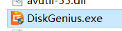

#### 2.1.2 将该空间格式化为FAT32的文件系统

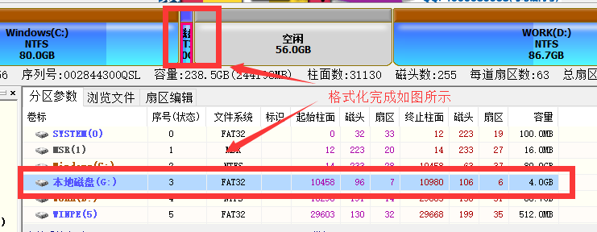

#### 2.1.3 将ubantu镜像中内容提取到格式化出的空间中

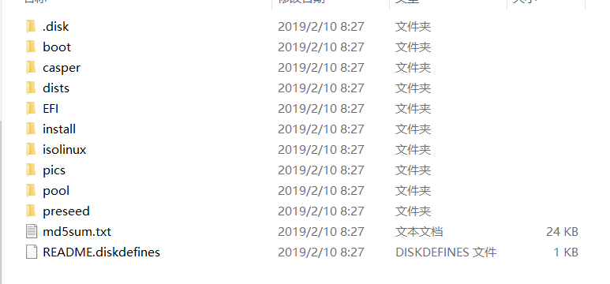

#### 2.1.4 在EFI文件夹下的BOOT文件夹中复制任意文件重命名为mmx64.efi

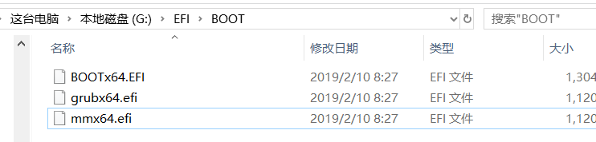

#### 2.1.5 使用esayUEFI软件在该空间设置一个UEFI启动项

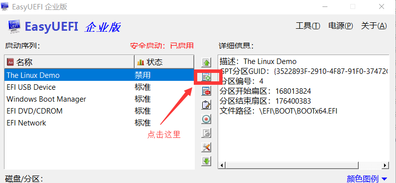
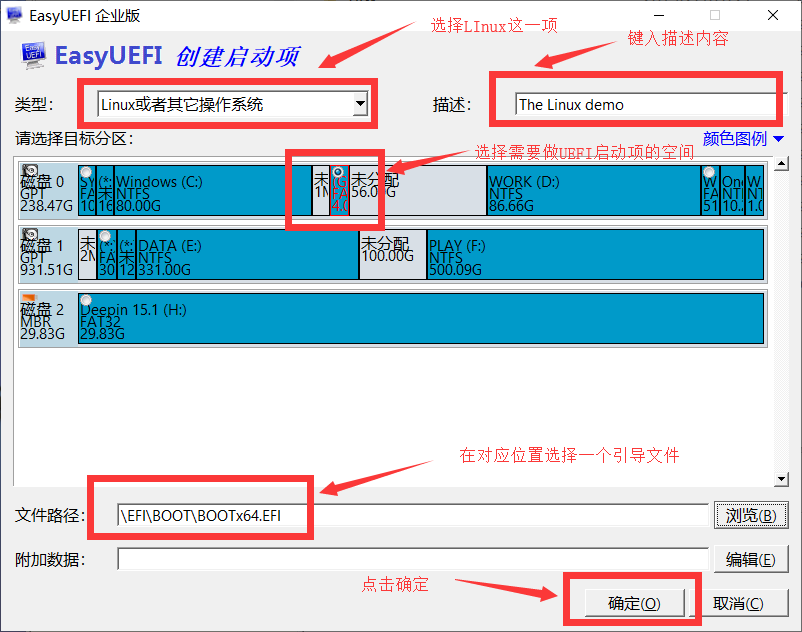

#### 2.1.6 将新增的启动项设置为最优先然后重启

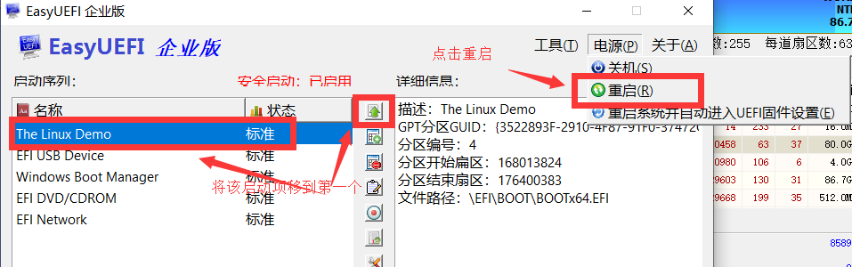

#### 2.1.7 U盘操作类似为了方便推荐使用U盘

#### 2.1.8 在进入选择界面时直接使用不安装试用模式（一般为第一项）进入即可进行模拟

#### 2.1.9 退出模拟环境可以在开机按F2进入Bios界面禁用那个启动项或者直接拔掉U盘

### 2.2 ubuntu初始化

【以下均在root权限下执行，[参考](https://blog.csdn.net/qq1784855023/article/details/85332267)】

#### 2.2.1 设置root密码并使用root账号

```sh
sudo passwd root
//输入密码
//再次输入密码
su
//输入刚设置的密码
```

#### 2.2.2 更换ubantu源

```sh
cp /etc/apt/sources.list /etc/apt/source.list.backup    //备份
gedit /etc/apt/sources.list
//将以下内容复制在打开文件的最后
deb http://mirrors.aliyun.com/ubuntu/ xenial main
deb-src http://mirrors.aliyun.com/ubuntu/ xenial main
deb http://mirrors.aliyun.com/ubuntu/ xenial-updates main
deb-src http://mirrors.aliyun.com/ubuntu/ xenial-updates main
deb http://mirrors.aliyun.com/ubuntu/ xenial universe
deb-src http://mirrors.aliyun.com/ubuntu/ xenial universe
deb http://mirrors.aliyun.com/ubuntu/ xenial-updates universe
deb-src http://mirrors.aliyun.com/ubuntu/ xenial-updates universe
deb http://mirrors.aliyun.com/ubuntu/ xenial-security main
deb-src http://mirrors.aliyun.com/ubuntu/ xenial-security main
deb http://mirrors.aliyun.com/ubuntu/ xenial-security universe
deb-src http://mirrors.aliyun.com/ubuntu/ xenial-security universe
//保存并退出文件
apt-get update
```

#### 2.2.3 安装aircrack-ng

```sh
apt-get install aircrack-ng
```

#### 2.2.4 转变网卡模式

```sh
iwconfig                           //查看网卡名
airmon-ng start [无线网卡名]
```

#### 2.2.5 安装并打开wireshark

```sh
apt-get install wireshark-qt
wireshark
```

#### 2.2.6 用windows中差不多的方式使用并抓取802.11的数据包

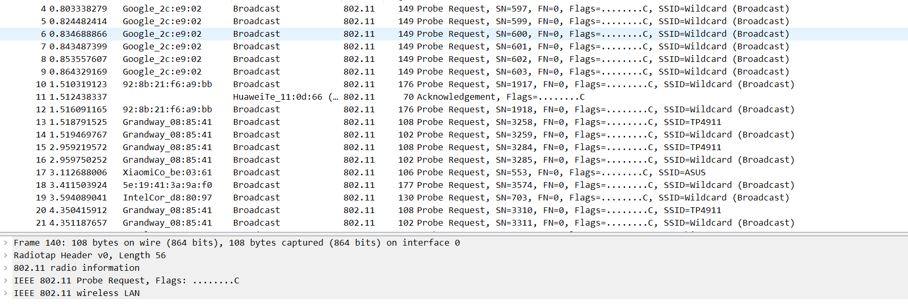

## 三、使用wireshark分析802.11的数据包

### 3.1 wireshark抓包结果（部分）

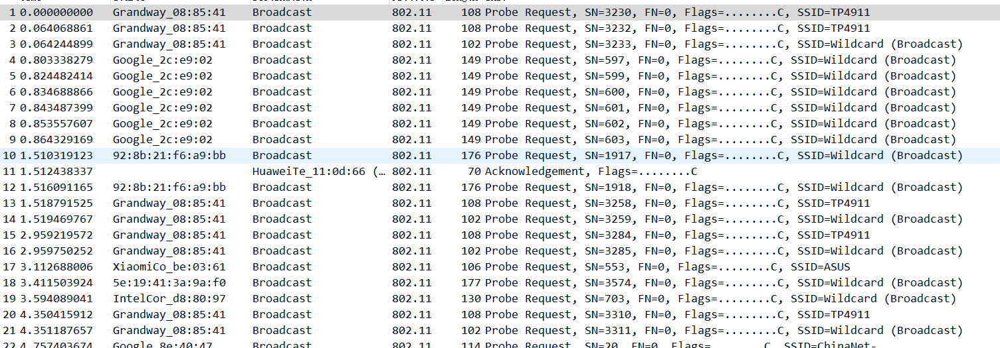

### 3.2 802.11管理帧（Probe request）

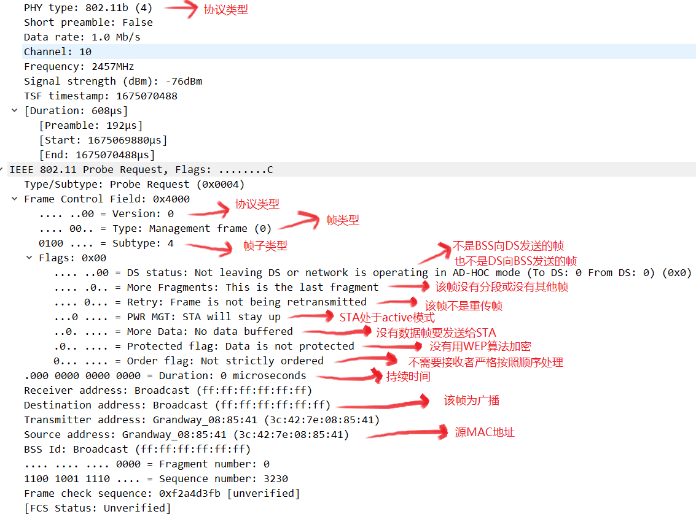

### 3.3 802.11控制帧（ACK确认）

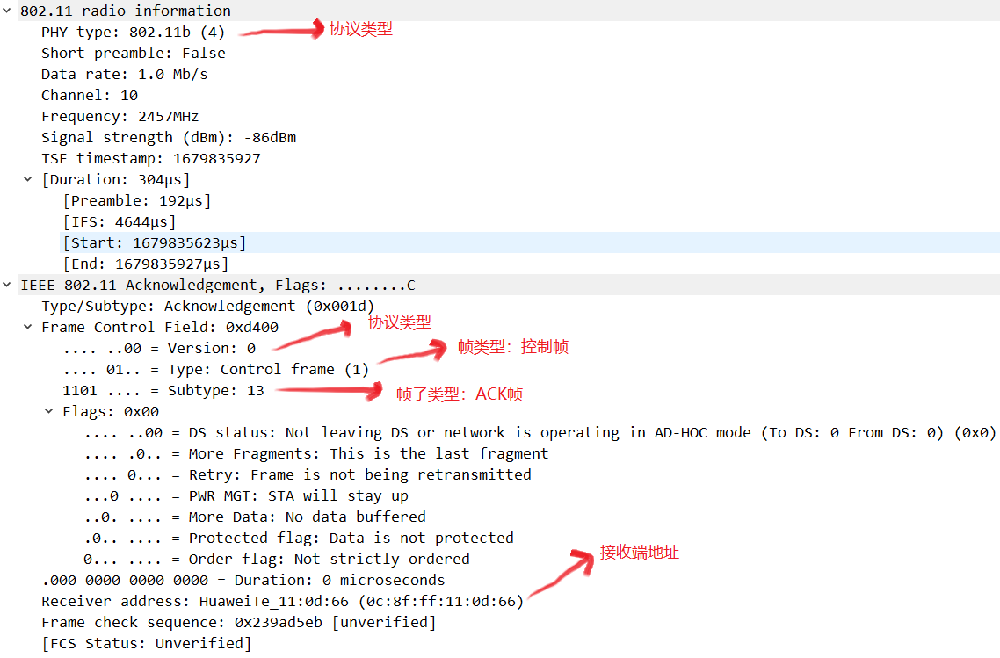

## 四、[附录](../../code/index.md)
