# [](../index.md) 作业2: java实现聊天和winpcap的基本应用

## 一、基于TCP/IP协议制作简单的Client/Server应用（Java实现）

### 1.1 构建Server程序（源代码）

```java
package socket;

import java.io.*;
import java.net.*;
// 手动关闭ServerSocket
// netstat -ano | find ":你的端口号"
// taskkill /f /pid:你的进程PID（在上一条命令行中会列出进程PID)
public class Server {

    public static void main(String[] args) {
        // TODO Auto-generated method stub
        try {
            ServerSocket serverS = null;
            try {
                serverS = new ServerSocket(5555);
                // 创建一个ServerSocket在端口5555监听客户请求
            } catch(Exception e) {
                System.out.println("Can not listen to: "+e);
            }
            Socket socketS = null;
            try {
                socketS = serverS.accept();
                // 使用accept()阻塞等待客户请求，有客户请求到来
                // 则产生一个Socket对象，并继续执行
            } catch (Exception e) {
                System.out.println("Error: "+e);
            }
            BufferedReader isS = new BufferedReader(new InputStreamReader(socketS.getInputStream()));
            // 由Socket对象得到客户机端发来的输入流，并构造BufferedReader对象
            PrintWriter osS = new PrintWriter(socketS.getOutputStream());
            // 由Socket对象得到发向客户机端的输出流，并构造PrintWriter对象
            BufferedReader sinS = new BufferedReader(new InputStreamReader(System.in));
            // 由系统标准输入设备构造BufferedReader对象
            System.out.println("ClientS: "+isS.readLine());
            // 从Client读入一字符串，并打印到标准输出上
            String line;
            line = sinS.readLine();
            System.out.println("SS");
            while(!line.equals("bye")) {
                // 若从系统标准输入读入的字符串为“bye”则停止循环
                osS.println(line);
                // 将从系统标准输入读入的字符串输入到Client
                osS.flush();
                // 刷新输出流，使Client马上收到该字符串
                System.out.println("ServerS: "+line);
                // 在系统标准输出上打印读入的字符串
                System.out.println("ClientS: "+isS.readLine());
                // 从Client读入一字符串，并打印到标准输出上
                line = sinS.readLine();
                // 从系统标准输入读入一字符串
            }
            osS.close(); // 关闭Socket输出流
            isS.close(); // 关闭Socket输入流
            socketS.close(); // 关闭Socket
            serverS.close(); // 关闭ServerSocket
        } catch(Exception e) {
            System.out.println("Error: "+e);
        }
    }
}
```

### 1.2 构建Client程序（源代码）

```java
package socket;

import java.io.*;
import java.net.*;

public class Client {
    public static void main(String args[]) {
        try {
            Socket socketC = new Socket("127.0.0.1",5555);
            // 向本机的5555端口发出客户请求
            BufferedReader sinC = new BufferedReader(new InputStreamReader(System.in));
            // 由系统标准输入设备构造BufferedReader对象
            PrintWriter osC = new PrintWriter(socketC.getOutputStream());
            // 由Socket对象得到发向服务器端的输出流，并构造PrintWriter对象
            BufferedReader isC = new BufferedReader(new InputStreamReader(socketC.getInputStream()));
            // 由Socket对象得到服务器端发回的输入流，并构造相应的BufferedReader对象
            String readline;
            readline = sinC.readLine();
            // 从系统标准输入读入一字符串
            while(!readline.equals("bys")) {
                // 若从系统标准输入读入的字符串为“bye”则停止循环
                System.out.println("ClientC: "+readline);
                // 在系统标准输出上打印读入的字符串
                osC.println(readline);
                // 将从系统标准输入读入的字符串输入到Server
                osC.flush();
                // 刷新输出流，使Server马上收到该字符串
                System.out.println("ServerC: "+isC.readLine());
                // 从Server读入一字符串，并打印到标准输出上
                readline = sinC.readLine();
                // 从系统标准输入读入一字符串
            }
            osC.close(); // 关闭Socket输出流
            isC.close(); // 关闭Socket输入流
            socketC.close(); // 关闭Socket
        } catch(Exception e) {
            System.out.println("Error: "+e);
        }
    }
}
```

### 1.3 运行结果展示

<center>
    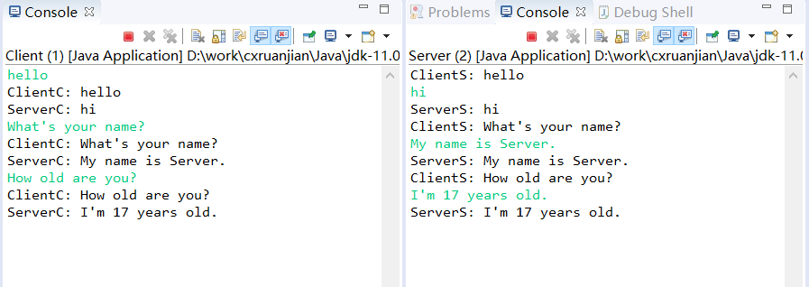</br>
</center>

### 1.4 程序运行过程

1. 首先运行Server的程序，通过创建ServerSocket对象serverS监听本机的5555端口发来的客户请求；然后通过创建Socket对象socketS，并通过accept()使其处于阻塞状态，等待客户请求的到来。
2. 接着运行Client的程序，通过创建Socket对象socketC，并构造其通过本机的5555端口发出客户请求；然后分别构造获取Client控制台输入的BufferedReader对象sinC、获取发向Server的输出流的PrintWriter对象osC以及获取Server发回的输入流的BufferedReader对象isC。
3. 通过readLine方法在Client的控制台获取一字符串赋给变量readline，先在Client的控制台打印出读入的字符串，然后通过对象osC的println方法将读入的字符串传给Server，并通过对象osC的flush方法刷新输出流，并等待Sever的回复。
4. 此时Server的对象socketS通过5555端口获取了从Client传来的客户请求；然后分别构造获取Server发回的输入流的BufferedReader对象isS、获取发向Server的输出流的PrintWriter对象osS以及获取Server控制台输入的BufferedReader对象sinS。
5. 将此时从5555端口获取的客户请求打印在Server的控制台上，然后通过readLine方法在Server的控制台获取一字符串赋给变量line，通过对象osS的println方法将读入的字符串传给Client，并通过对象osS的flush方法刷新输出流，然后在Server的控制台打印出读入的字符串，并等待Client的下一次请求。
6. 另外不论是Server还是Client都可以通过在自己的控制台输入字符串bye，单方面终止连接。

### 1.5 异常关闭处理

&emsp;&emsp;如果由于程序关闭的异常情况，导致未结束Server程序对5555端口的占用，可以打开windows的cmd，通过命令`netstat -ano | find ":你的端口号"`查找占用对应端口进程的PID，再利用该PID通过命令`taskkill /f /pid:你的进程PID`终止该进程。

## 二、编写winpcap 简单应用（C/C++实现）

### 2.1 下载相关文件

&emsp;&emsp;网上通过winpcap包进行socket编程基本是通过vs这款编译器做的，但由于vs过于庞大，个人喜欢用相对轻量的编译器Dev c++,因此以下对winpcap开发环境的配置主要针对编译器Dev c++。
&emsp;&emsp;首先是下载WinPcap的相关文件：
&emsp;&emsp;[WinPcap V4.1.3](https://www.winpcap.org/install/bin/WinPcap_4_1_3.exe)：驱动程序、Dll文件
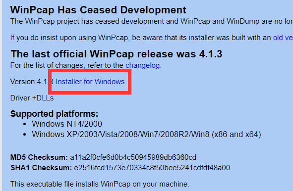
&emsp;&emsp;[WinPcap V4.1.3 Developer's Pack](https://www.winpcap.org/install/bin/WpcapSrc_4_1_3.zip)：库文件、头文件、简单的示例程序代码和帮助文件
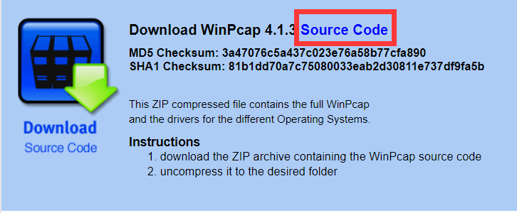
&emsp;&emsp;然后是通过WinPcap_4_1_3.exe按照步骤安装WinPcap，再将WpcapSrc_4_1_3.zip文件解压后放在自己能找到的位置。
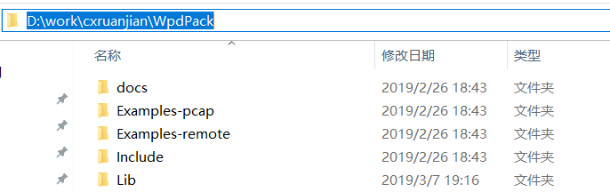

### 2.1 配置Dev-c++

1. 先在Tools->Compiler Options（即工具->编译选项） 打开编译器选项界面。
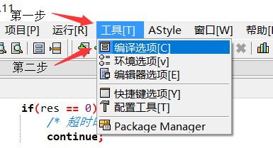
2. 在编译器选项界面中，点击设定编译器配置下拉菜单，选择TDM-GCC 4.9.2 32-bit Release（即32位编译器）。
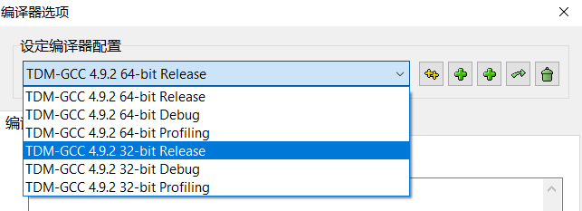
3. 然后在Directories->Libraries（即目录->库）里面加入winpcap开发包目录的Lib目录。
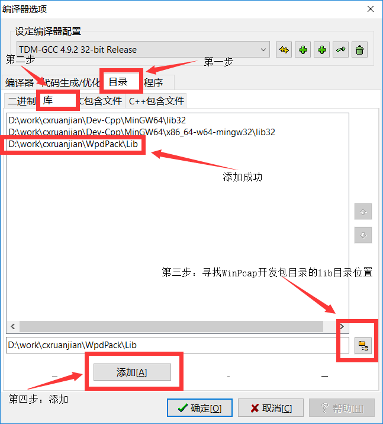
4. 在Directories->Includes（即目录->C/C++包含文件）里面加入winpcap开发包目录的Include目录。
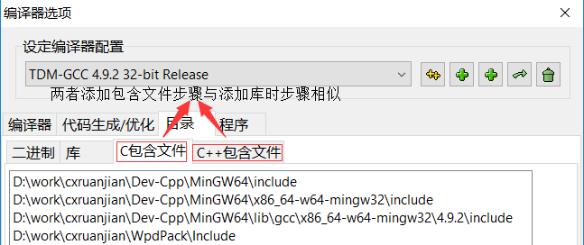
5. 创建C/C++项目，通过项目->项目属性打开项目选项界面。
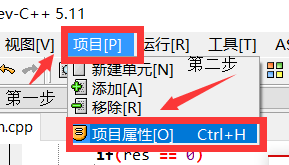
6. 在项目选项界面中，在参数中，通过加入库或对象按钮，将Wcap.lib文件加入该项目链接。
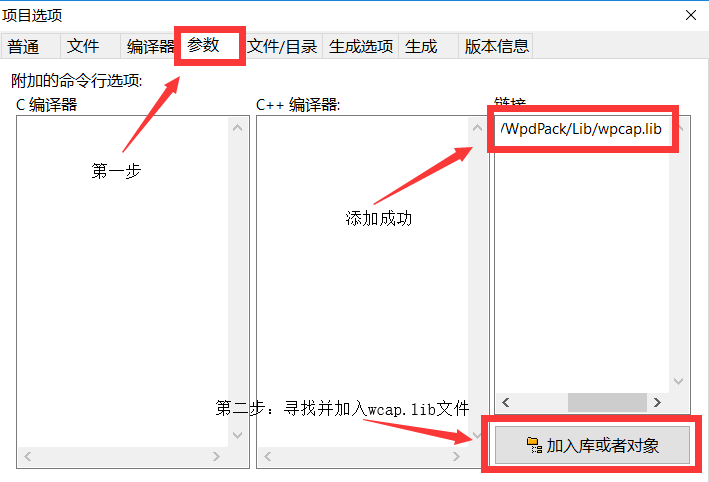
7. 在源码文件`#include <pcap.h>`的前面加入预处理定义——`#define WPCAP`和`#define HAVE_REMOTE`。
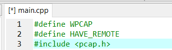
8. 选择32位编译器。
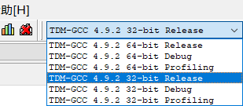
9. 如果需要对数字类型的IP地址转换成字符串类型还需要增加头文件——`#include <winsock2.h>`和`#include <ws2tcpip.h>`。
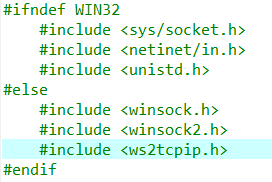

## 三、编写winpcap简单应用

### 3.1 [获取已安装设备的详细信息](../../code/experiment/1.2/main.cpp)

```c++
#include <iostream>
#include <string>
#define HAVE_REMOTE
#include <pcap.h>
#ifndef WIN32
    #include <sys/socket.h>
    #include <netinet/in.h>
    #include <unistd.h>
#else
    #include <winsock.h>
    #include <winsock2.h>
    #include <ws2tcpip.h>
#endif
#pragma comment(lib,"ws2_32.lib")

using namespace std;

char *iptos(u_long in);

int main(int argc, char** argv) {
    pcap_if_t *alldevs;
    pcap_if_t *d;
    pcap_addr_t *a;
    char ip6str[128];
    int i=0;
    char errbuf[PCAP_ERRBUF_SIZE+1];
    char source[PCAP_ERRBUF_SIZE+1];
    printf("Enter the device you want to list:\n"
            "rpcap://              ==> lists interfaces in the local machine\n"
            "rpcap://hostname:port ==> lists interfaces in a remote machine\n"
            "                          (rpcapd daemon must be up and running\n"
            "                           and it must accept 'null' authentication)\n"
            "file://foldername     ==> lists all pcap files in the give folder\n\n"
            "Enter your choice: ");

    fgets(source, PCAP_ERRBUF_SIZE, stdin);
    source[PCAP_ERRBUF_SIZE] = '\0';
    /* 获取本地机器设备列表 */
    if (pcap_findalldevs_ex(source, NULL /* auth is not needed */, &alldevs, errbuf) == -1) {
        fprintf(stderr,"Error in pcap_findalldevs_ex: %s\n", errbuf);
        exit(1);
    }

    /* 打印列表 */
    for(d= alldevs; d != NULL; d= d->next) {
        /* 设备名(Name) */
        printf("%d. %s\n", ++i, d->name);
        /* 设备描述(Description) */
        if (d->description)
            printf("\t(%s)\n", d->description);
        else
            printf("\t(No description available)\n");
        /* Loopback Address*/
        printf("\tLoopback: %s\n",(d->flags & PCAP_IF_LOOPBACK)?"yes":"no");
        /* IP addresses */
        for(a=d->addresses;a;a=a->next) {
            printf("\tAddress Family: #%d\n",a->addr->sa_family);
            switch(a->addr->sa_family)
            {
                case AF_INET:
                    printf("\tAddress Family Name: AF_INET\n");
                    if (a->addr)
                        printf("\tAddress: %s\n",iptos(((struct sockaddr_in *)a->addr)->sin_addr.s_addr));
                    if (a->netmask)
                        printf("\tNetmask: %s\n",iptos(((struct sockaddr_in *)a->netmask)->sin_addr.s_addr));
                    if (a->broadaddr)
                        printf("\tBroadcast Address: %s\n",iptos(((struct sockaddr_in *)a->broadaddr)->sin_addr.s_addr));
                    if (a->dstaddr)
                        printf("\tDestination Address: %s\n",iptos(((struct sockaddr_in *)a->dstaddr)->sin_addr.s_addr));
                    break;
                case AF_INET6:
                    printf("\tAddress Family Name: AF_INET6\n");
                    break;
                default:
                    printf("\tAddress Family Name: Unknown\n");
                    break;
            }
        }
    }

    if (i == 0) {
        printf("\nNo interfaces found! Make sure WinPcap is installed.\n");
        return 0;
    }

    /* 不再需要设备列表了，释放它 */
    pcap_freealldevs(alldevs);
    return 0;
}

/* 将数字类型的IP地址转换成字符串类型的 */
#define IPTOSBUFFERS    12
char *iptos(u_long in) {
    static char output[IPTOSBUFFERS][3*4+3+1];
    static short which;
    u_char *p;

    p = (u_char *)&in;
    which = (which + 1 == IPTOSBUFFERS ? 0 : which + 1);
    sprintf(output[which], "%d.%d.%d.%d", p[0], p[1], p[2], p[3]);
    return output[which];
}
```

### 3.2 过程描述

&emsp;&emsp;首先是选择菜单，根据用户不同的输入获取不同类别的设备信息。
&emsp;&emsp;以获取本地设备的输入"rpcap://"为例，先通过pcap_findalldevs_ex函数获取本地设备列表，并将其存入变量alldevs指向的内存空间。如果该函数运行出现异常，则会将异常信息保存在变量errbuf中。
&emsp;&emsp;获取本地信息列表后，通过遍历该列表，逐个显示每个本地设备的信息。对于每个设备而言，可输出的信息有设备名name，设备描述description，是否有本地回环接口flags，以及相关地址列表addresses。在该地址若为Ipv4格式，则可能会有IP地址，掩码地址，广播地址和目的地址等信息，这些信息可以通过函数iptos将其从数字类型转换为字符串类型；若为Ipv6格式，则可以通过函数getnameinfo进行解析获得。
&emsp;&emsp;最终将获得的信息打印在控制台中，从而让用户获得相关设备的详细信息。
