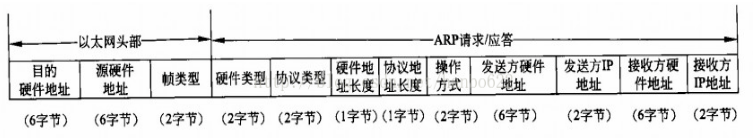
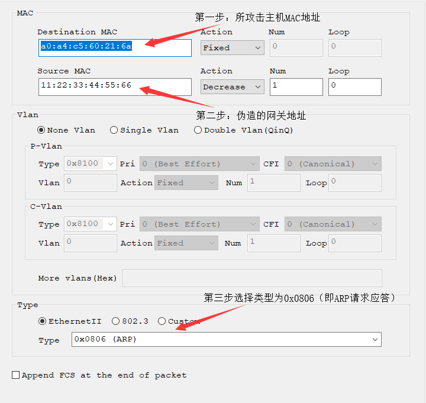
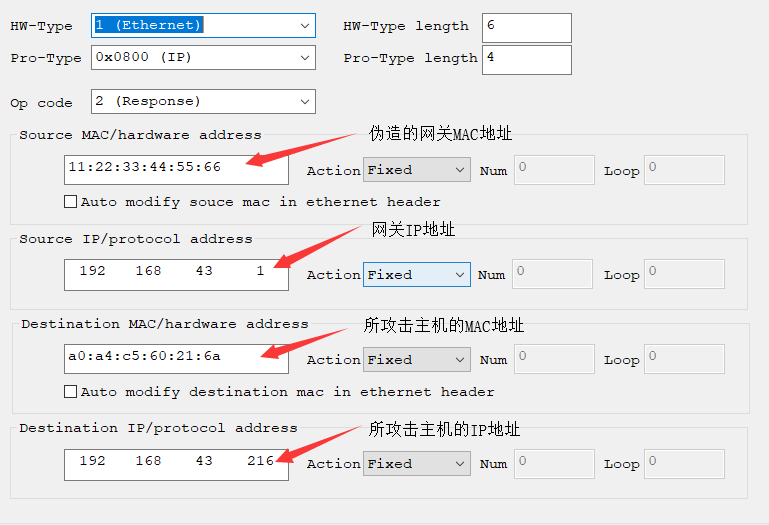
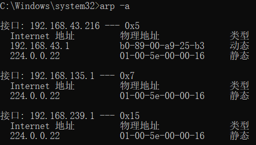
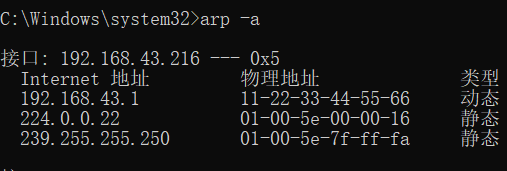
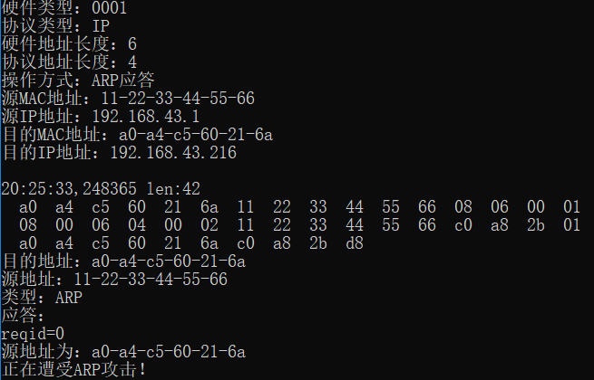

#  作业3: 模拟ARP攻击并检测ARP攻击

## 一、ARP攻击原理

### 1.1 简介

&emsp;&emsp;网络欺骗攻击作为一种非常专业化的攻击手段，给网络安全管理者，带来严峻的考验。网络安全的战场已经从互联网蔓延到用户内部的网络，特别是局域网。目前利用ARP欺骗的木马病毒在局域网中广泛传播，导致网络随机掉线甚至整体瘫痪，通讯被窃听，信息被篡改等严重后果。

### 1.2 ARP协议简述

&emsp;&emsp;一台主机和另一台主机通信，要知道目标的IP地址，但是在局域网中传输数据的网卡却不能直接识别IP地址，因此需要通过ARP解析协议将IP地址解析成MAC地址，从而知道对应网卡从而将数据通过网卡传给该网卡所在的主机。ARP协议的基本功能就是通过目标设备的IP地址，来查询目标设备的mac地址。在局域网的任意一台主机中，都有一个ARP缓存表，里面保存本机已知的此局域网中各主机和路由器的IP地址和MAC地址的对照关系。ARP缓存表的生命周期是有时限的（一般不超过20分钟）。

### 1.3 举例

&emsp;&emsp;假设局域网中有以下三台主机以及网关：

|主机名|IP地址|MAC地址|
|:-:|:-:|:-:|
|A|192.168.43.2|MAC-A|
|B|192.168.43.100|MAC-B|
|C|192.168.43.216|MAC-C|
|网关|192.168.43.1|MAC-W|

&emsp;&emsp;主机A想与主机C通讯，主机A会先查询自己的ARP缓存表里有没有C的MAC地址，有的话，就将MAC-C地址封装到数据包外面，发送出去。没有的话，A会向全网络发送一个ARP请求包，大声询问：我的IP地址是192.168.43.2，硬件地址是MAC-A，我想知道IP地址是192.168.43.216的硬件地址是多少？   此时，局域网内所有主机都收到了，C收到后会单独私密回应：我是192.168.43.216，我的硬件地址是MAC-C，其他主机不会理A的ARP请求。此时A知道了C的信息，在通过该MAC地址发送给B数据的同时也会动态的更新自身的缓存表，以便下一次发送数据给B时可以直接查询。
&emsp;&emsp;如果在主机A进行ARP请求时，主机B也进行了应答，并对应答进行了伪装，即：我是192.168.43.216，我的硬件地址是MAC-B。如果A先收到了B的应答包，那就会把本应发给C的数据包发给B，而C发现数据包的目的MAC地址不是自己反而把包给丢了。这样就是一次成功的ARP攻击，在主机A的ARP缓存表生命周期结束之前，本因发给B的数据C都能收到。
&emsp;&emsp;另外对于网关也可以进行类似的攻击，就是在主机重启时，会在局域网中发送询问网关的MAC地址的ARP请求包，此时如果同局域网有一台恶意的主机，将错误的网关MAC地址伪装成ARP应答包提前被该重启的主机接受，就会将错误的网关MAC地址记录在ARP缓存表中，从而导致该电脑无法通过网关访问外网。

## 二、检查ARP攻击（C/C++实现）

### 2.1 [抓取并分析ARP包和检测ARP攻击](../../code/experiment/1.3/main.cpp)

### 2.2 通过xcap模拟ARP攻击

     
    图 2 创建应答包的MAC头
     
    图 3 创建应答包的ARP头

### 2.3 ARP攻击前本机ARP缓存表

     
    图 4 攻击前ARP缓存表

### 2.4 通过命令arp -d清空ARP缓存表

     
    图 5 清空ARP缓存表

### 2.5 ARP攻击中本机ARP缓存表

     
    图 6 攻击中ARP缓存表

### 2.6 程序检测ARP攻击结果

     
    图 7 成功检测到ARP攻击

