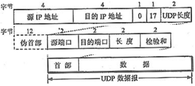

#  作业4: 抓取并分析IPv4和IPv6数据包

## 一、MAC数据包解析

### 1.1 MAC数据包格式

|目的MAC地址|源MAC地址|帧类型|
|:-:|:-:|:-:|
|6B|6B|4B|

### 1.2 MAC数据包解析

&emsp;&emsp;MAC首部一般为14字节，前六个字节表示目的MAC地址，中六字节表示源MAC地址，后2个字节表示帧类型。目的MAC地址表示以该MAC地址的网卡作为数据包的目的地，源MAC地址表示该MAC地址的网卡为数据包的发送源，最后四字节表示在MAC首部之后的数据由什么协议来解析。如果帧类型为0x0800，MAC首部之后就为IPv4数据包；如果帧类型为0x86dd，MAC首部之后就为IPv6数据包；如果帧类型为0x0806，MAC首部之后就为ARP数据包；如果帧类型为0x0835，MAC首部之后就为RARP数据包；如果帧类型为其他，则对应其他协议数据包格式。

## 二、IPv4数据包解析

### 2.1 IPv4数据包格式

     

### 2.2 IPv4数据包解析

&emsp;&emsp;IPv4首部一般至少为20字节，具体长度会随着选项字段的长短变化。
&emsp;&emsp;其第一个字节的前四位标志该IP协议的版本，由于此为IPv4数据包，因此该版本字段的值一定为4；后四位为首部长度，其单位为4字节，因此该字段的值为首部实际长度除以4后的结果，一般为5。
&emsp;&emsp;第二个字节用于区分服务，前三位为优先级，根据其值不同有八种优先级，具体请见下表：

|数值|优先级|数值|优先级|
|:-:|:-:|:-:|:-:|
|0b000|Routine-普通|0b100|Flash Override-极速|
|0b001|Priority-优先|0b101|Critic-关键|
|0b010|Immediate-快速|0b110|Internetwork Control-网间控制|
|0b011|Flash-闪速|0b111|Network Control-网络控制|

&emsp;&emsp;第4-7位为服务类型，这四位至多只有一位可以置一，根据不同的置一情况有五种服务类型，具体请见下表：

|数值|服务类型|
|:-:|:-:|
|0b0000|Normal Service-普通服务|
|0b0001|Minimize Delay-最小延迟|
|0b0010|Maximize Throughput-最大吞吐量|
|0b0100|Maximize Reliability-最大可靠性|
|0b1000|Minimize Monetary Cost-最小成本|

&emsp;&emsp;第8位为保留位，默认为0。
&emsp;&emsp;第三、四字节表示IPv4数据包总长度，包括IPv4首部以及首部之后的数据内容之和的长度。由于该字段只有2个字节，因此，一个IPv4数据包中包括首部最多有65535字节的内容。当出现数据包内容多于65535字节的时候，就要对数据进行分片，通过多个IPv4数据包传输，为保证分片后目的主机可以重新将分片组织成完整的数据，就需要后面三个字段的配合，即标识、标志以及片位移。
&emsp;&emsp;第五、六字节表示标识，IPv4软件在存储器中维持一个计数器，每产生一个数据报，计数器就加一，并将此值赋给该字段，因此对于同一个数据报的分片IPv4数据包的标识字段是一致的。
&emsp;&emsp;第七、八字节的前三位表示标志，目前标志字段的第一位无意义默认为0；第二位为0表示允许分片，为1表示不能分片；第三位为0表示为最后一个数据片，为1表示为中间数据片。后13位表示片位移，指出较长的分组在分片后，该片在原分组的相对位置。
&emsp;&emsp;第九字节表示生存时间，即数据包在网络中的寿命，当数据包经过一个路由器就把该字段减一，如果该字段减到0，就表示路由过长任然找不到目标主机的网络，因此自动丢弃该包。
&emsp;&emsp;第十字节表示上层协议类型。如果该字段为0x01，上层协议就是ICMP；如果该字段为0x02，上层协议就是IGMP；如果该字段为0x06，上层协议就是TCP；如果该字段为0x11，上层协议就是UDP；如果该字段为其他数值，上层协议就是该数值对应的协议。
&emsp;&emsp;第十一、十二字节表示首部检验和，用于检验IP数据包首部是否在传输到接收端之后是否发生了变化。由于在经过路由器后，生存时间、标识、片偏移等字段会发生变化，因此路由器都要重新计算一下首部检验和，保证正确数据不被丢。其计算方法如下：
&emsp;&emsp;1、把IP数据包首部中的检验和字段置为0。
&emsp;&emsp;2、把首部按16位为单位分组，并以此累加求和。若首部最后一组不满16位，则用0填充到16位。将最后的累加和求反。
&emsp;&emsp;3、求反的数值即首部检验和。
&emsp;&emsp;4、接收端按发送端的方式进行累加求和，如果累加和求反为0，则首部没有出错；否则，首部出错，丢弃该IP数据包。
&emsp;&emsp;第十三-十六字节表示源IP地址，即发送端的IP地址；第十七-二十字节表示目的IP地址，即接受端的IP地址。
&emsp;&emsp;根据之前的首部长度字段，可能之后有0-40字节的选项字段，用于支持排错、测量以及安全等措施。

## 三、UDP数据包解析

### 3.1 UDP数据包格式

|源端口地址|目的端口地址|用户数据包长度|检验和|
|:-:|:-:|:-:|:-:|
|2B|2B|2B|2B|

### 3.2 UDP数据包解析

&emsp;&emsp;UDP协议不面向链接，也不保证传输的可靠性，其首部一般为八字节。第一、二字节为源端口地址，表示发送端的端口地址；第三、四字节为目的端口地址，表示接受端的端口地址；第五、六字节为用户数据包长度，包括UDP首部与首部之后数据之和的长度；第七、八字节为检验和，由于UDP协议的性质，该字段可以省略。如果检验和字段为省略，其获取方式，需要增加伪首部然后就跟IPv4协议获取检验和的方式一致了，伪首部格式如下：

     

## 四、TCP数据包解析

### 4.1 TCP数据包格式

     

### 4.2 TCP数据包解析

&emsp;&emsp;TCP协议面向连接，在通信前通过三次握手的机制建立可靠的传输连接，在结束通信后通过四次分手的机制断开连接。
&emsp;&emsp;第一、二字节表示该段报文来自哪里，即发送端的端口地址；第三、四字节表示该段报文要传给哪个上层协议或应用程序，即接收端的端口地址。进行TCP通讯时，一般client是通过系统自动选择的临时端口号，而server一般是使用知名服务端口号或者自己指定的端口号。
&emsp;&emsp;第五-八字节表示一次TCP通信过程（从建立连接到断开）中某一次传输方向上的每个字节的编号。假设主机A和B进行TCP通信，A需要传送给B一串字节流，在其发送的一个TCP报文段中，该字段就会被A的系统初始化一个随机值ISN，之后再A到B的传输方向上的每一个TCP报文段中的该字段都会被设定成ISN加上该报文段所携带数据的第一个字节在整个字节流中的偏移。若某个TCP报文传送的数据为A到B方向的字节流的第2049~4096字节，那么该报文段的序号值就是ISN+2049。
&emsp;&emsp;第九-十二字节表示对另一方发送的TCP报文段的响应，其值是收到对方的TCP报文段中的序号字段的值加一。若在之前B收到A发到的TCP报文段时，需要给A发送一个确认收到的报文，系统除了按默认方法给该TCP报文段的序号字段赋值，也会将确认序号字段赋为之前从A那收到的TCP报文段的序号字段的值加一。
&emsp;&emsp;第十三、十四字节的前四位，表示TCP报文段首部长度，其单位为四字节，由于四位最大表示15，因此TCP报文段的首部的长度最大为60字节。中间六位为保留位，暂时无意义。后六位为标志位，相互配合表示TCP报文段的用途以及不同字段是否启用。标志位从左往右依次是，表示紧急指针字段是否有效的URG标志；表示确认序号是否有效的ACK标志，带该标志的TCP报文段也称确认报文段；提示接收端应用程序应立即从TCP接受缓存区读走数据为后续接收数据让出空间的PSH标志；表示要求对方重建连接的RST标志，带该标志的TCP报文段也称复位报文段；表示建立一个连接的SYN标志，带该标志的TCP报文段也称为同步报文段；表示告知对方本段要关闭连接的FIN标志。
&emsp;&emsp;第十五、十六字节为窗口大小，即接受通告窗口，用于TCP流量控制。该字段告诉对方本端TCP接收缓冲区还能容纳多少字节的数据，从而对方就能根据这个信息控制发送数据的速度。
&emsp;&emsp;第十七、十八字节为校验和，由于TCP报文的性质，需要保证传输的可靠，其与UTP报文检验和不同之处在于，除了要检验TCP首部也要检验TCP数据，因此在保证传输可靠的同时也一定程度上消耗了更多的资源。
&emsp;&emsp;第十九、二十字节为一个正的偏移量，其与序号字段的值相加表示最后一个紧急数据的下一字节的序号，因此这个字段是紧急指针，其相对于当前序号的偏移量，用于发送紧急数据。
&emsp;&emsp;之后四十字节为TCP头部选项，其长度可变。大致结构为：第一字节表示选项类型，第二字节表示选项部分长度，后面字节为选项的具体内容。常见的头部选项如下图所示：

     

## 五、IPv6数据包解析

### 5.1 IPv6数据包格式

     

### 5.2 IPv6数据包解析

&emsp;&emsp;IPv6是为了克服需要接入网络的设备越来越多但IPv4不够用的缺陷而产生的扩展版本，将IPv6地址将原来32位的IPv4地址扩展成了128位，大大增加了IP数量。IPv6首部一般至少为四十字节。
&emsp;&emsp;其前四字节的前四位与IPv4的前四位一样标志该IP协议的版本，由于是IPv6，这个字段默认为6。之后八位为通讯量等级，其与IPv4首部的区分服务字段功能差不多，用于区分该IPv6数据包的优先级和服务类型。最后二十位是流标签，可以说是对通讯量等级字段的进一步补充，该字段用于服务质量控制，只有流标号、源地址和目的地址三项完全一致时，才被认为是一个流。
&emsp;&emsp;第五、六字节是有效载荷长度，表示包的数据部分。对于IPv4首部的总长度字段而言，其区别是有效载荷长度只记录IPv6首部之后数据的长度，而总长度记录了IPv4首部以及之后数据部分之和的长度。
&emsp;&emsp;第七字节是下一个首部，相当于IPv4首部中的协议字段，通常用于表示IP的上一层协议是什么。不过在有IPv6扩展首部的情况下，该字段表示后面第一个扩展首部的协议类。
&emsp;&emsp;第八字节是跳数限制，其意义与IPv4中生存时间（TTL）字段一致，表示该数据包最多还能经过多少个路由器，其单位为跳（Hop）。
&emsp;&emsp;第九-二十四字节和第二十五-四十字节分别为IPv6协议下的源IP地址与目的IP地址。

## 六、获取并解析IPv4与IPv6数据包

### 6.1 抓取并分析IPv4数据包

     
     

### 6.2 抓取并分析IPv6数据包

     

## [附录](../../code/experiment/1.4/main.cpp)
