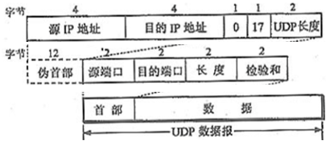
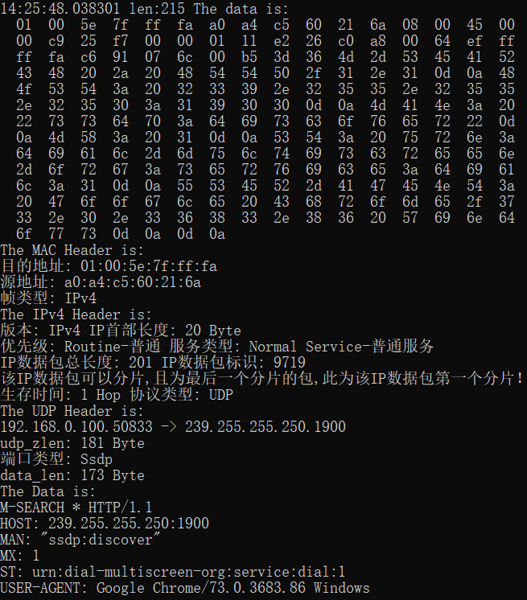
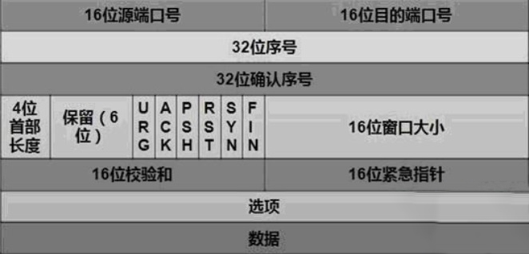
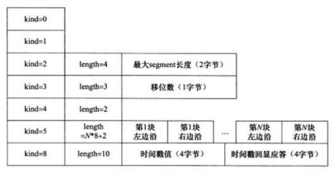
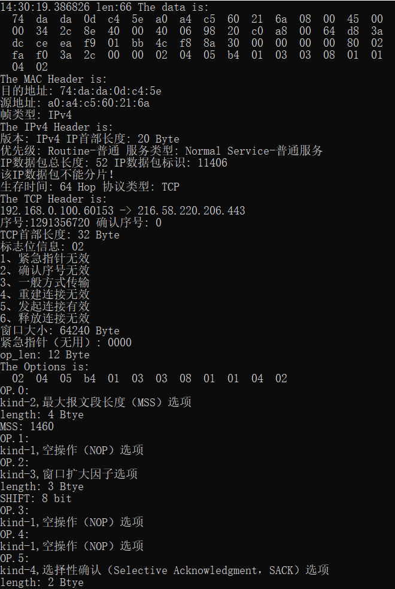
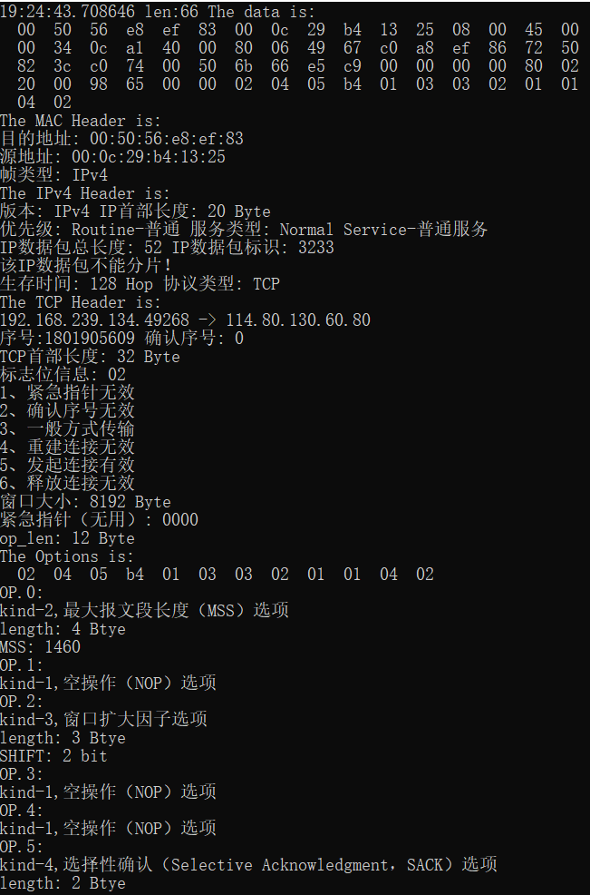
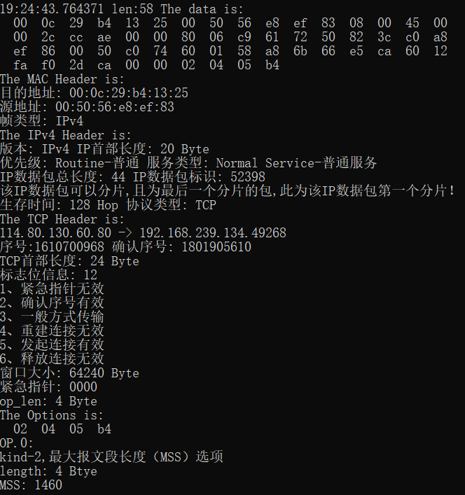
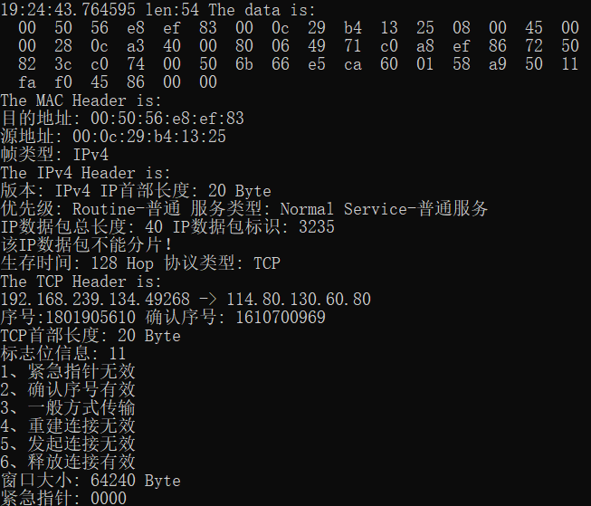
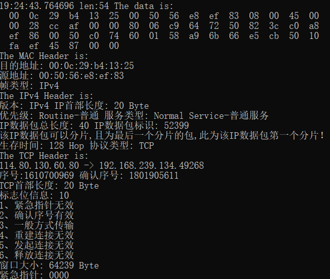
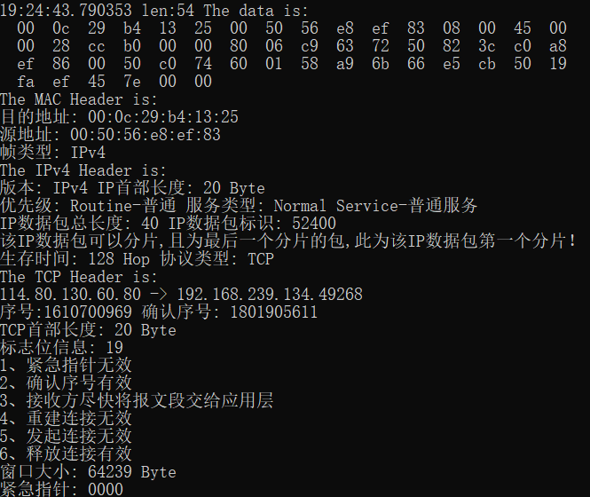

#  作业5: 抓取并分析UDP和TCP数据包

## 一、UDP数据包解析

### 1.1 UDP数据包格式

|源端口地址|目的端口地址|用户数据包长度|检验和|
|:-:|:-:|:-:|:-:|
|2B|2B|2B|2B|

### 1.2 UDP数据包解析

&emsp;&emsp;UDP协议不面向链接，也不保证传输的可靠性，其首部一般为八字节。第一、二字节为源端口地址，表示发送端的端口地址；第三、四字节为目的端口地址，表示接受端的端口地址；第五、六字节为用户数据包长度，包括UDP首部与首部之后数据之和的长度；第七、八字节为检验和，由于UDP协议的性质，该字段可以省略。如果检验和字段为省略，其获取方式，需要增加伪首部然后就跟IPv4协议获取检验和的方式一致了，伪首部格式如下：

     

### 1.3 UDP数据包实例解析

     
    图 1 UDP数据包内部二进制格式
     
    图 2 通过winpcap解析后的结果

## 二、TCP数据包解析

### 2.1 TCP数据包格式

     

### 2.2 TCP数据包解析

&emsp;&emsp;TCP协议面向连接，在通信前通过三次握手的机制建立可靠的传输连接，在结束通信后通过四次分手的机制断开连接。
&emsp;&emsp;第一、二字节表示该段报文来自哪里，即发送端的端口地址；第三、四字节表示该段报文要传给哪个上层协议或应用程序，即接收端的端口地址。进行TCP通讯时，一般client是通过系统自动选择的临时端口号，而server一般是使用知名服务端口号或者自己指定的端口号。
&emsp;&emsp;第五-八字节表示一次TCP通信过程（从建立连接到断开）中某一次传输方向上的每个字节的编号。假设主机A和B进行TCP通信，A需要传送给B一串字节流，在其发送的一个TCP报文段中，该字段就会被A的系统初始化一个随机值ISN，之后再A到B的传输方向上的每一个TCP报文段中的该字段都会被设定成ISN加上该报文段所携带数据的第一个字节在整个字节流中的偏移。若某个TCP报文传送的数据为A到B方向的字节流的第2049~4096字节，那么该报文段的序号值就是ISN+2049。
&emsp;&emsp;第九-十二字节表示对另一方发送的TCP报文段的响应，其值是收到对方的TCP报文段中的序号字段的值加一。若在之前B收到A发到的TCP报文段时，需要给A发送一个确认收到的报文，系统除了按默认方法给该TCP报文段的序号字段赋值，也会将确认序号字段赋为之前从A那收到的TCP报文段的序号字段的值加一。
&emsp;&emsp;第十三、十四字节的前四位，表示TCP报文段首部长度，其单位为四字节，由于四位最大表示15，因此TCP报文段的首部的长度最大为60字节。中间六位为保留位，暂时无意义。后六位为标志位，相互配合表示TCP报文段的用途以及不同字段是否启用。标志位从左往右依次是，表示紧急指针字段是否有效的URG标志；表示确认序号是否有效的ACK标志，带该标志的TCP报文段也称确认报文段；提示接收端应用程序应立即从TCP接受缓存区读走数据为后续接收数据让出空间的PSH标志；表示要求对方重建连接的RST标志，带该标志的TCP报文段也称复位报文段；表示建立一个连接的SYN标志，带该标志的TCP报文段也称为同步报文段；表示告知对方本段要关闭连接的FIN标志。
&emsp;&emsp;第十五、十六字节为窗口大小，即接受通告窗口，用于TCP流量控制。该字段告诉对方本端TCP接收缓冲区还能容纳多少字节的数据，从而对方就能根据这个信息控制发送数据的速度。
&emsp;&emsp;第十七、十八字节为校验和，由于TCP报文的性质，需要保证传输的可靠，其与UTP报文检验和不同之处在于，除了要检验TCP首部也要检验TCP数据，因此在保证传输可靠的同时也一定程度上消耗了更多的资源。
&emsp;&emsp;第十九、二十字节为一个正的偏移量，其与序号字段的值相加表示最后一个紧急数据的下一字节的序号，因此这个字段是紧急指针，其相对于当前序号的偏移量，用于发送紧急数据。
&emsp;&emsp;之后四十字节为TCP头部选项，其长度可变。大致结构为：第一字节表示选项类型，第二字节表示选项部分长度，后面字节为选项的具体内容。常见的头部选项如下图所示：

     

### 2.3 TCP数据包实例解析

     
    图 3 TCP内部二进制格式
     
    图 4 通过winpcap解析后的结果
     
    图 5 TCP选项字段二进制格式
     
    图 6 通过winpcap解析后的结果

## 三、TCP建立释放连接全过程

### 3.1 第一次握手

     
    图 7 第一次握手数据包二进制格式
     
    图 8 通过winpcap解析后结果
     
    图 9 通过winpcap解析其选项字段

### 3.2 第二次握手

     
    图 10 第一次握手数据包二进制格式
     
    图 11 通过winpcap解析后的结果
     
    图 12 通过winpcap解析其选项字段

### 3.3 第三次握手

     
    图 13 第三次握手二进制格式内容以及通过winpcap解析后的结果

### 3.4 第一次挥手

     
    图 14 第一次挥手数据包二进制格式
     
    图 15 通过winpcap解析后的结果

### 3.5 第二次挥手

     
    图 16 第二次挥手二进制格式内容以及通过winpcap解析后的结果

### 3.6 第三次挥手

     
    图 17 第三次挥手二进制格式内容以及通过winpcap解析后的结果

### 3.7 第四次挥手

     
     
    图 18 第四次挥手二进制格式内容以及通过winpcap解析后的结果

### 3.8 对于TCP连接释放的一些解释

1. 对于TCP连接，客户机需要先向服务器发送syn数据包，用以向服务器提交需要连接的请求，即第一次握手，此时数据包的序号为x，发起连接标志为为1.
2. 在服务器收到syn数据包后，会向对应的客户机发送确认用syn+ack数据包，用以确认已收到连接请求，即第二次握手，此时数据包的序号为y，确认序号为x+1，发起连接和确认序号的标志为1.
3. 当客户机收到确认syn+ack数据包后，会再次向服务器发送一个确认收到该包的ack包，即第三次挥手，此时数据包的确认需要为y+1，确认序号标志为1.此时客户机与服务器间的TCP连接正式连接。
4. 在TCP连接建立之后，每次某方发送一个数据包，在另一方收到后均会发送一个确认收到的数据包。
5. 对于TCP连接释放，客户机需要向服务器发送一个带有释放连接标志的fin数据包，用以告诉服务器，本客户机不会再向你发送数据了，即第一次挥手。
6. 服务器获取到该fin数据包后，就会向对应客户器发送一个带有确认序号标志的ack数据包，即第二次挥手。
7. 紧接着ack数据包发送的一段时间后，服务器会向相应客户机发送一个带有释放标记的fin数据包，用以告诉客户器，本服务器也不会再向你发送数据了，即第三次挥手
8. 在客户机收到服务器发送的fin数据包后，会向服务器发送一个已经收到的确认ack数据包，即第四次挥手。
9. 至此两机的TCP连接完全断开。

## 四、[附录](../../code/experiment/1.5/main.cpp)
