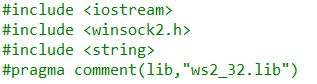
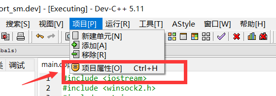
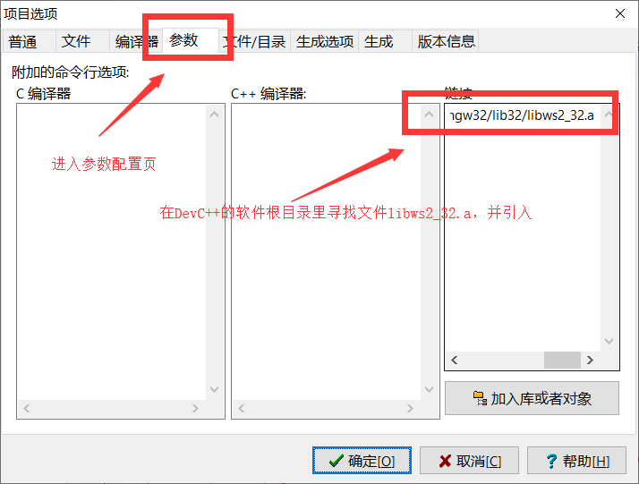
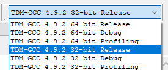
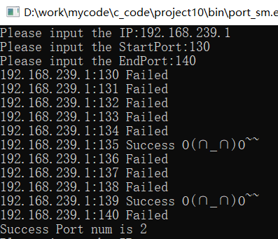
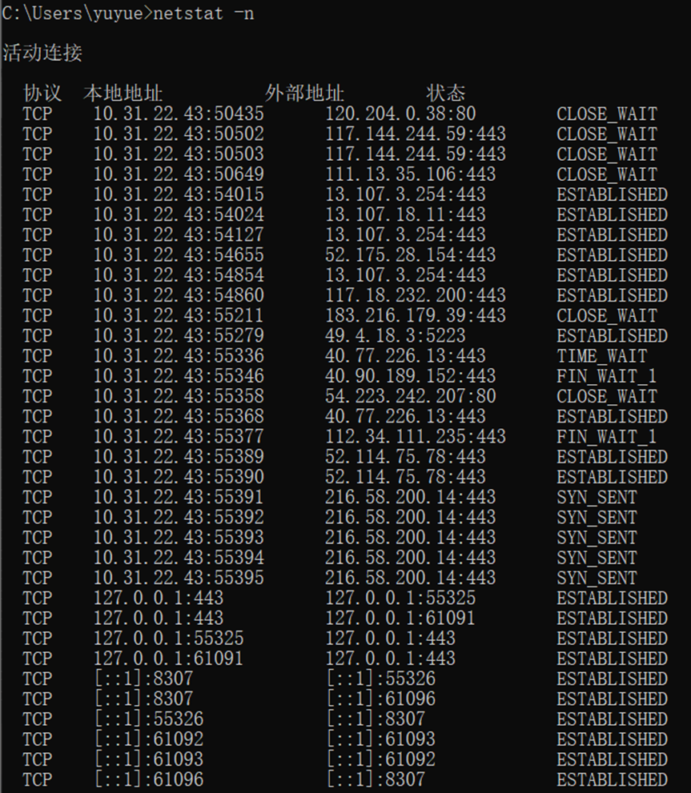

#  作业6: 端口扫描

## 一、C++中SOCKET编程

### 1.1 DevC++中SOCKET编程前环境配置

&emsp;&emsp;创建项目并在，主文件中引入头文件如下

&emsp;&emsp;打开项目属性

&emsp;&emsp;在参数配置页的链接配置中加入32位的文件libws2_32.a

&emsp;&emsp;选择32位的GCC编译器

### 1.2 SOCKET编程中内容简述

1. 比较常见的Internet套接字有两种类型，一种是"Stream Sockets"（流格式），另外一种是"Datagram Sockets"（数据包格式）
2. 对于流格式的套接字的应用，比较典型的是telnet，即将所输入的字符按顺序传输。
3. 对于数据包格式的套接字的应用，有面向无连接的UDP也有面向连接的TCP，对于无连接的UDP而言，为了保证数据传输的有效性，接收方在收到发送方的数据包时要回复一个ACK包，向发送方说明已收到数据包；否则，发送方在一定时间后会重新发送，直到收到接收方所发的ACK包。
4. 在C++的头文件winsock2.h中定义了一个结构体sockaddr，用于存储套接字地址信息，其中定义了类型变量sa_family与目标地址和端口信息变量sa_data。为了方便处理，还定义了并列的结构sockaddr_in，这个结构体中将原先的sa_data变量进行了进一步的细分，分为端口变量sin_port、Internet地址变量sin_addr与填充变量sin_zero。
5. 同时为了保证本机字节序与网络字节序之间的转换，定义了四个转换函数，如下：
`htons()--"Host to Network Short"`
`htonl()--"Host to Network Long"`
`ntohs()--"Network to Host Short"`
`ntohl()--"Network to Host Long"`
6. 为了方便IP地址的转换，定义了如下两个函数：
`inet_addr()(含义是" ascii to network")`
`inet_ntoa()("ntoa"的含义是"network to ascii")`
7. 在使用winsock函数之前，需要使用WSAStartup函数来装入并初始化动态链接库。
8. 对于socket中比较重要的socket()函数的调用而言，第一个参数用于定义套接字环境、第二个参数用于定义套接字类型，第三个参数用于定义所用的协议。
9. 测试端口是否打开，可以使用connect函数去连接试试，若连接成功，说明已被打开，反之，则是关闭状态。

## 二、通过C++的中SOCKET编程检测端口

## 三、通过win10的中netstat命令检测端口

### 3.1 netstat命令内容简述

1. netstat -s ——本选项能够按照各个协议分别显示其统计数据。如果你的应用程序（如Web 浏览器）运行速度比较慢，或者不能显示Web 页之类的数据，那么你就可以用本选项来查看一下所显示的信息。你需要仔细查看统计数据的各行，找到出错的关键字，进而确定问题所在。
2. netstat -e ——本选项用于显示关于以太网的统计数据。它列出的项目包括传送的数据报的总字节数、错误数、删除数、数据报的数量和广播的数量。这些统计数据既有发送的数据报数量，也有接收的数据报数量。这个选项可以用来统计一些基本的网络流量。
3. netstat -r ——本选项可以显示关于路由表的信息，类似于后面所讲使用route print 命令时看到的 信息。除了显示有效路由外，还显示当前有效的连接。
4. netstat -a ——本选项显示一个所有的有效连接信息列表，包括已建立的连接（ESTABLISHED ），也包括监听连接请求（LISTENING ）的那些连接，断开连接（CLOSE_WAIT ）或者处于联机等待状态的（TIME_WAIT ）等
5. netstat -n ——显示所有已建立的有效连接。

### 3.2 扫描结果

&emsp;&emsp;TCP协议面向连接，在通信前通过三次握手的机制建立可靠的传输连接，在结束通信后通过四次分手的机制断开连接
&emsp;&emsp;第一、二字节表示该段报文来自哪里，即发送端的端口地址；第三、四字节表示该段报文要传给哪个上层协议或应用程序，即接收端的端口地址。进行TCP通讯时

## 四、[附录](../../code/experiment/1.6/main.cpp)
