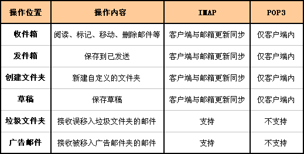
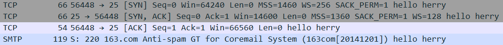

# [](../index.md) 作业7: 通过SMTP、POP3、IMAP协议收发邮件并解析

## 一、C++中SOCKET编程（SMTP、POP3、IMAP）

### 1.1 构建Sock类

&emsp;&emsp;根据SOCKET的入门文档，构建用于创建套接字的Sock类，其中包括连接服务器的方法`bool Connect(const string host_id,const int &port);`，还包括向服务器发送指令的方法`void send_socket(const string s);`和接受服务器反馈信息的方法`int recv_socket();`。这些功能性方法中依次对SOCKET编程中的`int connect(int sockfd, struct sockaddr *serv_addr, int addrlen);`、`int send(int sockfd, const void *msg, int len, int flags);`和`int recv(int sockfd, void *buf, int len, unsigned int flags);`三个方法的包装，使其更易使用。除这些功能实现方法以外还有一个获取反馈信息的方法`const string get_recvbuf();`

### 1.2 构建Base64加密解密类

&emsp;&emsp;根据Base64标准，构建Base64的加密类Base64Encrypt和解密类Base64Decrypt。
&emsp;&emsp;在Base64Encrypt类中有一个编码映射表Base64EncodeMap[64]，根据该编码映射表，将需加密的字符串，每三个字符进行一次重新编码，即将三个字符在二进制表示的情况下的24位，按六位一组分成四组，每组之前补两位0，由此每组表示的数字即编码映射表里的序号，最终将其转化为四个新的字符。当最后的字符不足三个字符时以字符"="补足。
&emsp;&emsp;生成编码映射表的代码：

```c++
for (int i = 0; i < 26; Base64EncodeMap[0 + i] = 'A' + i, ++i) {}
for (int i = 0; i < 26; Base64EncodeMap[26 + i] = 'a' + i, ++i) {}
for (int i = 0; i < 10; Base64EncodeMap[52 + i] = '0' + i, ++i) {}
Base64EncodeMap[62] = '+';
Base64EncodeMap[62] = '/';
```

&emsp;&emsp;在Base64Decrypt类中有一个解码映射表Base64DecodeMap[256]，根据该解码映射表，将已加密的字符串进行逆向操作，从而获得解密的字符串。
&emsp;&emsp;生成解码映射表的代码：

```c++
for (int i = 0; i < (1 << 8); Base64DecodeMap[i++] = 0xFF) {}
for (int i = 0; i < (1 << 8); Base64DecodeMap[Base64EncodeMap[i]] = i, ++i) {}
Base64DecodeMap['='] = 0;
```

&emsp;&emsp;对于Base64解密操作的密文而言，是有一定的要求的，即密文长度一定是4的倍数，且其中字符一定包含在编码映射表中或为字符"="，另外字符"="只可能出现在密文末尾，且至多只有两个。

### 1.3 主要邮箱的POP3/SMTP/IMAP服务器设置

|邮箱名|POP3|SMTP|IMAP|
|:-:|:-:|:-:|:-:|
|QQ邮箱|pop.qq.com:110|smtp.qq.com:25|imap.qq.com:143|
|163邮箱|pop.163.com:110|smtp.163.com:25|imap.163.com:143|
|阿里云邮箱|pop3.aliyun.com:110|smtp.aliyun.com:25|imap.aliyun.com:143|

### 1.4 SMTP协议命令

|SMTP命令格式|说明|
|:-:|:--|
`ehlo <SP> <domain> <CRLF>`|ehlo命令是SMTP邮件发送程序与SMTP邮件接收程序建立连接后必须发送的第一条SMTP命令，参数`<domain>`表示SMTP邮件发送者的主机名。<br>ehlo命令用于替代传统SMTP协议中的helo命令|
|`auth <SP> <para> <CRLF>`|如果SMTP邮件接收程序需要SMTP邮件发送程序进行认证时，它会向SMTP邮件发送程序提示它所采用的认证方式，SMTP邮件发送程序接着应该使用这个命令回应SMTP邮件接收程序，参数`<para>`表示回应的认证方式，通常是SMTP邮件接收程序先前提示的认证方式|
|`mail <SP> From: <reverse-path> <CRLF>`|此命令用于指定邮件发送者的邮箱地址，参数`<reverse-path>`表示发件人的邮箱地址|
|`rcpt <SP> To: <forword-path> <CRLF>`|此命令用于指定邮件接收者的邮箱地址，参数`<forward-path>`表示接收者的邮箱地址。如果邮件要发送给多个接收者，那么应使用多条`rcpt <SP> To`命令来分别指定每一个接收者的邮箱地址|
|`Data <CRLF>`|此命令用于表示SMTP邮件发送程序准备开始输入邮件内容，在这个命令后面发送的所有数据都将被当做邮件内容，直至遇到`<CRLF>.<CRLF>`标志符，则表示邮件内容结束|
|`Quit <CRLF>`|此命令表示要结束邮件发送过程，SMTP邮件接收程序接收到此命令后，将关闭与SMTP邮件发送程序的网络连接|
|>|在命令Data发送之后的邮件内容可以用`from：`标记发送者邮箱地址，`to：`标记接收者邮箱地址，`subject：`标记邮箱主题。这些后要有一个空行，即`\r\n`表示邮件正文开始，以`\r\n.\r\n`标记邮件内容结束|

### 1.5 SMTP常用响应

|响应状态码|响应内容|
|:--:|:--|
|220|`<domain>`服务就绪|
|250|要求的邮件操作完成|
|235|用户验证成功|
|334|等待用户输入验证信息|
|354|开始邮件输入，以"."结束|
|221|`<domain>`服务关闭|
|>|响应状态码的最高位数字代表了不同的分类，当其为 2 时表示命令执行成功；为5时表示命令执行失败；为3时表示命令没有完成|

### 1.6 POP3协议命令

|POP3命令格式|说明|
|:-:|:--|
|`user <SP> username <CRLF>`|user 命令是POP3客户端程序与POP3邮件服务器建立连接后通常发送的第一条命令，参数 username 表示收件人的帐户名称|
|`pass <SP> password <CRLF>`|pass 命令是在user命令成功通过后，POP3客户端程序接着发送的命令，它用于传递帐户的密码，参数 password 表示帐户的密码|
|`apop <SP> name,digest <CRLF>`|apop 命令用于替代user和pass命令，它以MD5 数字摘要的形式向POP3邮件服务器提交帐户密码|
|`stat<CRLF>`|stat 命令用于查询邮箱中的统计信息，例如：邮箱中的邮件数量和邮件占用的字节大小等|
|`uidl <SP> [msg#] <CRLF>`uidl 命令用于查询某封邮件的唯一标志符，参数msg#表示邮件的序号，是一个从1开始编号的数字|
|`list <SP> [MSG#] <CRLF>`|list 命令用于列出邮箱中的邮件信息，参数 msg#是一个可选参数，表示邮件的序号。当不指定参数时，POP3服务器列出邮箱中所有的邮件信息；当指定参数msg#时，POP3服务器只返回序号对应的邮件信息|
|`retr <SP> [msg#] <CRLF>`|retr 命令用于获取某封邮件的内容，参数 msg#表示邮件的序号|
|`dele <SP> [msg#] <CRLF>`|dele 命令用于在某封邮件上设置删除标记，参数msg#表示邮件的序号。POP3服务器执行dele命令时，只是为邮件设置了删除标记，并没有真正把邮件删除掉，只有POP3客户端发出quit命令后，POP3服务器才会真正删除所有设置了删除标记的邮件|
|`rest <CRLF>`|rest 命令用于清除所有邮件的删除标记|
|`top <SP> [msg#] <SP> n <CRLF>`|top 命令用于获取某封邮件的邮件头和邮件体中的前n行内容，参数msg#表示邮件的序号，参数n表示要返回邮件的前几行内容。使用这条命令以提高 Web Mail系统（通过Web站点上收发邮件）中的邮件列表显示的处理效率，因为这种情况下不需要获取每封邮件的完整内容，而是仅仅需要获取每封邮件的邮件头信息|
|`noop<CRLF>`|noop 命令用于检测POP3客户端与POP3服务器的连接情况|
|`quit<CRLF>`|quit 命令表示要结束邮件接收过程，POP3服务器接收到此命令后，将删除所有设置了删除标记的邮件，并关闭与POP3客户端程序的网络连接|
|>|对于POP3客户程序发送的每一条POP3命令，POP3服务器都将回应一些响应信息。响应信息由一行或多行文本信息组成，其中的第一行始终以`+OK`或`-ERR`开头，它们分别表示当前命令执行成功或执行失败|

&emsp;&emsp;POP3协议中有三种状态，认正状态，处理状态，和更新状态。命令的执行可以改变协议的状态，而对于具体的某命令，它只能在具体的某状态下使用
&emsp;&emsp;客户机与服务器刚与服务器建立连接时，它的状态为认证状态；一旦客户机提供了自己身份并被成功地确认，即由认可状态转入处理状态； 在完成相应的操作后客户机发出QUIT命令（具体说明见后续内容），则进入更新状态，更新之后又重返认可状态；当然在认可状态下执行QUIT命令，可释放连接。

---建立连接---|认可|--认证成功--|处理|--执行QUIT--|更新|
|_______ -QUIT结束_______________|

### 1.7 IMAP协议解析

&emsp;&emsp;POP3协议虽然允许在服务器上下载邮件，但在本地的操作（移动邮件、标记已读等），并不会反馈到服务器上。而IMAP提供了客户端与服务器之间的双向通讯，客户端的操作都会反馈到服务器上，对邮件进行的操作，服务器上的邮件也会做相应的动作。
&emsp;&emsp;由于IMAP协议增加了许多POP3不具备的特性，因此其命令比较复杂，可以查看其[中文文档](https://blog.csdn.net/suhuaiqiang_janlay/article/details/78638307)

### 1.8 POP3与IMAP之间的差异



## 二、程序运行与wireshark对其抓包结果（SMTP、POP3、IMAP）

### 2.1 SMTP协议

#### 2.1.1 建立连接




#### 2.1.2 告知SMTP服务器本主机名


#### 2.1.3 告知SMTP服务器以登陆方式认证，用户名密码登陆


#### 2.1.4 指定邮件发送者和接收者邮箱地址


#### 2.1.5 告知SMTP服务器邮件内容并发送邮件


#### 2.1.6 告知SMTP服务器断开连接


### 2.2 POP3协议

#### 2.2.1 建立连接


#### 2.2.2 告知pop3服务器邮箱用户名与密码


#### 2.2.3 查询邮箱中的统计信息并列出


#### 2.2.4 显示对应id的邮件内容


#### 2.2.5 断开连接


### 2.3 IMAP协议

#### 2.3.1 建立连接


#### 2.3.2 告知IMAP需要服务器支持的功能列表，防止服务器主动中断连接


#### 2.3.3 通过登陆方式进行认证


#### 2.3.4 选中一个邮箱查询其信息并列出邮件


#### 2.3.5 根据序号获取邮件内容


#### 2.3.6 断开与IMAP服务器的连接


## 三、[附录](../../code/index.md)
