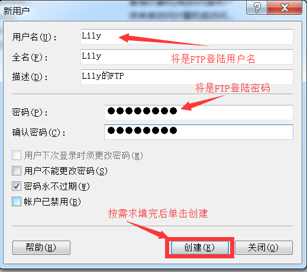
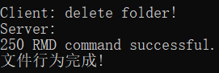
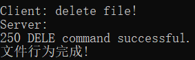

#  作业8: 模拟并分析FTP、HTTP协议过程

## 一、C++中SOCKET编程

### 1.1 封装Sock类

&emsp;&emsp;根据SOCKET的入门文档，构建用于创建套接字的Sock类，其中包括连接服务器的方法`bool Connect(const string host_id,const int &port);`，还包括向服务器发送指令的方法`void send_socket(const string s);`和接受服务器反馈信息的方法`int recv_socket();`。这些功能性方法中依次对SOCKET编程中的`int connect(int sockfd, struct sockaddr *serv_addr, int addrlen);`、`int send(int sockfd, const void *msg, int len, int flags);`和`int recv(int sockfd, void *buf, int len, unsigned int flags);`三个方法的包装，使其更易使用。除这些功能实现方法以外还有一个获取反馈信息的方法`const string get_recvbuf();`和一个直接打印反馈信息的方法`void putBuf();`。为了避免网络的复杂性导致，socket建立连接时因为超时而连接建立失败，因此通过`setsockopt(sock, SOL_SOCKET, SO_SNDTIMEO, (char *)&timeout, sizeof(timeout));`将超时限制提高以适应复杂网络。

## 二、FTP协议内容简述

### 2.1 FTP协议简介

&emsp;&emsp;FTP协议工作在TCP/IP模型的应用层，其传输协议是TCP，因此FTP客户端和服务器之间的连接时可靠的、面向连接的，为数据传输提供了可靠的保证。

### 2.2 FTP协议缺陷

1. 明文登陆，但FTP协议的目的主要是为了实现文件共享，因此其在某些情况下，并不注重用户名密码的保密。
2. FTP客户端程序的数据传输端口一般大于1024，因此容易被防火墙过滤
3. 运行FTP服务端程序的机器可能在连接目标监听随机端口被防火墙提示
4. FTP在传输数量多的小文件性能不好

### 2.3 FTP文件类型

1. ASCII码文件类型（默认选择），以NVT ASCII码形式通过数据连接传输
2. EBCDIC文件类型。该文本文件传输方式要求两端都是EBCDIC系统
3. 图像文件类型（也成为二进制文件类型），数据发送形式呈现为一个连续的比特流

### 2.4 FTP数据结构

1. 文件结构（File Structure）字节流，无结构；
2. 记录结构（Record Structure）文件被划分为记录，用于文本文件；
3. 页结构（Page Structure）文件被划分为页，每页有页号和页头。可以进行随机存取或顺序存取

### 2.5 FTP传输方式

1. 流模式：数据以字节流的形式传送
   * 记录结构
   * 文件结构
2. 块模式：文件以块的形式传送，块带有自己的头部分。头字节包括16位计数域和8位描述子代码
3. 压缩模式：压缩模式中，因为数据是压缩过的，对于增加带宽有很多好处。
   * 块模式头字节的结构
   
   * 描述子代码在描述子字节中的位标记说明
   

### 2.6 FTP传输与控制采用独立连接的优势

1. 使FTP协议更加简单并且更容易实现，例如控制连接可以直接采用Telnet协议实现，FTP数据连接不会与FTP命令混淆起来；
2. 在数据连接结束后，控制连接仍然保留着，它能够在新的传输连接时被使用；
3. 发送方与接收方在所有的数据都到达时可以在数据连接上用文件结束来通知另一方，从而达到命令传输的功能。

### 2.7 FTP服务器/客户机整体模型

### 2.8 FTP常用命令

|FTP命令格式|说明|
|:-:|:-:|
|登陆类||
|`USER <SP> username <CRLF>`|登陆账号|
|`PASS <SP> password <CRLF>`|登陆密码|
|`REIN <CRLF>`|要求重新登陆|
|`QUIT <CRLF>`|退出|
|建立文件传输套接字通信类||
|`PASV <CRLF>`|被动模式|
|`PORT <SP> <address> <CRLF>`|主动模式|
|文件操作类||
|`STOR <SP> filename <CRLF>`|上传文件|
|`APPE <SP> filename <CRLF>`|上传文件 追加|
|`DELE <SP> filename <CRLF>`|删除指定文件|
|`REST <SP> bytenum <CRLF>`|下载文件 偏移后的部分|
|`RETR <SP> filename <CRLF>`|下载文件|
|`ABOR <CRLF>`|放弃传输一个文件|
|目录操作类||
|`CWD <SP> foldername <CRLF>`|改变当前目录到指定目录|
|`CDUP <CRLF>`|返回上一层目录 根目录时不变|
|`LIST <CRLF>`|显示当前目录下文件信息|
|`LIST <SP> foldername <CRLF>`|显示指定目录下文件信息|
|`MKD <SP> foldername <CRLF>`|创建一个目录|
|`PWD <CRLF>`|显示当前目录路径|
|`RWD <SP> foldername <CRLF>`|删除目录|
|`RNFR <SP> pathname <CRLF>`|指定要移动或重命名的路径|
|`RNTO <SP> pathname <CRLF>`|指定新的路径|
|`NLST <CRLF>`|仅显示当前目录下的文件|
|`NLST <SP> foldername <CRLF>`|仅显示指定目录下的文件|
|模式与类型|A:文本 E:EBCDIC N:Nonprint I:二进制 T:Telnet格式控制符|
|`TYPE <SP> char <CRLF>`|^|
|参数信息类||
|`SYST <CRLF>`|获取服务端系统信息|
|`STAT <SP> pathname <CRLF>`|获取相关信息|

### 2.9 FTP服务器响应码

|响应状态码|响应内容|响应状态码|响应内容|
|:--|:-:|:--|:-:|
|110|新文件的重启标志|332|需要账号|
|120|服务器准备就绪|350|文件行为未|
|125|数据连接打开中|421|关闭服务|
|150|文件OK|425|不能开数据连|
|200|成功|426|结束连|
|202|不执行的命令|450|文件不可用|
|211|系统状态回复|451|本地错误|
|212|目录状态回复|452|磁盘空间不足|
|213|文件状态回复|500|无效命令|
|214|帮助状态回复|501|错误参数|
|215|系统类型回复|502|命令未执行|
|220|服务器准备就绪|503|错误指令序列|
|221|服务关闭|504|无效命令参数|
|225|数据链接打开|530|登陆失败|
|226|数据连接关闭|532|要存储文件说明|
|227|进入被动模式|550|文件路径不可用|
|230|登陆成功|551|页类型未知|
|250|完成的文件行为|552|存储空间超出|
|257|建立的路径名|553|文件名不允许|
|331|用户名有效 需要密码|-|-|
|第一个数字给出了命令状态的一般性指示，比如响应成功、失败或不完整。第一个数字的含义如下：||||
|1 表示服务器正确接收信息 还未处理||4 表示信息暂时错误||
|2 表示服务器已经正确处理信息||5 表示信息永久错误||
|3 表示服务器正确接收信息 正在处理||-||
|第二个数字是响应类型的分类，如 2 代表跟连接有关的响应，3 代表用户认证。第二个数字的含义如下：||||
|0 表示语法||3 表示与用户认证有关的信息||
|1 表示系统状态和信息||4 表示未定义||
|2 表示连接状态||5 表示与文件系统有关的信息||
|第三个数字提供了更加详细的信息||||

## 三、HTTP协议内容简述

### 3.1 HTTP协议简述

&emsp;&emsp;HTTP--Hyper Text Transfer Protocol，超文本传输协议，是一种建立在TCP上的无状态连接，整个基本的工作流程是客户端发送一个HTTP请求，说明客户端想要访问的资源和请求的动作，服务端收到请求之后，服务端开始处理请求，并根据请求做出相应的动作访问服务器资源，最后通过发送HTTP响应把结果返回给客户端。其中一个请求的开始到一个响应的结束称为事务，当一个事物结束后还会在服务端添加一条日志条目。

### 3.2 HTTP请求

&emsp;&emsp;HTTP请求是客户端往服务端发送请求动作，告知服务器自己的要求。
&emsp;&emsp;HTTP请求由状态行、请求头、请求正文三部分组成：
&emsp;&emsp;状态行：包括请求方式Method、资源路径URL、协议版本Version；
&emsp;&emsp;请求头：包括一些访问的域名、用户代理、Cookie等信息；
&emsp;&emsp;请求正文：就是HTTP请求的数据。
&emsp;&emsp;备注：请求方式Method一般有GET、POST、PUT、DELETE，含义分别是获取、修改、上传、删除，其中GET方式仅仅为获取服务器资源，方式较为简单，因此在请求方式为GET的HTTP请求数据中，请求正文部分可以省略，直接将想要获取的资源添加到URL中。
现在大多数协议版本为http/1.1。
&emsp;&emsp;GET请求样例如下：

&emsp;&emsp;POST请求样例如下：

### 3.3 HTTP响应

&emsp;&emsp;服务器收到了客户端发来的HTTP请求后，根据HTTP请求中的动作要求，服务端做出具体的动作，将结果回应给客户端，称为HTTP响应。
&emsp;&emsp;HTTP响应由三部分组成：状态行、响应头、响应正文；
&emsp;&emsp;状态行：包括协议版本Version、状态码Status Code、回应短语；
&emsp;&emsp;响应头：包括搭建服务器的软件，发送响应的时间，回应数据的格式等信息；
&emsp;&emsp;响应正文：就是响应的具体数据。
&emsp;&emsp;备注：我们主要关心并且能够在客户端浏览器看得到的是三位数的状态码，不同的状态码代表不同的含义，其中大致如下：

|响应状态码|说明|
|:-:|:--|
|1xx|表示HTTP请求已经接受，继续处理请求|
|2xx|表示HTTP请求已经处理完成|
|3xx|表示把请求访问的URL重定向到其他目录|
|4xx|表示客户端出现错误|
|5xx|表示服务端出现错误|

### 3.4 HTTP常见状态码

|响应状态码|说明|
|:-:|:--|
|200|OK/请求已经正常处理完毕|
|301|请求永久重定向|
|302|请求临时重定向|
|304|请求被重定向到客户端本地缓存|
|400|客户端请求存在语法错误|
|401|客户端请求没有经过授权|
|403|客户端的请求被服务器拒绝 一般为客户端没有访问权限|
|404|客户端请求的URL在服务端不存在|
|500|服务端永久错误|
|503|服务端发生临时错误|

### 3.5 HTTP响应模型

&emsp;&emsp;服务器收到HTTP请求之后，会有多种方法响应这个请求，下面是HTTP响应的四种模型：
&emsp;&emsp;单进程I/O模型：服务端开启一个进程，一个进程仅能处理一个请求，并且对请求顺序处理；
&emsp;&emsp;多进程I/O模型：服务端并行开启多个进程，同样的一个进程只能处理一个请求，这样服务端就可以同时处理多个请求；
&emsp;&emsp;复用I/O模型：服务端开启一个进程，但是呢，同时开启多个线程，一个线程响应一个请求，同样可以达到同时处理多个请求，线程间并发执行；
&emsp;&emsp;复用多线程I/O模型：服务端并行开启多个进程，同时每个进程开启多个线程，这样服务端可以同时处理进程数M*每个进程的线程数N个请求。

### 3.6 HTTP请求报文

&emsp;&emsp;求报文的起始由请求行构成（有些资料称为状态行，名字不一样而已，都是指的一个东西），用来说明该请求想要做什么，由`<Method>`、`<URL>`、`<Version>`三个字段组成，注意每个字段之间都有一个空格。
&emsp;&emsp;其中`<Method>`字段有不同的值：
&emsp;&emsp;GET --- 访问服务器的资源
&emsp;&emsp;POST --- 向服务器发送要修改的数据
&emsp;&emsp;HEAD --- 获取服务器文档的首部
&emsp;&emsp;PUT --- 向服务器上传资源
&emsp;&emsp;DELETE --- 删除服务器的资源
&emsp;&emsp;`<URL>`字段表示服务器的资源目录定位
&emsp;&emsp;`<Version>`字段表示使用的http协议版本
&emsp;&emsp;首部部分由多个请求头（也叫首部行）构成，那些首部字段名有如下，不全：
&emsp;&emsp;Accept --- 指定客户端能够接收的内容格式类型
&emsp;&emsp;Accept-Language --- 指定客户端能够接受的语言类型
&emsp;&emsp;Accept-Ecoding --- 指定客户端能够接受的编码类型
&emsp;&emsp;User-Agent --- 用户代理，向服务器说明自己的操作系统、浏览器等信息
&emsp;&emsp;Connection --- 是否开启持久连接（keepalive）
&emsp;&emsp;Host --- 服务器域名
&emsp;&emsp;主体部分就是报文的具体数据。

### 3.7 HTTP响应报文

&emsp;&emsp;响应报文的起始由状态行构成，用来说明服务器做了什么，由`<Version>`、`<Status-Code>`、`<Phrase>`三个字段组成，同样的每个字段之间留有空格；
&emsp;&emsp;`<Status-Code>` --- 上边已经说明；
&emsp;&emsp;首部由多个响应头(也叫首部行)组成，首部字段名如下，不全：
&emsp;&emsp;Server --- 服务器软件名，Apache/Nginx
&emsp;&emsp;Date --- 服务器发出响应报文的时间
&emsp;&emsp;Last-Modified --- 请求资源的最后的修改时间
&emsp;&emsp;主体部分是响应报文的具体数据。

### 3.8 HTTP协议版本更替

【HTTP/0.9】
&emsp;&emsp;HTTP协议的最初版本，功能简陋，仅支持请求方式GET，并且仅能请求访问HTML格式的资源。
【HTTP/1.0】
&emsp;&emsp;在0.9版本上做了进步，增加了请求方式POST和HEAD；不再局限于0.9版本的HTML格式，根据Content-Type可以支持多种数据格式，即MIME多用途互联网邮件扩展，例如text/html、image/jpeg等；同时也开始支持cache，就是当客户端在规定时间内访问统一网站，直接访问cache即可。
&emsp;&emsp;但是1.0版本的工作方式是每次TCP连接只能发送一个请求，当服务器响应后就会关闭这次连接，下一个请求需要再次建立TCP连接，就是不支持keepalive。
【HTTP/1.1】
&emsp;&emsp;解决了1.0版本的keepalive问题，1.1版本加入了持久连接，一个TCP连接可以允许多个HTTP请求； 加入了管道机制，一个TCP连接同时允许多个请求同时发送，增加了并发性；新增了请求方式PUT、PATCH、DELETE等。
&emsp;&emsp;但是还存在一些问题，服务端是按队列顺序处理请求的，假如一个请求处理时间很长，则会导致后边的请求无法处理，这样就造成了队头阻塞的问题；同时HTTP是无状态的连接，因此每次请求都需要添加重复的字段，降低了带宽的利用率。
【HTTP/2.0】
&emsp;&emsp;为了解决1.1版本利用率不高的问题，提出了HTTP/2.0版本。增加双工模式，即不仅客户端能够同时发送多个请求，服务端也能同时处理多个请求，解决了队头堵塞的问题；HTTP请求和响应中，状态行和请求/响应头都是些信息字段，并没有真正的数据，因此在2.0版本中将所有的信息字段建立一张表，为表中的每个字段建立索引，客户端和服务端共同使用这个表，他们之间就以索引号来表示信息字段，这样就避免了1.0旧版本的重复繁琐的字段，并以压缩的方式传输，提高利用率。
&emsp;&emsp;另外也增加服务器推送的功能，即不经请求服务端主动向客户端发送数据。
&emsp;&emsp;当前主流的协议版本还是HTTP/1.1版本。

### 3.9 网站访问量

&emsp;&emsp;IP——IP访问量
&emsp;&emsp;相同的公网IP计算一次，就是同一个局域网内的所有用户访问一个网站，但是他们都是借助一个公网IP去访问那个网站的（NAT），因此这也只能算作一个IP访问量。换一次公网IP则会加1。
&emsp;&emsp;PV——网页访问量
&emsp;&emsp;用户访问的页面数就是PV访问量，同一个局域网的不同用户，而且就算是同一个用户，只要刷新一次网站页面，PV访问量就加1，三个访问量的值往往数PV的值最大。
&emsp;&emsp;UV——访客访问量
&emsp;&emsp;这里的访客不是用户，而是电脑，一台电脑算一个访客，即使是同一台电脑的不同用户，访问同一个网站UV也只能加1，只有更换电脑才会使UV加1，因为服务端会记录客户端电脑的信息。

## 四、搭建FTP服务器（Windows7自带功能）

### 4.1 打开FTP相关功能

&emsp;&emsp;开始菜单→控制面板→程序→打开或关闭Windows功能

### 4.2 创建用于登陆FTP的用户

&emsp;&emsp;开始菜单→右键单击计算机→管理→单击本地用户和组→右键单击用户→新用户

### 4.3 创建FTP服务器

&emsp;&emsp;开始菜单→搜索IIS并打开→在左边栏右键单击→添加FTP站点

* 第一步

* 第二步

* 第三步

### 4.4 允许同一局域网的其他主机访问

1. 在刚创建的FTP服务器中的FTP IPv4地址和域限制中允许其他主机IP。
2. 开始菜单→控制面板→系统与安全→允许程序通过Windows防火墙→勾选FTP协议相关内容并确定。
3. 在上述操作后无效可以先试试重启，若依旧无效可以试试直接关闭防火墙。

## 五、搭建HTTP服务器（Windows7自带功能）

### 5.1 打开HTTP相关功能

&emsp;&emsp;开始菜单→控制面板→程序→打开或关闭Windows功能

### 5.2 创建HTTP服务器

&emsp;&emsp;开始菜单→搜索IIS并打开→在左边栏右键单击→添加网站

### 5.3 允许同一局域网的其他主机访问

1. 开始菜单→控制面板→系统与安全→允许程序通过Windows防火墙→勾选HTTP协议相关内容并确定。
2. 开始菜单→控制面板→系统与安全→Windows防火墙→高级设置→右键单击入站规则→新建规则
   * 第一步：选择端口
   * 第二步：选择TCP并在特定端口中输入HTTP网站设定的端口
   * 第三步：允许连接
   * 第四步：勾选所有
   * 第五步：输入该规则描述
   * 第六步：启用这个规则
3. 在上述操作后无效可以先试试重启，若依旧无效可以试试直接关闭防火墙。

## 六、程序运行与wireshark对其抓包结果（FTP、HTTP）

### 6.1 FTP协议

#### 6.1.1 建立连接

#### 6.1.2 登陆FTP服务器

#### 6.1.3 重新登陆FTP服务器

#### 6.1.4 设置FTP服务器传输类型

#### 6.1.5 更改FTP服务器工作目录

#### 6.1.6 返回上层目录

#### 6.1.7 创建目录

#### 6.1.8 删除目录

#### 6.1.9 列出FTP指定目录的所有内容

#### 6.1.10 修改文件名&移动目录

#### 6.1.11 从FTP服务器复制文件到本地

#### 6.1.12 从本地复制文件到FTP服务器

#### 6.1.13 删除文件

#### 6.1.14 断开FTP服务器

### 6.2 HTTP协议

#### 6.2.1 建立连接

#### 6.2.2 发送GET请求获取网页内容

#### 6.2.3 发送GET请求获取CSS

#### 6.2.4 发送GET请求获取JS

#### 6.2.5 发送GET请求获取LIB

#### 6.2.6 发送POST请求获取JSON

## 七 [附录](../../code/index.md)
