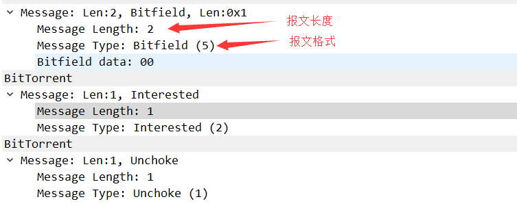
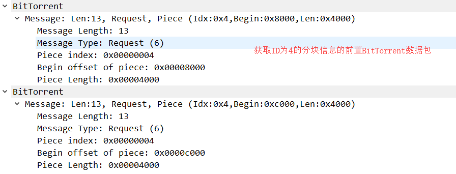

# [](../index.md) 作业9: 模拟并分析BitTorrent协议过程

## 一、C++中SOCKET编程

### 1.1 封装Sock类

&emsp;&emsp;根据SOCKET的入门文档，构建用于创建套接字的Sock类，其中包括连接服务器的方法`bool Connect(const string host_id,const int &port);`，还包括向服务器发送指令的方法`void send_socket(const string s);`和接受服务器反馈信息的方法`int recv_socket();`。这些功能性方法中依次对SOCKET编程中的`int connect(int sockfd, struct sockaddr *serv_addr, int addrlen);`、`int send(int sockfd, const void *msg, int len, int flags);`和`int recv(int sockfd, void *buf, int len, unsigned int flags);`三个方法的包装，使其更易使用。除这些功能实现方法以外还有一个获取反馈信息的方法`const string get_recvbuf();`和一个直接打印反馈信息的方法`void putBuf();`。为了避免网络的复杂性导致，socket建立连接时因为超时而连接建立失败，因此通过`setsockopt(sock, SOL_SOCKET, SO_SNDTIMEO, (char *)&timeout, sizeof(timeout));`将超时限制提高以适应复杂网络。

## 二、BitTorrent协议内容简述

### 2.1 BitTorrent协议简介

&emsp;&emsp;BitTorrent是一种内容分发协议，由布拉姆·科恩自主开发。它采用高效的软件分发系统和点对点技术共享大体积文件（如一部电影或电视节目），并使每个用户像网络重新分配结点那样提供上传服务。
&emsp;&emsp;一般的下载服务器，如HTTP、FTP服务器，会为每一个发出下载请求的用户提供下载服务，因此当请求下载服务的用户较多时，用户下载的速度会受到服务器带宽的限制，甚至导致服务器的奔溃。而BitTorrent的工作方式与之不同。分配器或文件的持有者将文件发送给其中一名用户，再由这名用户转发给其它用户，用户之间相互转发自己所拥有的文件部分，直到每个用户的下载都全部完成。这种方法可以使下载服务器同时处理多个大体积文件的下载请求，而无须占用大量带宽。即利用用户主机的上传带宽分担服务器带宽压力。

### 2.2 BitTorrent协议缺陷

1. 当某些资源比较冷门，下载用户比较少时，其下载速度会非常慢。
2. 由于Bittorrent协议会将一个文件进行虚拟分块，因此可能出现某些虚拟分块只有部分用户的主机上有，当这些用户的主机由于某种原因断开连接或关机时，其他下载用户就有可能无法完整下载所需文件，导致下载失败。
3. 也因为一个文件会存在多个用户主机中，因此其中内容可能会被某些用户进行篡改，导致最终下载文件与源文件内容不符，轻则导致文件下载失败，重则导致本机中毒甚至崩溃。

### 2.3 BitTorrent协议内容

#### 2.3.1 MetaInfo文件——包含协议运行所需的所有详细信息的文件

1. MetaInfo文件的扩展名为".torrent"，其数据是由BitTorrent客户端从文件中提取的。
2. 每个MetaInfo中信息如下：
   * announce：字符串，Tracker的主服务器的URL
   * announce：列表，Tracker的服务器URL列表
   * comment：种子文件的注释。
   * comment.utf-8：种子文件注释的utf-8编码
   * creation date：种子文件建立的时间，从1970年1月1日00:00:00到现在的秒数。
   * encoding：种子文件的默认编码，比如GB2312、Big5、utf-8等
   * info：描述文件内容信息的字典。
   * nodes：包含一系列IP和相应端口的列表，是用于连接DHT的初始结点。
3. 单文件info字典内容
   * length：文件的大小，用byte计算
   * path：文件的名字，在下载时不可更改
   * path.utf-8：文件名的UTF-8编码
   * name：推荐的文件夹名，此项可在下载时更改
   * name.utf-8：推荐的文件夹名的utf-8编码
   * piece length：每个文件块的大小，用byte计算
   * publisher：文件发布者的名字
   * publisher.utf-8：文件发布者的名字的utf-8编码
   * publisher-url：文件发布者的网址
   * publisher-url.utf-8：文件发布者的网址的utf-8编码
4. 多文件info字典内容
   * files：将每个文件信息包含其中。
5. "MetaInfo"文件会经过"Bencoding"方法编码后成为"torrent"文件。Bencoding 支持字节字符串, 整数, 列表和字典四种结构。它分别使用'i'/'l'/'d'作为整数，列表和字典的开始分隔符。 这三种类型的结束分隔符都是'e'。字节字符串没有分隔符。
6. Bencoding 结构如下：
   * 字节字符串：`<string length in base ten ASCII> : <string data>`， 例如4:spam 表示"spam"
   * 整数：`i<base ten ASCII>e`，例如i3e表示整数3
   * 列表：`l<bencoded values>e`，例如l4:spam4:eggsi3ee 表示：["spam","eggs",3]
   * 字典：`d<bencoded string><bencoded element>e`， 例如d4spaml1:a1:bee表示 {"spam" => ["a" , "b"] }
   * 注意：负数也是被允许的， 例如'i-3e', 但是任何数字都不能以0开头，例如'i03e'或者'i-03'都是非法的。但，'i0e'是合法的。

#### 2.3.2 Tracker——帮助管理BitTorrent协议的服务器

1、Tracker用于存储关于torrent的统计信息，帮助peers找到各自并开始通讯，即找到拥有着他们需要的数据的peers。
2、Tracker是一个HTTP / HTTPS服务，通常在端口6969上运行。
3、Tracker合法参数：

|参数|说明|
|:-:|:--|
|info_hash|metainfo文件的info key的20-byte SHA1 hash值|
|peer_id|20-byte string，客户端的unique ID|
|uploaded|目前上传的总数，base ten ASCII 编码|
|downloaded|目前下载的总数，base ten ASCII 编码|
|left|客户端仍需下载的bytes数，base ten ASCII 编码|
|compact|指定回应中的peers的格式是二进制形式|
|event|If specified, must be one of the following: started, stopped, completed|
|ip|(optional) The IP address of the client machine, in dotted format.|
|numwant|(optional) The number of peers the client wishes to receive from the tracker.|
|key|(optional) Allows a client to identify itself if their IP address changes.|
|trackerid|(optional) If previous announce contained a tracker id, it should be set here|

4、Tracker响应参数

|参数|说明|
|:-:|:--|
|failure message|如果有这个键，那么其他键都将不存在，它的值是人类可阅读的错误信息|
|warning message|跟failure message相似, 但是响应仍有其他键|
|interval|客户端在将常规请求发送给tracker之间应该等待的时间间隔|
|min interval|最小公告间隔。 如果出现这个键，那么客户端不能比这更频繁地重新发布消息|
|tracker id|客户端应该在其下一个公告中发回的字符串。 如果这个键不存在并且之前的公告发送了tracker id，则继续使用旧值|
|complete|拥有完整文件的peers数量|
|incomplete|不作种的peers数量|
|peers (字典形式)|一个包含字典的列表|
|peer id|peer's unique ID|
|ip|peer的IP地址，包括IPv6 (hexed)或者 IPv4(dotted quad)或者 DNS name (string)|
|port|peer的端口 (integer)|
|peers(二进制形式)|除了上面的字典形式， peers的值还可以是由6个字节的倍数组成的字符串，前4个字节是IP地址，最后2个字节是端口号。 全部以网络字节序表示。|

#### 2.3.3 Peers——用户通过BitTorrent协议交换文件数据

1、Peers通过TCP来传输和发送数据
2、Peers通过HTTP以纯文本的格式与Tracker进行通讯


#### 2.3.4 Data——通过协议传输的文件

1、Data根据BitTorrent被分为较小的片段在peers之间传输。除了最后一块片段之外的片段都是固定的，方便Tracker能够监视谁拥有哪些数据，也能将文件分解为可验证的片段，然后为每个分段计算其hash值并保存在“MetaInfo”文件中，在其他peer下载时可以检查这些片段的数据完整性。
2、当分段过大时，会导致下载时效率降低，也会随着数据完整性检查频率的降低让数据下载失败的概率增加。
3、当分段过小时，会需要过多的hash检验，使得“MetaInfo”文件变得臃肿，从而会被Tracker服务器所需的主机存储量和带宽所限制。
4、因此一般分段大小最常见的尺寸是256kb、512kb和1mb，片段数计算可得：总大小/片段大小。

#### 2.3.5 客户端——位于peer是计算机上并实现协议的程序

## 三、搭建BitTorrent服务器（ubantu、BitTorrent）

【以下均在root权限下执行，[参考](https://blog.csdn.net/qq1784855023/article/details/85332267)】

### 3.1 安装bittorrent

`apt-get install bittorrent`

### 3.2 安装Apache

`apt-get install apache2`

### 3.3 配置apache服务器

```sh
cd /etc/apache2/mods-available
gedit mime.conf
在响应的位置追加
AddType application/x-bittorrent .torrent
```


### 3.4 在Web主目录下建立bt用文件夹

`mkdir /var/www/html/bt/`


### 3.5 复制测试文件并制作种子

```sh
cp /home/yuyue/work/install/ultraiso.exe  /var/www/html/bt/
btmakemetafile ultraiso.exe  http://192.168.239.138:6666/announce
```


### 3.6 开启Tracker服务并在服务器做种

```sh
bttrack --port 6666 --dfile /tmp/dfile >/tmp/bt.log &
btlaunchmany ./ > /dev/null &
```


## 四、使用比特精灵下载并用wireshark对其抓包（BitTorrent）

### 4.1 安装并打开比特精灵


### 4.2 wireshark抓包结果


#### 4.2.1 通过HTTP协议获取在服务器上的种子文件


#### 4.2.2 通过TCP与其他peers建立连接获取数据


#### 4.2.3 通过TCP获取文件分段信息




#### 4.2.4 获取ID为4的分块的内容




#### 4.2.5 获取ID为0的分块的内容


#### 4.2.6 获取ID为1的分块的内容


#### 4.2.7 获取ID为2的分块的内容


#### 4.2.8 获取ID为3的分块的内容


## 五、[附录](../../code/index.md)

### 测试用tracker

```tracker
udp://tracker.torrent.eu.org:451/announce
udp://tracker.tiny-vps.com:6969/announce
udp://tracker.sith.su:80/announce
udp://tracker.mg64.net:6969/announce
udp://tracker.leechers-paradise.org:6969/announce
udp://tracker.kuroy.me:5944/announce
udp://tracker.grepler.com:6969/announce
udp://tracker.filetracker.pl:8089/announce
udp://tracker.desu.sh:6969/announce
udp://tracker.coppersurfer.tk:6969/announce
udp://tracker.coppersurfer.tk:6969
udp://p4p.arenabg.com:1337/announce
udp://open.stealth.si:80/announce
udp://mgtracker.org:2710/announce
udp://ipv4.tracker.harry.lu:80/announce
udp://bt.xxx-tracker.com:2710/announce
udp://9.rarbg.com:2790/announce
udp://208.67.16.113:8000/announce
udp://168.235.67.63:6969/announce
http://tracker2.wasabii.com.tw:6969/announce
http://tracker1.wasabii.com.tw:6969/announce
http://tracker1.itzmx.com:8080/announce
http://tracker.vanitycore.co:6969/announce http://tracker.tiny-vps.com:6969/announce
http://tracker.skyts.net:6969/announce
udp://tracker.opentrackr.org:1337/announce
http://tracker.mg64.net:6881/announce
http://tracker.kamigami.org:2710/announce http://tracker.grepler.com:6969/announce
http://tracker.filetracker.pl:8089/announce
http://tracker.dler.org:6969/announce
http://tracker.baravik.org:6970/announce http://torrentsmd.com:8080/announce
http://share.camoe.cn:8080/announce
http://p4p.arenabg.com:1337/announce
http://mgtracker.org:6969/announce
http://ipv4.tracker.harry.lu:80/announce
http://ipv4.tracker.harry.lu:80/annouce
http://ipv4.tracker.harry.lu/announce
http://inferno.demonoid.ph:3415/announce
http://inferno.demonoid.ooo:3418/announce
http://inferno.demonoid.ooo:3416/announce http://inferno.demonoid.ooo:3412/announce
http://inferno.demonoid.ooo:3410/announce
http://inferno.demonoid.ooo:3395/announce
udp://explodie.org:6969/announce
http://bt.ttk.artvid.ru:6969/announce
http://bt.artvid.ru:6969/announce
http://87.248.186.252:8080/announce
http://5.79.83.193:2710/announce
http://0123456789nonexistent.com:80/announce
http://0123456789nonexistent.com/announce
udp://9.rarbg.me:2770/announce
udp://62.138.0.158:6969/announce
http://inferno.demonoid.ph:3392/announce
http://173.254.204.71:1096/announce
udp://tracker.ilibr.org:6969/announce
http://www.skyts.net:6969/announce
http://tracker4.itzmx.com:2710/announce http://t.nyaatracker.com/announce
http://t.acg.rip:6699/announce
http://mgtracker.org:2710/announce
http://tracker.kuroy.me:5944/announce
http://open.acgtracker.com:1096/announce http://tracker3.itzmx.com:6961/announce
http://tracker2.itzmx.com:6961/announce
http://retracker.gorcomnet.ru/announce
udp://tracker.piratepublic.com:1337/announce
http://tracker.xfsub.com:6868/announce udp://shadowshq.yi.org:6969/announce
udp://eddie4.nl:6969/announce
udp://208.67.16.113:8000/annonuce
udp://shadowshq.eddie4.nl:6969/announce udp://tracker.kamigami.org:2710/announce
udp://tracker.leechers-paradise.org:6969
udp://9.rarbg.to:2740/announce
udp://p4p.arenabg.ch:1337/announce
http://bt.cnscg.com:6969/announce
http://bt.cnscg.org:6969/announce 
http://secure.pow7.com/announce
http://tracker.tfile.me/a
http://tracker.tfile.me/announce
http://retracker.gorcomnet.ru:80/announce
```

### 可用tracker

```tracker
udp://tracker.tiny-vps.com:6969/announce
udp://tracker.leechers-paradise.org:6969/announce
udp://ipv4.tracker.harry.lu:80/announce
udp://bt.xxx-tracker.com:2710/announce
udp://168.235.67.63:6969/announce
http://tracker1.itzmx.com:8080/announce
udp://tracker.opentrackr.org:1337/announce
udp://explodie.org:6969/announce
http://tracker4.itzmx.com:2710/announce http://t.nyaatracker.com/announce
http://t.acg.rip:6699/announce
udp://tracker.leechers-paradise.org:6969
```
