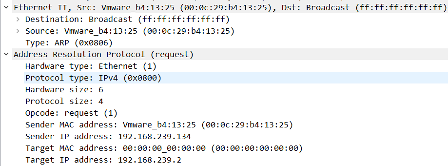
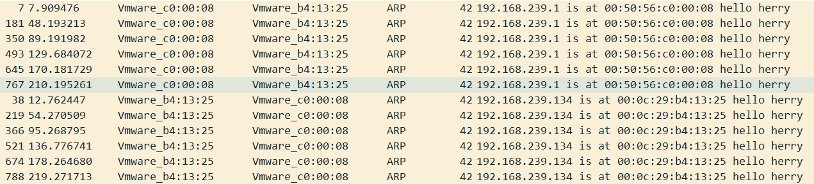

#  实验1: ARP协议分析

## 一、实验目的

1. 练习使用网络分析系统
2. 学会在捕获同网络中以及不同网络中的一台存在的计算机的数据包
3. 学会在捕获同网络中以及不同网络中的一台不存在的计算机的数据包
4. 会根据所捕获的ARP数据包读出ARP请求和应答分组的格式
5. 能够对数据包进行分析
6. 了解ARP中一些命令的使用

## 二、实验内容

### 2.1 内容一

* 二人一组。发送方是本机，接收方为本网络另一台计算机，分别在各自的计算机捕获对方的ARP封包（请求和回答包）。
* 在实验报告中记录封包的内容。
* 标出ARP封包MAC帧的HA地址。以及IP包的IP地址。
* 对此时ARP找到的硬件地址作出说明。

#### 2.1.1 时序图

1. 掌握类的概念、类的定义格式、类与结构的关系、类的成员属性和类的封装性；
2. 掌握类对象的定义；
3. 理解类的成员的访问控制的含义，公有、私有和保护成员的区别；
4. 掌握构造函数和析构函数的含义与作用、定义方式和实现，能够根据要求正确定义和重载构造函数。能够根据给定的要求定义类并实现类的成员函数；

#### 2.1.2 结果截图

【时序图】

【arp请求与应答】

【arp请求包0】

【arp应答包0】

【arp请求包1】

【arp应答包1】

#### 2.1.3 相关说明

1. IP为192.168.239.134，MAC地址为00:0c:29:b4:13:25的主机A广播arp请求包0，希望获取网关的MAC地址。
2. IP为192.168.239.1，MAC地址为00:50:56:c0:00:08的网关对主机A发送arp应答包0，告知其网关的MAC地址。
3. IP为192.168.239.1，MAC地址为00:50:56:c0:00:08的网关广播arp请求包1，希望更新主机A的MAC地址。
4. IP为192.168.239.134，MAC地址为00:0c:29:b4:13:25的主机A对网关发送arp应答包1，告知其主机A的MAC地址。

### 2.2 内容二

* 发送方是本机，接收方为另一个网络上的一台主机，捕获ARP封包（请求和回答包）。
* 在实验报告中记录封包的内容。
* 根据《计算机网络》图4-10，画出拓扑图，标出ARP封包MAC帧的HA地址。以及IP包的IP地址。
* 对此时ARP找到的硬件地址作出说明。

#### 2.2.1 时序图

#### 2.2.2 结果截图

【arp请求与应答】

【arp请求包】

【arp应答包】

【拓扑图】

#### 2.2.3 相关说明

1. 主机A通过ping命令访问www.baidu.com，首先需要知道网关的MAC地址，因此会向网关发送ARP请求包获取网关的MAC地址。
2. 主机A发送的ping数据包经过网关转发到另一个网络的网关，以此类推，最终发往www.baidu.com。
3. 对于主机A而言只能获取与网关交流的ARP请求与应答，因此表现与内容一差不多。

### 2.3 内容三

* 不做任何网络操作，连续抓取本机对本网络其它主机的ARP封包，记录抓取的内容，并说明自己的系统ARP缓存多久更新一次。
* （注，可同时不断用ARP –a 命令观察ARP高速缓存的内容）

#### 2.3.1 内容解答

1. 先通过arp -d命令将IP为192.168.239.1的主机和IP为192.168.239.134的虚拟机的arp缓存表清空。
2. 在IP为192.168.239.1的主机处开启wireshark开始抓arp包。
3. 再在IP为192.168.239.134的虚拟机通过ping -t 192.168.239.1命令持续向IP为192.168.239.1的主机发送ping数据包。
4. 当arp缓存表中由相应的信息，ping命令会根据这个信息直接发包；若没有就会先发arp包进行信息获取，而两次arp包获取的时间间隔就是arp缓存表的刷新时间。
5. 为减小误差，通过多次抓包求平均值。
6. IP为192.168.239.143的虚拟机的arp缓存表的刷新时间为：40.457157
7. IP为192.168.239.1的主机的arp缓存表的刷新时间为：41.3018532

### 2.4 内容四

* PING本网络一台不存在的主机。捕获相关的ARP数据封包，画出时序图，并进行说明分析。

#### 2.4.1 时序图一

1. 由于当前网络中不存在IP为192.168.43.216的主机。
2. 因此，当进行ping命令时，本机会直接提示无法访问目标主机。
   * PING其它网络一台不存在的主机，捕获相关的ARP数据包，并进行说明分析。（本网络不存在的计算机可ping 192.168.8.247，其它网络不存在主机可分别PING 192.168.7.33和210.32.23.20)

#### 2.4.2 时序图二

1. 由于要ping的主机在另一个网络，因此需要通过本地网关转发到那个主机所在网络的网关。
2. 首先，需要本地网关的MAC地址，因此会首先发送arp广播包询问本地网关的主机地址。
3. 然后，本地网关会将ping数据包转发给另一个网络的网关，另一个网络的网关为了得到IP为192.168.239.111的主机，会在另一个网络中发送arp广播包用于获取其MAC地址。
4. 由于，本地主机与另一个网络的网关不在同一个网络中。
5. 因此，本地主机无法获取另一个网络的网关发送的ARP广播包，也就无法收到反馈信息了。

## 三、心得体会

1. 在同一个网络下，当某一台主机第一次向另一台主机发送数据包时，会首先通过arp请求获取对方主机的MAC地址，对方回复后就会更新本机的arp缓存表，在缓存表中数据的刷新时间未结束之前，该主机向对方主机发送数据包前就不再发送arp广播包，而是直接通过arp缓存表获取对方主机的MAC地址。
2. 与此同时，对方主机也会发送为了反馈确认信息，也会通过arp请求询问本机的MAC地址。因此在第一次发包时，会获取两次arp请求与应答。
3. 对方网络中的arp广播包，因此arp攻击往往是对同一个网络的主机进行的。针对这一点，我们可以采取相应的措施来规避arp攻击，保证网络的安全。
