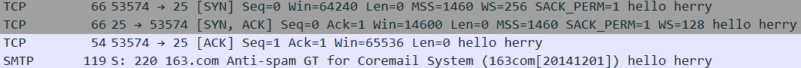

#  实验2: SMTP、POP3协议分析

## 一、实验目的

1. 理解SMTP、POP3协议的基本原理
2. 理解SMTP、POP3协议的工作过程；
3. 理解SMTP、POP3的基本命令格式；
4. 理解应用程序协议与传输层协议的关系

## 二、实验内容

1. 学习邮件服务的工作原理；
2. 理解SMTP、和PO3协议；
3. 学习POP3协议的命令格式和使用方法；
4. 学习Foxmail的使用方法。

## 三、实验结果与分析

### 3.1 SMTP协议

#### 3.1.1 连接SMTP服务器

     
     
    图 1 SMTP服务器反馈的信息

#### 3.1.2 告诉SMTP服务器本机主机名

     
     
    图 2 SMTP反馈的授权信息

#### 3.1.3 选择登陆方式验证

     
     
    图 3 SMTP反馈请输入用户名

#### 3.1.4 输入用户名

     
     
    图 4 SMTP反馈请输入密码

#### 3.1.5 输入密码

     
     
    图 5 SMTP反馈登陆成功

#### 3.1.6 输入发件人邮箱

     
     
    图 6 SMTP反馈发件人邮箱设置成功

#### 3.1.7 输入收件人邮箱

     
     
    图 7 SMTP反馈收件人邮箱设置成功

#### 3.1.8 输入邮件正文

     
     
    图 8 邮件正文信息
     
    图 9 SMTP反馈邮件发送成功

#### 3.1.9 告知SMTP服务器断开连接

     
     
    图 10 SMTP反馈断开连接

### 3.2 POP3协议

#### 3.2.1 连接POP服务器

     
     
    图 11 POP反馈连接成功信息与授权码

#### 3.2.2 发送用户名

     
     
    图 12 POP反馈用户名接收成功

#### 3.2.3 发送密码

     
     
    图 13 POP反馈密码接收成功

#### 3.2.4 查看邮箱统计数据

     
     
    图 14 POP反馈邮箱中邮件数量以及其占用

#### 3.2.5 查看已收到邮件列表

     
     
    图 15 POP反馈邮件大小及其ID

#### 3.2.6 获取指定ID的邮件内容

     
     
    图 16 POP反馈邮件获取成功
     
    图 17 获取的邮件正文内容

#### 3.2.7 告知POP服务器断开连接

     
     
    图 18 POP反馈断开连接

### 3.3 时序图

#### 3.3.1 SMTP协议

     

#### 3.3.2 POP3协议

     

## 四、实验心得

1、对于SMTP协议与POP3协议而言，主机与响应服务器均是通过TCP的三次握手建立连接，四次挥手断开连接。
2、在SMTP协议中，主机与SMTP服务器间的用户名与密码交互，均提前通过Base64编码后的，虽然Base64会将其加密成一串字符串，但由于Base64本身是公开的，因此为防止用户名与密码的泄露，需要用其他手段，比如SSL再次加密。
3、在POP协议中，在一开始时只获取，邮箱中的邮件大小及其ID的列表，只有通过指定ID才能真正获取对应的邮件中的内容。
4、在SMTP协议中的反馈信息前的常用状态码如下：

|响应状态码|响应内容|
|:-:|:--|
|220|`<domain>`服务就绪|
|250|要求的邮件操作完成|
|235|用户验证成功|
|334|等待用户输入验证信息|
|354|开始邮件输入，以"."结束|
|221|`<domain>`服务关闭|
|>|响应状态码的最高位数字代表了不同的分类，当其为 2 时表示命令执行成功；为5时表示命令执行失败；为3时表示命令没有完成|

5、POP3协议中有三种状态，认正状态，处理状态，和更新状态。命令的执行可以改变协议的状态，而对于具体的某命令，它只能在具体的某状态下使用。客户机与服务器刚与服务器建立连接时，它的状态为认证状态；一旦客户机提供了自己身份并被成功地确认，即由认可状态转入处理状态； 在完成相应的操作后客户机发出QUIT命令（具体说明见后续内容），则进入更新状态，更新之后又重返认可状态；当然在认可状态下执行QUIT命令，可释放连接。

---建立连接---|认可|--认证成 功--|处理|--执行QUIT--|更新|
|_______ -QUIT结束_______________|

