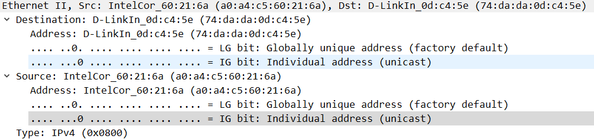
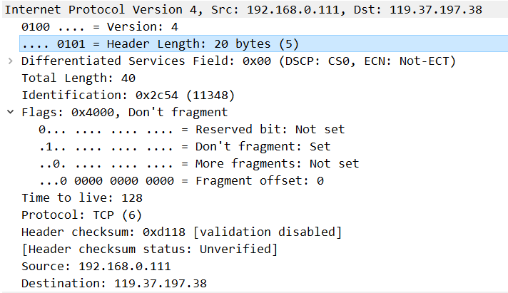

#  实验3: TCP、UDP协议分析

## 一、实验目的

1. 练习使用网络分析系统
2. 学会在捕获同网络中以及不同网络中的一台存在的计算机的数据包
3. 学会在捕获同网络中以及不同网络中的一台不存在的计算机的数据包
4. 会根据所捕获的TCP、UDP数据包分析协议工作过程
5. 能够对数据包进行分析

## 二、实验内容

1. 分析TCP协议连接与释放的7次过程
2. 分析UDP协议的报文格式

## 三、实验结果与分析

### 3.1 UDP协议分析

|字段|内容|
|:--|:--|
|Destination（目的地址）|74:da:da:0d:c4:5e|
|Source（源地址）|a0:a4:c5:60:21:6a|
|Type（帧类型）|0x0080(IPv4)|

|字段|内容|
|:--|:--|
|Version（版本）|0100(IPv4)|
|HeaderLength（首部长度）|0101(20bytes)|
|ServicesField（区分服务）|0x00(普通服务)|
|TotalLength（总长度）|175bytes|
|Indentification（标识）|0x1576(5494)|
|Flags（标志）|0x0000|
|TimetoLive（生存时间）|128跳|
|Protocol（协议）|17(UDP)|
|HeaderChecksum（首部校验和）|0xd11d|
|Source（源地址）|192.168.0.111|
|Destination（目的地址）|120.204.17.18|

|字段|内容|
|:--|:--|
|SourcePort（源端口）|4022|
|DestinationPort（目的端口）|8000|
|Length（UDP报文长度）|155bytes|
|Checksum（首部校验和）|0xfb7a|

### 3.2 TCP协议分析

#### 3.2.1 时序图

#### 3.2.2 第一次握手

|字段|内容|
|:--|:--|
|Destination（目的地址）|74:da:da:0d:c4:5e|
|Source（源地址）|a0:a4:c5:60:21:6a|
|Type（帧类型）|0x0080(IPv4)|

|字段|内容|
|:--|:--|
|Version（版本）|0100(IPv4)|
|HeaderLength（首部长度）|0101(20bytes)|
|ServicesField（区分服务）|0x00(普通服务)|
|TotalLength（总长度）|52bytes|
|Indentification（标识）|0x2c43(11331)|
|Flags（标志）|0x4000(允许分片)|
|TimetoLive（生存时间）|128跳|
|Protocol（协议）|6(TCP)|
|HeaderChecksum（首部校验和）|0xd11d|
|Source（源地址）|192.168.0.111|
|Destination（目的地址）|119.37.197.38|

|字段|内容|
|:--|:--|
|SourcePort（源端口号）|49262|
|DestinationPort（目的端口号）|443|
|SequenceNumber（序号）|0|
|AcknowledgmentNumber（确认序号）|0|
|HeaderLength（首部长度）|32bytes|
|Flags（标志）|0x002(SYN)-建立连接|
|WindowSizeValue（窗口大小）|64240bytes|
|Checksum（校验和）|0xb7c1|
|UrgentPointer（紧急指针）|0|
|Options（选项）|MaximumSegmentSize:1460bytes WindowScale:8 SACKPermitted（选择性确认）|

#### 3.2.3 第二次握手

|字段|内容|
|:--|:--|
|Destination（目的地址）|a0:a4:c5:60:21:6a|
|Source（源地址）|74:da:da:0d:c4:5e|
|Type（帧类型）|0x0080(IPv4)|

|字段|内容|
|:--|:--|
|Version（版本）|0100(IPv4)|
|HeaderLength（首部长度）|0101(20bytes)|
|ServicesField（区分服务）|0x00(普通服务)|
|TotalLength（总长度）|52bytes|
|Indentification（标识）|0x0000(0)|
|Flags（标志）|0x4000(允许分片)|
|TimetoLive（生存时间）|47跳|
|Protocol（协议）|6(TCP)|
|HeaderChecksum（首部校验和）|0x4e61|
|Source（源地址）|119.37.197.38|
|Destination（目的地址）|192.168.0.111|

|字段|内容|
|:--|:--|
|SourcePort（源端口号）|443|
|DestinationPort（目的端口号）|49262|
|SequenceNumber（序号）|0|
|AcknowledgmentNumber（确认序号）|1|
|HeaderLength（首部长度）|32bytes|
|Flags（标志）|0x012(SYN、ACK)|
|WindowSizeValue（窗口大小）|14600bytes|
|Checksum（校验和）|0x71f4|
|UrgentPointer（紧急指针）|0|
|Options（选项）|MaximumSegmentSize:1460bytes SACKPermitted（选择性确认） WindowScale:7|

#### 3.2.4 第三次握手

|字段|内容|
|:--|:--|
|Destination（目的地址）|74:da:da:0d:c4:5e|
|Source（源地址）|a0:a4:c5:60:21:6a|
|Type（帧类型）|0x0080(IPv4)|

|字段|内容|
|:--|:--|
|Version（版本）|0100(IPv4)|
|HeaderLength（首部长度）|0101(20bytes)|
|ServicesField（区分服务）|0x00(普通服务)|
|TotalLength（总长度）|40bytes|
|Indentification（标识）|0x2c46(11334)|
|Flags（标志）|0x4000(允许分片)|
|TimetoLive（生存时间）|128跳|
|Protocol（协议）|6(TCP)|
|HeaderChecksum（首部校验和）|0xd126|
|Source（源地址）|192.168.0.111|
|Destination（目的地址）|119.37.197.38|

|字段|内容|
|:--|:--|
|SourcePort（源端口号）|49262|
|DestinationPort（目的端口号）|443|
|SequenceNumber（序号）|1|
|AcknowledgmentNumber（确认序号）|1|
|HeaderLength（首部长度）|20bytes|
|Flags（标志）|0x002(ACK)-确认序号有效|
|WindowSizeValue（窗口大小）|256bytes|
|Checksum（校验和）|0xeace|
|UrgentPointer（紧急指针）|0|
|Options（选项）|-|

#### 3.2.5 第一次挥手

|字段|内容|
|:--|:--|
|Destination（目的地址）|74:da:da:0d:c4:5e|
|Source（源地址）|a0:a4:c5:60:21:6a|
|Type（帧类型）|0x0080(IPv4)|

|字段|内容|
|:--|:--|
|Version（版本）|0100(IPv4)|
|HeaderLength（首部长度）|0101(20bytes)|
|ServicesField（区分服务）|0x00(普通服务)|
|TotalLength（总长度）|40bytes|
|Indentification（标识）|0x2c55(11349)|
|Flags（标志）|0x4000(允许分片)|
|TimetoLive（生存时间）|128跳|
|Protocol（协议）|6(TCP)|
|HeaderChecksum（首部校验和）|0xd117|
|Source（源地址）|192.168.0.111|
|Destination（目的地址）|119.37.197.38|

|字段|内容|
|:--|:--|
|SourcePort（源端口号）|49262|
|DestinationPort（目的端口号）|443|
|SequenceNumber（序号）|989|
|AcknowledgmentNumber（确认序号）|546|
|HeaderLength（首部长度）|20bytes|
|Flags（标志）|0x011(ACK、FIN)|
|WindowSizeValue（窗口大小）|254bytes|
|Checksum（校验和）|0xe4d2|
|UrgentPointer（紧急指针）|0|
|Options（选项）|-|

#### 3.2.6 第二次挥手

|字段|内容|
|:--|:--|
|Destination（目的地址）|a0:a4:c5:60:21:6a|
|Source（源地址）|74:da:da:0d:c4:5e|
|Type（帧类型）|0x0080(IPv4)|

|字段|内容|
|:--|:--|
|Version（版本）|0100(IPv4)|
|HeaderLength（首部长度）|0101(20bytes)|
|ServicesField（区分服务）|0x00(普通服务)|
|TotalLength（总长度）|40bytes|
|Indentification（标识）|0x1631(5681)|
|Flags（标志）|0x4000(允许分片)|
|TimetoLive（生存时间）|47跳|
|Protocol（协议）|6(TCP)|
|HeaderChecksum（首部校验和）|0x383c|
|Source（源地址）|119.37.197.38|
|Destination（目的地址）|192.168.0.111|

|字段|内容|
|:--|:--|
|SourcePort（源端口号）|443|
|DestinationPort（目的端口号）|49262|
|SequenceNumber（序号）|546|
|AcknowledgmentNumber（确认序号）|990|
|HeaderLength（首部长度）|20bytes|
|Flags（标志）|0x010(ACK)-确认序号有效|
|WindowSizeValue（窗口大小）|131bytes|
|Checksum（校验和）|0xe54d|
|UrgentPointer（紧急指针）|0|
|Options（选项）|-|

#### 3.2.7 第三次挥手

|字段|内容|
|:--|:--|
|Destination（目的地址）|a0:a4:c5:60:21:6a|
|Source（源地址）|74:da:da:0d:c4:5e|
|Type（帧类型）|0x0080(IPv4)|

|字段|内容|
|:--|:--|
|Version（版本）|0100(IPv4)|
|HeaderLength（首部长度）|0101(20bytes)|
|ServicesField（区分服务）|0x00(普通服务)|
|TotalLength（总长度）|40bytes|
|Indentification（标识）|0x1630(5680)|
|Flags（标志）|0x4000(允许分片)|
|TimetoLive（生存时间）|47跳|
|Protocol（协议）|6(TCP)|
|HeaderChecksum（首部校验和）|0x383d|
|Source（源地址）|119.37.197.38|
|Destination（目的地址）|192.168.0.111|

|字段|内容|
|:--|:--|
|SourcePort（源端口号）|443|
|DestinationPort（目的端口号）|49262|
|SequenceNumber（序号）|545|
|AcknowledgmentNumber（确认序号）|989|
|HeaderLength（首部长度）|20bytes|
|Flags（标志）|0x011(FIN、ACK)|
|WindowSizeValue（窗口大小）|131bytes|
|Checksum（校验和）|0xe54e|
|UrgentPointer（紧急指针）|0|
|Options（选项）|-|

#### 3.2.8 第四次挥手

|字段|内容|
|:--|:--|
|Destination（目的地址）|74:da:da:0d:c4:5e|
|Source（源地址）|a0:a4:c5:60:21:6a|
|Type（帧类型）|0x0080(IPv4)|

|字段|内容|
|:--|:--|
|Version（版本）|0100(IPv4)|
|HeaderLength（首部长度）|0101(20bytes)|
|ServicesField（区分服务）|0x00(普通服务)|
|TotalLength（总长度）|40bytes|
|Indentification（标识）|0x2c54(11331)|
|Flags（标志）|0x4000(允许分片)|
|TimetoLive（生存时间）|128跳|
|Protocol（协议）|6(TCP)|
|HeaderChecksum（首部校验和）|0xd118|
|Source（源地址）|192.168.0.111|
|Destination（目的地址）|119.37.197.38|

|字段|内容|
|:--|:--|
|SourcePort（源端口号）|49262|
|DestinationPort（目的端口号）|443|
|SequenceNumber（序号）|989|
|AcknowledgmentNumber（确认序号）|546|
|HeaderLength（首部长度）|20bytes|
|Flags（标志）|0x010(ACK)-确认序号有效|
|WindowSizeValue（窗口大小）|254bytes|
|Checksum（校验和）|0xe4d3|
|UrgentPointer（紧急指针）|0|
|Options（选项）|-|

## 四、实验心得

1. 在此次获取TCP三次握手四次挥手过程的数据包，是通过与域搜云平台的主页建立连接产生的，但其四次挥手的数据包的时序有略微的问题，即服务器先向本机发送了断开连接的报文，之后本机才向主机发送断开连接的报文。
2. UDP是无连接的协议，因此其报文内容非常简单，只有目的端口、源端口、报文长度和首部校验和。
3. TCP是面向连接的协议，因此其报文比UDP协议复杂的多，其使用了三次握手和四次挥手的机制，从而保证了连接的可靠性。
